+======================================================================+
|  MERGED CODE EXPORT                                                   |
|  Project:  Suivre les Clients Sheet                                  |
|  Source:   (entire project)                                          |
|  Date:     2026-07-25 14:39:03                                       |
|  Status:   Complete                                                  |
+======================================================================+

 FOLDER STRUCTURE
-------------------
|--  01 - Overview/
|   |-- 00 - Overview MOC.md
|   |-- 01 - Workbook at a Glance.md
|   |-- 02 - Architecture and Layers.md
|   \-- 03 - End-to-End Data Flow.md
|--  02 - Sheets/
|   |-- 00 - Sheets MOC.md
|   |-- 01 - REF - Foundation.md
|   |-- 02 - ETAT - Master Ledger.md
|   |-- 03 - Devis - Quote Engine.md
|   \-- 04 - BON - Client Statement.md
|--  03 - ETAT Columns/
|   |-- 00 - ETAT Columns MOC.md
|   |-- 01 - Identity (B-K).md
|   |-- 02 - Quote and Balance (L-Q).md
|   |-- 03 - Installments (R-Y).md
|   |-- 04 - Special Services (Z-AE).md
|   |-- 05 - Term Tracking (AF-AL).md
|   \-- 06 - Hidden Payment Log (AM).md
|--  04 - Codes and Vocabulary/
|   |-- 00 - Codes MOC.md
|   |-- 01 - Level Codes (niveau).md
|   |-- 02 - Class Codes (CLASSE).md
|   |-- 03 - Town List (DISTINATION).md
|   |-- 04 - Option Codes.md
|   |-- 05 - Price Table.md
|   \-- 06 - French Terms Glossary.md
|--  05 - Formulas/
|   |-- 00 - Formulas MOC.md
|   |-- 01 - ETAT Core Formulas (L, P, Q).md
|   |-- 02 - REMISE and Installment Shortcuts (J, S).md
|   \-- 03 - Devis Block Formulas.md
|--  06 - Workflows/
|   |-- 00 - Workflows MOC.md
|   |-- 01 - New Family Inquiry.md
|   |-- 02 - Student Enrollment.md
|   |-- 03 - Payment Recording.md
|   \-- 04 - Customer Statement.md
|--  07 - Hidden Logic/
|   |-- 00 - Hidden Logic MOC.md
|   |-- 01 - Named Ranges.md
|   |-- 02 - Data Validations.md
|   \-- 03 - Conditional Formatting.md
|--  08 - Issues and Fixes/
|   |-- 00 - Issues MOC.md
|   |-- 01 - Broken BON Sheet.md
|   |-- 02 - Missing Devis Dropdowns.md
|   |-- 03 - Stale 2021-2022 Dates.md
|   \-- 04 - Off-by-One in S94.md
|--  09 - Appendix/
|   |-- 00 - Appendix MOC.md
|   |-- 01 - Workbook Stats.md
|   |-- 02 - REF Sheet Full Content.md
|   \-- 03 - AM Comment Samples.md
\-- 00 - Home.md

This file contains the full source code of: (entire project)
Project root: /home/mersel/Documents/Learn/Obsidian Notes/Mersel/How To Be/Carrer/Projects Description/08. Electron Management Software/El Imtyaz/Suivre les Clients Sheet
Total files in this part: 46


========================================================================
 FILE: 01 - Overview/00 - Overview MOC.md
   Language: markdown
========================================================================

---
tags:
  - moc
  - overview
---

# Overview MOC

The Overview section gives you the high-level mental model before you dive into specific sheets, columns, or formulas.

## Notes in this section

1. [[01 - Workbook at a Glance]] — what the workbook does, who uses it, the four sheets at a glance.
2. [[02 - Architecture and Layers]] — the four-layer model (REF → Devis → ETAT → BON) and how data moves between them.
3. [[03 - End-to-End Data Flow]] — one family's payment traced end-to-end through all four sheets.

## Reading order

If you only have 10 minutes, read [[01 - Workbook at a Glance]] and the diagram in [[02 - Architecture and Layers]]. That gives you 80% of the understanding.

If you have 30 minutes, add [[03 - End-to-End Data Flow]] — it shows how everything connects through a concrete example.

## Related sections

- [[00 - Sheets MOC]] — dive into any of the four sheets
- [[00 - Formulas MOC]] — the engine that drives the workbook
- [[00 - Workflows MOC]] — how operators actually use the workbook day-to-day


========================================================================
 FILE: 01 - Overview/01 - Workbook at a Glance.md
   Language: markdown
========================================================================

---
tags:
  - overview
  - sheet/ETAT
  - sheet/Devis
  - sheet/BON
  - sheet/REF
---

# Workbook at a Glance

## What this workbook is

`Suivis clients 2026_2027.xlsx` is the **financial tracking system** for Sarl Elimtiyaz, a private school in Boumerdès Province, Algeria. It manages the school's receivables for the 2026/2027 academic year — tracking every enrolled student, calculating what each family owes, recording every payment, and showing the outstanding balance at any moment.

The French name `Suivis clients` means "client follow-up". Here, "clients" means **student families** — each family is treated as a customer, and each student is one row in the master ledger.

## Who uses it

The workbook is operated by the school's accounting/admin staff. They use it to:

1. **Generate quotes** for prospective families ([[03 - Devis - Quote Engine|Devis sheet]]).
2. **Enroll students** and record the agreed annual fee ([[02 - ETAT - Master Ledger|ETAT sheet]], column L).
3. **Record payments** as families pay installments throughout the year (columns R–Y in ETAT).
4. **See who owes what** at any point in time (column Q in ETAT).
5. **Print a customer statement** for any family that asks ([[04 - BON - Client Statement|BON sheet]] — currently broken).
6. **Audit cash receipts** against bank deposits (the hidden AM comment column — see [[06 - Hidden Payment Log (AM)]]).

## The four sheets

| Sheet | Size | Role | Working? |
|---|---|---|---|
| `REF` | 224 × 4 | Static lookup tables (parents, class codes, towns) | Yes, but mostly dormant |
| `Devis` | 480 × 26 | 10 family quote templates | Yes |
| `ETAT 20262027` | 1032 × 54 | The master ledger (390 students) | Yes — the engine |
| `BON ` | 45 × 26 | Client statement print template | **No** — every formula returns `#REF!` |

See [[02 - Architecture and Layers]] for how these sheets connect, and [[03 - End-to-End Data Flow]] for a worked example.

## What it manages

| Entity                 | Where it lives                                               | How many                           |
| ---------------------- | ------------------------------------------------------------ | ---------------------------------- |
| Students               | One row each in [[02 - ETAT - Master Ledger\|ETAT]]          | 390                                |
| Families / tutors      | Grouped by parent name (column E)                            | ~250+                              |
| Quote templates        | One block per family in [[03 - Devis - Quote Engine\|Devis]] | 10                                 |
| Class levels           | Column G of ETAT (PRIM, COLG, LYC, etc.)                     | 11 distinct                        |
| Specific classes       | Column H of ETAT (CP, CE1, CM2, 1AAM, etc.)                  | 24 distinct                        |
| Transport destinations | Column V of ETAT                                             | 20 canonical towns                 |
| Annual fees            | Column L of ETAT                                             | One per student (387 are formulas) |
| Installment payments   | Columns R–Y of ETAT                                          | Up to 7 per student                |
| Outstanding balances   | Column Q of ETAT                                             | One per student                    |

## Currency and conventions

- All monetary values are in **Algerian Dinars (DZD)**. No currency symbol is used; numbers are bare.
- The school charges roughly **200,000–400,000 DZD per student per year** (≈ 1,400–2,800 USD at 2024 rates), plus transport of 35,000–55,000 DZD if needed.
- Fees are split into: a registration fee (FI = 25,000 typically), then 2 or 3 tuition installments (V2/2V/v3), plus 3 transport installments (1T/T2/t3) if applicable.

## Three operational layers + one foundation

The workbook is best understood as **three operational layers** sitting on **one reference layer**. Each layer has a different job, and each feeds the next:

1. **Foundation** = `REF` — defines the vocabulary (class codes, towns, parent names).
2. **Layer 1 — Quote** = `Devis` — generates the annual quote for a prospective family.
3. **Layer 2 — Ledger** = `ETAT 20262027` — tracks each student and their payments through the year.
4. **Layer 3 — Statement** = `BON` — prints a one-page summary for a specific family.

See [[02 - Architecture and Layers]] for the full breakdown.

## Why this is a "system" not just a spreadsheet

The workbook is more than a list of students because it combines four functions in one file:

1. **Operational ledger** — every payment is recorded here, not in a separate accounting system.
2. **Quote generator** — prospective families get printed quotes straight from this file.
3. **Customer statement** — families can ask for a balance statement and get one printed (when BON works).
4. **Audit trail** — the hidden comment log in column AM keeps a hand-typed record of every cash receipt (amount, date, receipt book number).

That's why the file is large (1,032 rows × 54 columns on the main sheet) and why it has so many cross-sheet formulas — even though most of those cross-sheet formulas are currently broken (see [[00 - Issues MOC]]).

## Quick stats

For the full breakdown, see [[01 - Workbook Stats]].

- **390 students** enrolled
- **1,513 formulas** across all sheets
- **~80 cell comments** in column AM (the audit trail)
- **2 broken named ranges** (`parent`, `TUTEUR`)
- **5 undefined named ranges** referenced by Devis dropdowns (`CLASSE`, `FI`, `FRAISSCOLAIRE`, `SERVICE`, `transport`)

---

**Next**: [[02 - Architecture and Layers]]


========================================================================
 FILE: 01 - Overview/02 - Architecture and Layers.md
   Language: markdown
========================================================================

---
tags:
  - overview
  - architecture
---

# Architecture and Layers

The workbook is built in **four layers**, each with a clear job. The lower layers feed the upper layers, but the connections are sometimes automatic (formulas) and sometimes manual (a person copies a number from one sheet to another).

## The four-layer model

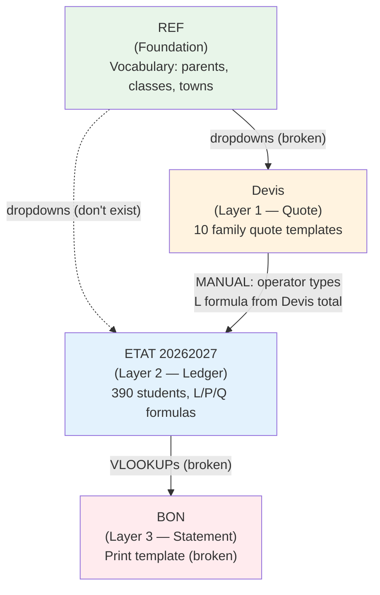

## Layer by layer

### Foundation — `REF` sheet

**Job**: Define the controlled vocabulary — the list of acceptable parent names, class codes, and transport destinations.

**What it holds** (see [[01 - REF - Foundation]]):
- Column A: 8 parent/tutor family names
- Column B: 26 class codes (MS, GS, CP, CE1, 1AAM, 3AP, autiste, etc.)
- Column D: 20 town names (BOUMERDES, CORSO, BOUDOUAOU, etc.)

**How it's exposed**: via two named ranges:
- `CLIENT` → `REF!$A:$A` (parent names) — working but unused
- `NIVEAU` → `REF!$B:$B` (class codes) — working but unused

> [!warning] Dormant
> Despite the design intent, no formula or data validation in the workbook actually reads from REF. Operators type class codes and town names by hand into ETAT. See [[02 - Missing Devis Dropdowns]].

### Layer 1 — `Devis` sheet (Quote generation)

**Job**: Produce a printable annual price quote for a family considering enrollment.

**What it holds**: 10 quote blocks (one per family), each 48 rows tall. Each block contains:
- A family name (typed in cell B2 of the block)
- A quote number (e.g., `0101/2021/2022` — note: still says 2021/2022 — see [[03 - Stale 2021-2022 Dates]])
- One row per child with: first name, class, registration fee (FI), tuition, service type, service amount
- An auto-summed line total per child
- An auto-summed subtotal across siblings
- A typed discount (Réduction) and optional reimbursement
- A computed grand total: `Montant Total = subtotal − discount − reimbursement`
- Two printed notes about the 5% early-payment bonus and the deposit requirement
- The school's RIB for bank transfers

**How it produces its output**: through formulas in column I that sum each row, then sum the rows into a subtotal, then subtract the discount and refund to get the grand total. The 5% early-payment bonus is computed in column D of the notes row. See [[03 - Devis Block Formulas]].

**Where the output goes**: nowhere automatically. The operator reads the grand total off the printed quote and **manually types a formula** into column L of the ETAT sheet that reconstructs that total (`=25000+205000+35000-J2`). This is a **manual handoff**, not a formula link.

See [[03 - Devis - Quote Engine]].

### Layer 2 — `ETAT 20262027` sheet (Master ledger)

**Job**: Track every enrolled student, calculate their annual fee, record every payment, and show the outstanding balance.

**What it holds** (see [[02 - ETAT - Master Ledger]]):
- 390 student rows, each with identity, pricing, payments, and balance
- Identity (B–K): name, phone, parent, level, class, option, discount, justification
- Pricing (L–Q): annual quote (L, formula), refund (M), prior debts (N, O), total paid (P, formula), balance owed (Q, formula)
- Payment detail (R–Y): registration (R), installments (S, T, U), transport (W, X, Y)
- Services (Z–AE): psychology, speech therapy, e-plant, catch-up classes
- Term tracking (AF–AL): September/December/March — currently empty
- Hidden log (AM): cell comments containing receipt details

**How it produces its output**: through three formula families (see [[01 - ETAT Core Formulas (L, P, Q)]]):
1. **L** (annual quote) — `=25000+205000+35000-J2` (hand-built from the family's quote)
2. **P** (total paid) — `=R2+S2+T2+U2+W2+X2+Y2` (sums all payment columns)
3. **Q** (balance owed) — `=L2-P2` (the simplest and most important formula)

Plus arithmetic shortcuts in J (REMISE) and S (V2) — see [[02 - REMISE and Installment Shortcuts (J, S)]].

### Layer 3 — `BON ` sheet (Client statement)

**Job**: Produce a one-page printable statement for a specific family, showing their annual quote, total paid, and remaining balance — plus a 10-line payment history.

**What it holds**: a print template with:
- An input cell `F8` (where the operator types the family name)
- Two child rows (`E12`, `E13`) where the operator types student names
- 16 VLOOKUP formulas that should pull the quote, paid, and history from the master ledger

**How it's supposed to work**: the operator types a family name → the VLOOKUPs search the (now-deleted) `'PAR PARENT'` sheet and the (now-renamed) `'Etat General Versement'` sheet → the values appear on the printout.

> [!danger] Broken
> When the workbook was restructured for 2026/2027, the source sheets were renamed and deleted, but the BON formulas weren't updated. **Every formula on the BON sheet returns `#REF!`**. The data-validation dropdown on F8 also references a broken named range (`parent` → `#REF!`). See [[01 - Broken BON Sheet]].

## How data moves between the layers

| From → To | What moves | How |
|---|---|---|
| REF → Devis | Dropdown lists for class codes, fees, services, transport | Automatic via named ranges (**currently broken**) |
| REF → ETAT | Dropdown lists for class codes, towns | Mostly manual — operators type codes by hand |
| Devis → ETAT | The annual quote number | **Manual** — operator reads Devis total, types a matching formula into ETAT column L |
| ETAT → BON | Quote, paid, balance, payment history | Automatic via VLOOKUP (**currently broken**) |

> [!important] The only fully automatic link that works
> The only **fully automatic** cross-sheet link that actually fires end-to-end is **inside the ETAT sheet itself**: change a payment cell → `P` updates → `Q` updates. That's the engine, and it's the only part of the system that works reliably every time.

## Why this layered design works (when it works)

The layering gives each sheet a single clear job:

- **REF** is a **data dictionary** — change it once, and every dropdown updates (in theory).
- **Devis** is a **customer-facing document** — print it, sign it, send it to the family.
- **ETAT** is an **internal operations table** — update it daily as payments come in.
- **BON** is a **customer-facing summary** — print it on demand when a parent asks.

Each sheet can be modified, printed, or shared independently. The cost of this separation is that the links between layers are fragile — if you rename a sheet, the layer above breaks. Which is exactly what happened to BON.

## The real input boundary

The most important thing to understand is that the **only input boundary that matters day-to-day** is the payment columns on the ETAT sheet (R, S, T, U, W, X, Y). Everything else — quotes, discounts, identity — is set once at enrollment and rarely changed.

So the daily loop is:

1. Family pays → operator types amount into the right payment column on ETAT.
2. Operator leaves a comment on AM with the receipt details (see [[06 - Hidden Payment Log (AM)]]).
3. `P` (total paid) updates automatically.
4. `Q` (balance owed) updates automatically.
5. The conditional-formatting green fill confirms the row is now "active".

That's the engine. Everything else in the workbook is either setup (REF, Devis) or reporting (BON).

## Which sheet should you change first?

When you want to change something, change it on the right sheet and the effect propagates:

| If you want to change… | Change it on… | And the effect propagates to… |
|---|---|---|
| The list of valid class codes | `REF!B:B` | (in principle) every dropdown — but currently nowhere, because the dropdowns are broken |
| The list of towns | `REF!D:D` | nowhere automatically — operators type town names by hand into ETAT column V |
| A specific quote for a specific family | `Devis` block | nothing else — you must also update ETAT column L manually |
| A student's annual quote | `ETAT!L:L` (the formula) | `Q` automatically (because Q = L − P) |
| A student's discount | `ETAT!J:J` | `L` automatically (if L's formula subtracts J) and therefore `Q` |
| A payment amount | `ETAT!R:Y` (or Z:AE) | `P` automatically and therefore `Q` |
| A receipt log entry | `ETAT!AM:AM` (comment) | nowhere — comments are not referenced by formulas |
| The client statement printout | `BON!F8` (then print) | nothing — it's a one-shot view |

---

**Next**: [[03 - End-to-End Data Flow]]


========================================================================
 FILE: 01 - Overview/03 - End-to-End Data Flow.md
   Language: markdown
========================================================================

---
tags:
  - overview
  - data-flow
  - workflow
---

# End-to-End Data Flow

This note traces a single payment from the moment a family first inquires about enrollment all the way to the moment the school prints them a balance statement. Each step shows which sheet is involved, what data moves, and which formula fires.

## The story

The **MAHAMED OUSSAID** family inquires about enrolling their three children (MAHDI, AMINE, and one unnamed child) for the 2026/2027 school year. They enroll, pay in installments, and at the end of the year ask for a statement. Here's what happens in the workbook at each step.

## Step 1 — Quote generation (Devis sheet, Block 1)

The operator opens [[03 - Devis - Quote Engine|Devis]] and fills in Block 1 (rows 2–47):

| Cell | Value | Meaning |
|---|---|---|
| `B2` | `MAHAMED OUSSAID` | Family name (typed) |
| `I7` | `0101/2021/2022` | Quote number (typed) — note stale year |
| `A15` | `MAHDI` | Child 1 first name |
| `D15` | `CM1` | Child 1 class |
| `E15` | `28000` | Child 1 registration fee (FI) |
| `F15` | `210000` | Child 1 tuition |
| `G15` | `Transport` | Service type |
| `H15` | `43000` | Transport amount |
| `I29` | `10000` | Discount (typed) |

### Formulas that fire

| Cell | Formula | Result |
|---|---|---|
| `I15` | `=+SUM(A15:H15)` | `= 28000 + 210000 + 43000 = 281000` |
| `I27` | `=+SUM(I15:I26)` | `= 281000 + 186000 + 186000 = 653000` (subtotal) |
| `I31` | `=+I27-I29` | `= 653000 − 10000 = 643000` (grand total) |
| `D35` | `=+SUM(F15:F26)*0.05` | `= 460000 × 0.05 = 23000` (5% early-payment bonus) |

The **MAHAMED OUSSAID** family is quoted a grand total of **643,000 DZD** for the year, with a possible 23,000 DZD discount if they pay everything before June 30. See [[03 - Devis Block Formulas]] for the full pattern.

The operator prints this quote (rows 2–47) and gives it to the family. **No data leaves the Devis sheet yet** — the link to the next sheet is manual.

## Step 2 — Enrollment (ETAT sheet, three new rows)

The family decides to enroll all three children. The operator creates three new rows in [[02 - ETAT - Master Ledger|ETAT 20262027]], one per child. For each row, they fill in the identity block and then **manually reconstruct** the annual quote in column L using a formula that mirrors the Devis calculation.

Let's say MAHDI goes on row 7, AMINE on row 8, and the third child on row 9:

| Cell | Value | Meaning |
|---|---|---|
| `F7` | `MAHAMED MAHDI` | Student name |
| `G7` | `PRIM` | Level (primary) |
| `H7` | `CM2` | Class (the operator adjusts CM1 → CM2 if the child was promoted) |
| `I7` | `TRNSP` | Option: transport needed |
| `J7` | `=20000+25000` | Discount components (typed) → 45,000 |
| `V7` | `BOUMERDES` | Transport destination |

### Formula that fires (column L)

The operator looks at the Devis sheet, sees the line for MAHDI was `28000 (FI) + 210000 (tuition) + 43000 (transport) − discount`, and types:

| Cell | Formula | Result |
|---|---|---|
| `L7` | `=30000+250000+20000+52000-J7+1000` | `= 30000 + 250000 + 20000 + 52000 − 45000 + 1000 = 258000` |

> [!note] Why the components change
> The operator may adjust the components — here they bumped FI from 28,000 to 30,000 because MAHDI was promoted from CM1 to CM2, and they added 52,000 for transport to a farther town. The 1,000 at the end is a small adjustment.

This is the **most important moment** in the data flow: the Devis output becomes the ETAT input. It's a **manual handoff**, not an automatic link. The operator is essentially translating "the family owes 643,000 total for three kids" into "this kid's row gets L=258,000, that kid's row gets L=…, the third kid's row gets L=…, and the three L values should add up to 643,000."

See [[01 - ETAT Core Formulas (L, P, Q)]] for the full L formula breakdown.

### Other formulas that fire automatically

| Cell | Formula | Result |
|---|---|---|
| `P7` | `=R7+S7+T7+U7+W7+X7+Y7` | `= 0` (nothing paid yet) |
| `Q7` | `=L7-P7` | `= 258000` (full balance owed) |

The student is now in the ledger with a 258,000 DZD balance.

## Step 3 — First payment (registration fee)

The family pays the 30,000 DZD registration fee in cash on May 5th. The receipt is logged in receipt book B11, receipt #05.

### What the operator does

1. **Types the amount into column R** (FI = Frais d'Inscription): `R7 = 30000`
2. **Logs the receipt as a cell comment on column AM** (the hidden payment log):
   - Right-click `AM7` → Insert comment → type `30000/05/05B11`
   - Format: `amount/date/receipt-book-and-number`
   - See [[06 - Hidden Payment Log (AM)]] for the full convention.

### Formulas that fire automatically

| Cell | Formula | Result |
|---|---|---|
| `P7` | `=R7+S7+T7+U7+W7+X7+Y7` | `= 30000` (total paid) |
| `Q7` | `=L7-P7` | `= 258000 − 30000 = 228000` (new balance) |

The balance drops from 258,000 to 228,000. The conditional formatting on the row kicks in — the green fill appears on every populated cell (see [[03 - Conditional Formatting]]).

## Step 4 — Second payment (1st tuition installment)

The family pays 100,000 DZD on May 10th (receipt book B11, receipt #07).

### What the operator does

1. **Types the amount into column S** (V2 = 2nd versement): `S7 = 100000`
2. **Logs the receipt**: Comment on `AM7` is updated (or a new line is added): `100000/10/05B11`. The full comment now reads:
   ```
   30000/05/05B11
   100000/10/05B11
   ```

### Formulas that fire automatically

| Cell | Formula | Result |
|---|---|---|
| `P7` | `=R7+S7+T7+U7+W7+X7+Y7` | `= 30000 + 100000 = 130000` |
| `Q7` | `=L7-P7` | `= 258000 − 130000 = 128000` |

## Step 5 — Transport payment

The family pays 30,000 DZD toward transport on May 15th.

### What the operator does

1. **Types the amount into column W** (1T = 1st transport tranche): `W7 = 30000`
2. **Logs the receipt** as another comment line on `AM7`.

### Formulas that fire automatically

| Cell | Formula | Result |
|---|---|---|
| `P7` | `=R7+S7+T7+U7+W7+X7+Y7` | `= 30000 + 100000 + 30000 = 160000` |
| `Q7` | `=L7-P7` | `= 258000 − 160000 = 98000` |

## Step 6 — Family asks for a statement (BON sheet)

At the end of the year, the family wants a printed statement showing everything they've paid and what they still owe.

### What the operator is supposed to do

1. Open the [[04 - BON - Client Statement|BON sheet]].
2. Type `MAHAMED OUSSAID` into `F8` (the client input cell).
3. Type the three children's names into `E12` and `E13` (and conceptually more rows below).
4. The VLOOKUP formulas auto-populate the rest of the page.
5. Print.

### What actually happens (because BON is broken)

Every formula on the BON sheet returns `#REF!` because:

- `C10`, `H12`, `I12`, `H13`, `I13` reference `'PAR PARENT'!A4:E785` — a sheet that doesn't exist anymore.
- `A22:A31` reference `'Etat General Versement'!G7:AS1255` — the sheet was renamed to `ETAT 20262027`.
- The `F8` dropdown uses the named range `parent`, which itself points to `#REF!`.

So the operator either:

- **Bypasses BON entirely** and prints directly from `ETAT 20262027` (filtering by parent name in column E).
- **Or** manually types the numbers into BON, defeating its purpose.

See [[01 - Broken BON Sheet]] for the full diagnosis and how to fix it.

## The complete data flow at a glance

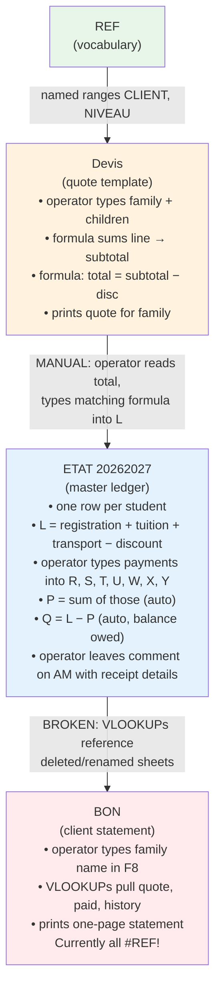

## Key takeaway

The data flow is **mostly manual at the input boundary** (REF → Devis → ETAT) and **mostly automatic at the output boundary** (ETAT → BON). The automation at the output is currently broken, which means in practice the entire data flow is manual: the operator reads numbers off the ETAT sheet and either prints them directly or types them into BON by hand.

The **only formula link that actually fires end-to-end** in this workbook is inside the ETAT sheet itself: change a payment cell → `P` updates → `Q` updates. That's the engine, and it's the only part of the system that works reliably every time.

---

**Next**: [[00 - Sheets MOC]]


========================================================================
 FILE: 02 - Sheets/00 - Sheets MOC.md
   Language: markdown
========================================================================

---
tags:
  - moc
  - sheets
---

# Sheets MOC

The workbook has four sheets. Each one is documented in its own note here.

## Notes in this section

1. [[01 - REF - Foundation]] — the reference layer (parents, class codes, towns). Mostly dormant.
2. [[02 - ETAT - Master Ledger]] — the operational heart. 390 students, the L/P/Q formula engine.
3. [[03 - Devis - Quote Engine]] — 10 family quote blocks for prospective families.
4. [[04 - BON - Client Statement]] — the broken print template for customer statements.

## Sheet relationships

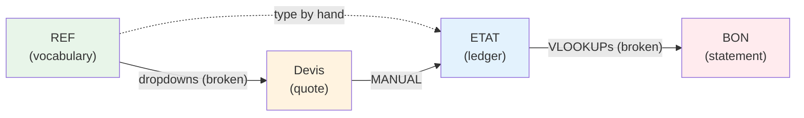

## At a glance

| Sheet | Size | Role | Status |
|---|---|---|---|
| `REF` | 224 × 4 | Static lookup tables | Working, mostly dormant |
| `Devis` | 480 × 26 | 10 family quote templates | Working |
| `ETAT 20262027` | 1032 × 54 | Master ledger (390 students) | Working — the engine |
| `BON ` | 45 × 26 | Client statement print template | **Broken** — every formula returns `#REF!` |

## What to read first

Start with [[02 - ETAT - Master Ledger]] — it's the operational heart and most of the workbook's complexity lives there. Then read the other three in any order.

## Related sections

- [[00 - ETAT Columns MOC]] — column-by-column breakdown of ETAT
- [[00 - Formulas MOC]] — the formulas that drive ETAT, Devis, and (broken) BON
- [[00 - Issues MOC]] — what's broken and how to fix it


========================================================================
 FILE: 02 - Sheets/01 - REF - Foundation.md
   Language: markdown
========================================================================

---
tags:
  - sheet/REF
  - foundation
---

# REF — The Foundation

> [!info] One-line role
> A static lookup table that defines the controlled vocabulary (parent names, class codes, towns) used by every other sheet.

## At a glance

| Property | Value |
|---|---|
| Position in workbook | 4th (last) tab |
| Size | 224 rows × 4 columns |
| Formulas | 0 (pure data) |
| Data validations | 0 |
| Conditional formatting | 0 |
| Merged cells | 0 |
| Hidden | No |

## What each column holds

### Column A — Parent / Tutor family names

The named range `CLIENT` points to `REF!$A:$A`. It contains **8 family names** (rows 1–8):

| Row | Value |
|---|---|
| 1 | MERDAS SAMIR |
| 2 | TALAOOURAR YOUNES |
| 3 | BELRECHID |
| 4 | HARBI |
| 5 | MOULFI |
| 6 | HAMADACHE |
| 7 | HASSAIN |
| 8 | SLIMANI |

> [!warning] Incomplete
> This list is **far shorter** than the actual number of families in the school (the ETAT sheet tracks 390 students across hundreds of distinct parent names). It looks like a leftover from a much earlier version of the workbook — possibly the seed list used to demonstrate the dropdown concept. It is not actively maintained.

### Column B — Class level codes

The named range `NIVEAU` points to `REF!$B:$B`. It contains **26 class codes** (rows 1–26):

```
MS, GS, PS, TPS, CP, CE1, CE2, CM1, CM2,
1AP, 2AP, 3AP, 4AP, 5AP,
1AAM, 2AAM, 3AAM, 4AAM,
1AS, 2AS, 3AS,
1CS, 2CS, 3CS, 4CS,
autiste
```

These represent every possible class the school offers, from pre-school (MS/GS/PS/TPS) through primary (CP–CM2), middle school (1AP–5AP, 1AAM–4AAM, 1AS–3AS), high school (1CS–4CS), and a special-needs class (autiste).

See [[02 - Class Codes (CLASSE)]] for what each code means.

### Column C — empty

Column C is entirely empty. It may have been intended for an additional attribute (perhaps "tuition tier" or "section") but was never used.

### Column D — Town / Transport destinations

Contains **20 town names** (rows 1–20), representing the geographic area the school's transport service covers:

```
BOUMERDES, CORSO, SAHEL, FIGUIER, ZEMOURI, BOUDOUAOU, REGHIAA, ROUIBA,
BORDJ MNAIL, SI MUSTAPHA, ISSER, THENIA, BENI AMRANE, OULED MOUSSA,
OULED HEDDAJ /HOUCHE MEKHEFI, KHEMIS KHENCHELA, TIDJELABINE, BENYOUNES,
SOUK ELHAD, CAP DJENET
```

All of these are towns in or near **Boumerdès Province** in northern Algeria, which confirms the school's location. See [[03 - Town List (DISTINATION)]].

## Named ranges that point here

| Name | Refers to | Status | Used by |
|---|---|---|---|
| `CLIENT` | `REF!$A:$A` | Working | Nothing actively — BON was supposed to use it but uses `parent` instead, which is broken |
| `NIVEAU` | `REF!$B:$B` | Working | Nothing actively — should be used by Devis and ETAT dropdowns, but they reference other broken names |

Both named ranges cover **whole columns** (`$A:$A` rather than `$A$1:$A$8`), which means any dropdown using them would include the empty cells below the data. This is a minor design flaw — bounded ranges like `$A$1:$A$50` or an Excel Table would be cleaner.

See [[01 - Named Ranges]] for the full story.

## How REF connects to the rest of the workbook

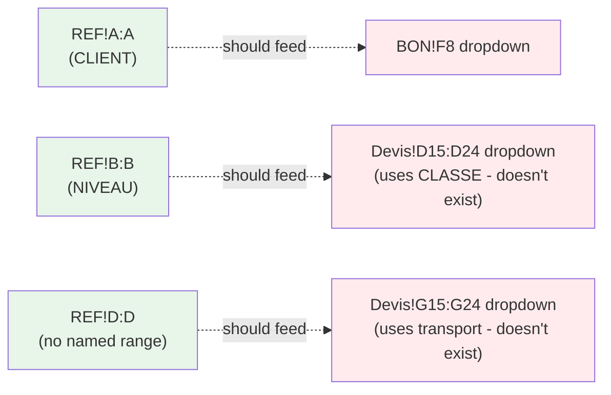

In practice, **no formula or data validation in the workbook actually reads from REF**. The two named ranges (`CLIENT`, `NIVEAU`) are defined but unused. The operators type class codes and town names by hand into ETAT, and the Devis dropdowns reference five other named ranges (`CLASSE`, `FI`, `FRAISSCOLAIRE`, `SERVICE`, `transport`) that don't exist at all — see [[02 - Missing Devis Dropdowns]].

> [!note] Effectively dormant
> REF is a **dormant** sheet today: it stores useful reference data, but nothing in the workbook actively consumes it. The design intent was clearly to use it for dropdown validation; the implementation just isn't wired up.

## What REF is missing

Looking at what the Devis dropdowns want, REF should ideally also contain:

| Missing list | Used by | Should hold |
|---|---|---|
| `CLASSE` | Devis column D | Same as NIVEAU essentially — class codes |
| `FI` (registration fee tiers) | Devis column E | The set of valid FI amounts: 18000, 25000, 28000, 30000, 33000 |
| `FRAISSCOLAIRE` (tuition tiers) | Devis column F | The set of valid tuition amounts (see [[05 - Price Table]]) |
| `SERVICE` (service types) | Devis column G | Transport, PSY, ORTH, Ratrapage, etc. |
| `transport` (transport amount tiers) | Devis column H | 35000, 43000, 52000, 55000 |
| `TUTEUR` (parent list, full) | ETAT column E | All ~250 distinct parent names, not just 8 |

If you wanted to repair the workbook, the highest-leverage change would be to extend REF with these lists and repoint the broken named ranges at them. See [[02 - Missing Devis Dropdowns]] for the fix.

## Why the sheet is called "REF"

`REF` is short for **Référence** (French) or **Reference** (English). It's the school's "lookup table" sheet — a common pattern in Excel workbooks that need to standardize data entry across multiple sheets.

Some operators might also interpret `REF` as a hint that the sheet is **referenced by** other sheets, but as we've seen, that referencing is currently broken.

---

**See also**:
- [[02 - REF Sheet Full Content]] — the full row-by-row dump
- [[01 - Named Ranges]] — the four workbook-scoped names
- [[02 - Missing Devis Dropdowns]] — why REF is currently dormant
- [[02 - Class Codes (CLASSE)]] — what every code in column B means
- [[03 - Town List (DISTINATION)]] — the 20 towns in column D


========================================================================
 FILE: 02 - Sheets/02 - ETAT - Master Ledger.md
   Language: markdown
========================================================================

---
tags:
  - sheet/ETAT
  - ledger
  - core
---

# ETAT 20262027 — The Master Ledger

> [!info] One-line role
> The operational heart of the workbook. One row per student. Stores identity, computes the annual quote, records every payment, and shows the outstanding balance.

## At a glance

| Property | Value |
|---|---|
| Position in workbook | 1st tab |
| Size | 1032 rows × 54 columns |
| Active data range | rows 1–404 (1 header + 390 students + ~13 spare rows); rows 405–1032 are empty spare capacity |
| Formulas | 1,422 |
| Data validations | 1 (on column AG) |
| Conditional formatting | 2 rules (green fill + green-to-white color scale) |
| Merged cells | 0 |
| Auto-filter | Active on `$A$1:$AN$404` |
| Hidden | No |

## What this sheet does

This is the **operational ledger** of the school. Every enrolled student gets one row. As payments come in throughout the year, the operator types the amount into the appropriate payment column, and three formulas automatically update:

1. **P** (TOTAL VERSEMENTS) — sums all payment columns for that row
2. **Q** (TOTAL*CREANCE) — computes the outstanding balance: `L − P`
3. The conditional formatting kicks in — populated cells turn light green

The sheet is the **single source of truth** for who owes what. When the operator wants to know the school's total receivables, they filter or sum column Q. When a parent asks for a statement, the operator either prints this sheet (filtered by parent name) or — if it were working — pulls the data via the BON sheet.

## Column layout

The 38 columns of the active data area break into six logical groups. See the dedicated column-group notes for full detail:

| Group | Cols | Purpose | Note |
|---|---|---|---|
| Identity | B–K | Phone, email, tutor, name, level, class, option, discount, justification | [[01 - Identity (B-K)]] |
| Quote & balance | L–Q | Annual quote, refund, debts, payments, total paid, balance owed | [[02 - Quote and Balance (L-Q)]] |
| Installment payments | R–Y | Registration, 2nd/3rd installments, transport tranches | [[03 - Installments (R-Y)]] |
| Special services | Z–AE | Psychology, speech therapy, e-plant, ratrapage | [[04 - Special Services (Z-AE)]] |
| Term tracking | AF–AL | September/December/Mars term payments and receivables | [[05 - Term Tracking (AF-AL)]] |
| Hidden log | AM | Cell comments containing payment receipt details | [[06 - Hidden Payment Log (AM)]] |
| Broken | AN | Header is `#REF!` — references a deleted column | — |

## The four formula families

These are the engine of the entire workbook. Every other formula in the sheet is one of these four patterns (or a one-off arithmetic shortcut):

### Formula ① — Column L: DEVIS ANNUEL (annual quote)

```
L2:  =25000+205000+35000-J2
L3:  =25000+205000+35000+55000-J3
L5:  =25000+305000+52000        (no -J)
```

**Pattern**: `registration + tuition + transport − discount`

The numeric components are picked from a fixed price menu (see [[05 - Price Table]]):
- `25000` = standard primary registration fee
- `30000` = collège/lycée registration fee
- `18000` = pre-school registration fee
- `205000` / `220000` = primary tuition (with/without transport option)
- `305000` / `330000` = collège tuition
- `340000–365000` = lycée tuition
- `35000` / `43000` / `52000` / `55000` = transport tiers (by distance)

The discount `J` is subtracted when the formula includes `-J2`. About 26 rows omit the `-J` term, meaning the family gets no discount.

There are **387** L formulas; 3 rows have a literal number instead.

See [[01 - ETAT Core Formulas (L, P, Q)]].

### Formula ② — Column P: TOTAL VERSEMENTS (total paid)

```
P2:  =R2+S2+T2+U2+W2+X2+Y2
```

**Pattern**: `registration (R) + 2nd installment (S) + alt 2nd (T) + 3rd installment (U) + transport 1 (W) + transport 2 (X) + transport 3 (Y)`

It does **not** include the special-service columns (Z–AE) or the term-tracking columns (AF–AL). This is a deliberate scope choice — those columns are tracked separately and not part of the "core" annual fee.

There are **403** P formulas (one per active student row).

See [[01 - ETAT Core Formulas (L, P, Q)]].

### Formula ③ — Column Q: TOTAL*CREANCE (balance owed)

```
Q2:  =L2-P2
```

**Pattern**: `annual quote − total paid = balance owed`

This is the simplest and most important formula in the workbook. It's the number the school cares about most: how much each family still owes.

There are **403** Q formulas.

See [[01 - ETAT Core Formulas (L, P, Q)]].

### Formula ④ — Columns J and S: arithmetic shortcuts

```
J5:  =5000+10000+10000      (discount composed of 3 components → 25,000)
J7:  =20000+25000           (discount = 45,000)
S4:  =82000+10000           (2nd installment = 92,000)
S5:  =122000-25000          (2nd installment = 97,000, after discount)
S56: =100000-J56            (2nd installment = base 100,000 minus discount)
S94: =110000-J95             off-by-one — should be J94, see [[04 - Off-by-One in S94]]
```

**Pattern**: the operator types an arithmetic expression that shows how the discount or installment was derived. This makes the calculation auditable — you can see at a glance that the 25,000 discount is composed of a 5,000 sibling discount + 10,000 early-payment + 10,000 special reduction.

There are **144** J formulas and **83** S formulas (plus 2 in column U).

See [[02 - REMISE and Installment Shortcuts (J, S)]].

## Data validation (only one rule)

```
type=decimal  operator=lessThan  formula1=10000.0  range=AG1:AG1032
allow_blank=True  showErrorMessage=False
```

The only enforced validation rule says: column AG (CREANCES SEPTEMBRE — September receivable) must be a decimal less than 10,000 DZD. But:
- `showErrorMessage=False` means Excel won't block invalid input — it just silently allows it.
- Column AG is **entirely empty** in this year's file, so the rule never fires anyway.

This is essentially a placeholder validation. See [[02 - Data Validations]].

## Conditional formatting (two rules)

Both rules apply to the entire data range `A1:AL1032`:

### Rule 1 — Highlight non-empty cells

- **Type**: `notContainsBlanks`
- **Formula**: `LEN(TRIM(A1))>0`
- **Fill**: solid `#B7E1CD` (light green)
- **Effect**: any cell with content gets a light-green background. This makes populated rows visually stand out from the empty spare rows below.

### Rule 2 — Green-to-white color scale

- **Type**: `colorScale`
- **Min color**: `#57BB8A` (medium green)
- **Max color**: `#FFFFFF` (white)
- **Effect**: numeric values across the range get a gradient — higher values are more intensely green.

> [!note] Rule interaction
> Both rules apply to the same range. Rule 1 has priority 1, so its solid fill **overrides** Rule 2's color scale for any cell with content. In practice, the color scale is effectively invisible. This is probably a configuration oversight. See [[03 - Conditional Formatting]].

## Auto-filter

The auto-filter is active on `$A$1:$AN$404`. This means:
- Every column header in the active range has a dropdown arrow.
- The operator can click any arrow to filter/sort by that column.
- Common use: filter column E (TUTEUR) by a parent name to see all children of one family.
- The hidden named range `_xlnm._FilterDatabase` (defined in `workbook.xml`) remembers the current filter state.

Note: the auto-filter range ends at row 404, but the sheet has 1,032 rows. Rows 405–1032 are **outside the filter range** — they're spare capacity for future enrollments but won't show up in filtered views until the operator extends the filter range.

## Student distribution

A few useful counts from the actual data:

### By level (column G)

| Level | Count | Meaning |
|---|---|---|
| PRIM | 204 | Primary school |
| COLG | 113 | Collège (middle school) |
| LYC | 40 | Lycée (high school) |
| GS | 21 | Grande Section (pre-school, age 5) |
| MS | 4 | Moyenne Section (pre-school, age 4) |
| AUTISTE | 2 | Special-needs class |
| Other (NV2, NV3, NV4, NV5, CLYC, LYCI) | 6 | Various — possibly non-gradeable |
| **Total** | **390** | |

### By class (column H, top counts)

| Class | Count |
|---|---|
| CP | 51 |
| 3AAM | 41 |
| 1AAM | 33 |
| CE1 | 34 |
| CM2 | 34 |
| CE2 | 31 |
| CM1 | 29 |
| 2AAM | 21 |
| GS | 22 |
| 4AAM | 18 |
| 2EM | 16 |

### By transport destination (column V)

The most common destinations: Boumerdès (35), Corso (17), Boudouaou (16), Ouled Moussa (12), Thenia (6), Bordj Mnaïl (5), Réghaia (5), Zemmouri (4), Sahel (4), and a long tail of smaller towns.

> [!warning] Spelling chaos
> There's a lot of **spelling inconsistency** in the town names — e.g., `BOUMERDES`, `BOUMERDES20000`, `BOUMREDES`, `BOUMRDES` are all the same town typed differently. This is a side effect of having no working dropdown. See [[03 - Town List (DISTINATION)]].

## The hidden AM comment log

Column AM has **no header and no cell values** (just one stray `'-'` in AM292). But it carries ~80 cell comments, each one a hand-typed payment receipt in the format:

```
amount/date  receipt#
```

Examples:
- `AM2`: `239500/05/05` — 239,500 DZD paid on 05/05
- `AM8`: `600000/17/06` + `22000/07/06b01` — two payments
- `AM17`: `250000/07/05B11` — 250,000 DZD on 07/05, receipt book B11, receipt 11

The receipt-book codes (`B01`, `B11`, `B12`) identify which physical receipt book was used. This is the school's **manual audit trail** layered on top of the formal column-P totals.

See [[06 - Hidden Payment Log (AM)]] for the full convention and many extracted comments.

## The broken AN column

Cell `AN1` contains `#REF!` — meaning the header was a formula that referenced a now-deleted column. The column itself is empty below the header. It's a leftover from an earlier version of the sheet and should be cleaned up.

## How ETAT connects to the rest of the workbook

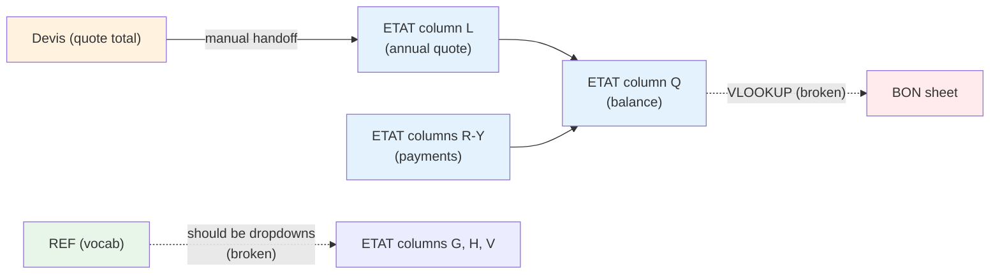

The ETAT sheet is mostly **self-contained** — all its formulas reference cells within the same sheet. The only external references it should be making (via BON's VLOOKUPs) are broken.

## Why the sheet is named "ETAT 20262027"

`ETAT` is French for **statement** or **state** (in the sense of "state of affairs"). Here it means "statement of accounts" for the school year 2026/2027. The previous year's file was probably called `ETAT 20252026` or `Etat General Versement` (which is the name BON's VLOOKUPs still reference — see [[01 - Broken BON Sheet]]).

## Daily operating loop

When the operator sits down to record payments for the day, the loop is:

1. Open `ETAT 20262027`.
2. For each payment received, find the student's row (filter column F by name, or scroll).
3. Type the amount into the appropriate payment column:
   - Registration → R (FI)
   - 2nd tuition installment → S (V2) or T (2V)
   - 3rd tuition installment → U (v3)
   - 1st transport tranche → W (1T)
   - 2nd transport tranche → X (T2)
   - 3rd transport tranche → Y (t3)
   - Psychology session → Z (PSY1) or AA (PSY2)
   - Speech therapy → AB (ORTH1) or AC (ORTH2)
   - E-plant / planning → AD
   - Catch-up class → AE (Ratrapage)
4. Right-click the AM cell on the same row → add a comment with `amount/date/receipt#`.
5. Verify that P (TOTAL VERSEMENTS) updated — it should now include the new amount.
6. Verify that Q (TOTAL*CREANCE) updated — it should now be lower.
7. The green conditional formatting should appear on the cells you populated.

That's it. The whole accounting system runs on those seven steps. See [[03 - Payment Recording]] for the full workflow.

---

**See also**:
- [[01 - Identity (B-K)]]
- [[02 - Quote and Balance (L-Q)]]
- [[03 - Installments (R-Y)]]
- [[04 - Special Services (Z-AE)]]
- [[05 - Term Tracking (AF-AL)]]
- [[06 - Hidden Payment Log (AM)]]
- [[01 - ETAT Core Formulas (L, P, Q)]]
- [[03 - Conditional Formatting]]
- [[03 - Payment Recording]]


========================================================================
 FILE: 02 - Sheets/03 - Devis - Quote Engine.md
   Language: markdown
========================================================================

---
tags:
  - sheet/Devis
  - quote
---

# Devis — The Quote Engine

> [!info] One-line role
> Generates printable annual price quotes for families considering enrollment. Contains 10 independent quote blocks, one per family.

## At a glance

| Property | Value |
|---|---|
| Position in workbook | 3rd tab |
| Size | 480 rows × 26 columns |
| Formulas | 75 |
| Data validations | 5 (all broken) |
| Conditional formatting | 0 |
| Merged cells | ~150 (for layout) |
| Hidden | No |

## What this sheet does

The Devis sheet is a **print-ready quote generator**. Each "block" is a self-contained one-page quote for one family. The school uses it when a family inquires about enrollment: the operator types the family name and one row per child with the chosen services, the formulas compute the total, and the operator prints the page as a formal quote.

The French word `Devis` means **quote** or **estimate** — a document specifying the cost of a service before it's provided. In this workbook, each Devis block is a quote for one year of school for one family.

## The 10 quote blocks

Each block is exactly 48 rows tall, repeated 10 times down the sheet:

| Block | Rows | Devis n° | Client (col B) |
|---|---|---|---|
| 1 | 2–47 | 0101/2021/2022 | MAHAMED OUSSAID |
| 2 | 50–95 | 0102/2021/2022 | KOUBA |
| 3 | 98–143 | 0103/2021/2022 | DJAOUD |
| 4 | 147–192 | 0103/2021/2022 | LOUNA |
| 5 | 195–240 | 0104/2021/2022 | NEGACHE |
| 6 | 245–290 | 0104/2021/2022 | HEBBAZ |
| 7 | 291–336 | 0105/2021/2022 | FOUIDI |
| 8 | 340–385 | 0106/2021/2022 | OUERDAN |
| 9 | 387–432 | 0107/2021/2022 | MEDJKANE |
| 10 | 435–480 | 0107/2021/2022 | KOROGLI |

> [!warning] Stale dates
> The devis numbers and "Validité 30/06/2021" dates are still from the **2021/2022** school year. They were never updated when the workbook was renamed for 2026/2027. See [[03 - Stale 2021-2022 Dates]].

> [!warning] Numbering errors
> Blocks 3 and 4 share the same devis number `0103/2021/2022` — that's a numbering error by the operator. Same for blocks 5/6 (`0104`) and 9/10 (`0107`).

## Block anatomy (using Block 1 as the example)

```
Row  2:   A2='Client'   B2='MAHAMED OUSSAID'      ← family name (typed)
Row  6:   F6='Devis'                              ← title
Row  7:   F7='Devis n°'   I7='0101/2021/2022'     ← quote number (typed)
Row  9:   F9='Date'       I9='=TODAY()'           ← today's date (auto)
Row 11:   F11='Validité '                         ← payment validity date (typed)
Row 13:   A13='Prenom élève'  D13='Classe'  E13='F I'
          F13='Frais Scolarisation'  G13='Services '  I13='Total'   ← column headers
Row 15:   A15='MAHDI'   D15='CM1'   E15=28000   F15=210000
          G15='Transport'   H15=43000   I15='=+SUM(A15:H15)'
Row 16:   A16='AMINE'   E16=18000   F16=125000
          G16='Transport'   H16=43000   I16='=+SUM(A16:H16)'
Row 17:   D17='GS'   E17=18000   F17=125000
          G17='Transport'   H17=43000   I17='=+SUM(A17:H17)'
... rows 18–26: more children (up to 12 per block) ...
Row 27:   G27='Sous-total '   I27='=+SUM(I15:I26)'      ← subtotal
Row 29:   G29='Réduction'    I29=10000                  ← discount (typed)
Row 31:   G31='Montant Total DZD'   I31='=+I27-I29'     ← grand total
Row 35:   A35='Nb 01: une remise de 5% sois'
          D35='=+SUM(F15:F26)*0.05'                     ← 5% early-payment bonus
          E35='est rajoutée si le paiement est effectué en totalité avant le 30 juin 2021'
Row 37:   A37='Nb 02: Toute inscription doit etre confirmée par un versement
                 (frais d'inscription + 1er tranche)'
Row 39:   E39='=18000*2+28000+21000+25000'   ← sanity check: recomputes sum of FIs
Row 41:   A41='Note'
Row 42:   A42='Paiement par chèque, bien notifié l'ordre "Sarl Elimtiyaz"'
Row 43:   A43='Versement ou du virement bancaire nous renvoyer par mail
                 une copie du bordereau de versement'
Row 44:   A44='RIB:00400141400004179159'
```

## The five column types in each child row

| Column | Header | What it holds | Example |
|---|---|---|---|
| A | Prenom élève | Child's first name (typed) | `MAHDI` |
| D | Classe | Class code (typed, should be dropdown) | `CM1` |
| E | F I | Frais d'Inscription (registration fee) | `28000` |
| F | Frais Scolarisation | Annual tuition | `210000` |
| G | Services | Service type (Transport, PSY, ORTH, etc.) | `Transport` |
| H | (amount) | Service amount | `43000` |
| I | Total | Auto-summed row total (formula) | `=+SUM(A15:H15)` |

> [!note] Sum range quirk
> The `I` formula sums columns A through H, but columns A, D, and G contain text — so in practice it's `E + F + H`. Excel silently ignores text in SUM ranges.

## The five formula patterns per block

See [[03 - Devis Block Formulas]] for the full breakdown. Quick summary:

1. **Line total** (`I15`, `I16`, …): `=+SUM(A15:H15)` — adds the registration + tuition + service amount for one child.
2. **Subtotal** (`I27`): `=+SUM(I15:I26)` — adds up all the children's line totals.
3. **Grand total** (`I31`): `=+I27-I29` — subtotal minus discount. Some blocks also subtract a reimbursement row: `=+I27-I29-I30`.
4. **5% early-payment bonus** (`D35`): `=+SUM(F15:F26)*0.05` — 5% of total tuition, shown as an extra discount if paid before June 30.
5. **FI sanity check** (`E39`): `=18000*2+28000+21000+25000` — operator's manual verification that the FI column adds up to the expected total.

## Data validations (dropdowns) — all broken

Five dropdown lists are configured for each block's input cells:

| Dropdown | Targets | Formula1 | Should hold | Status |
|---|---|---|---|---|
| Classe | D15:D24 (and 9 other blocks) | `CLASSE` | Class codes | broken |
| F I | E15:E24 (and 9 other blocks) | `FI` | Fee tiers | broken |
| Frais Scolarisation | F15:F24 (and 9 other blocks) | `FRAISSCOLAIRE` | Tuition tiers | broken |
| Services | G15:G23 (and 9 other blocks) | `SERVICE` | Service types | broken |
| Services amount | H15:H24 (and 9 other blocks) | `transport` | Transport tiers | broken |

All five reference named ranges that **don't exist anywhere in the workbook**. When you click any of these cells, the dropdown is empty. The operators must type values by hand.

See [[02 - Missing Devis Dropdowns]] for the full diagnosis and how to fix it by adding the missing lists to the REF sheet.

## Merged cells — why there are so many

The ~150 merged cell ranges exist purely for **print layout**. The sheet is meant to be printed as a one-page quote, so:

- `B2:D2` merges to give the family name a wide centered title.
- `A13:C13`, `G13:H13` etc. merge the column headers to align with the data below.
- `A22:B22`, `A23:B23` etc. merge the payment-history labels (in BON, not Devis — but same idea).
- The footer notes (`A41:A44`) span multiple rows for readability.

If you're just reading the data, ignore the merges — they're cosmetic.

## The two embedded images

The xlsx archive contains two image files:
- `xl/media/image1.jpg`
- `xl/media/image2.jpg`

These are likely the school logo and possibly a header/footer image placed at the top of each Devis block for branding the printed quote. They don't affect any formula.

## How Devis connects to the rest of the workbook

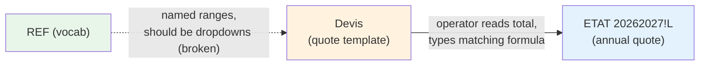

**Output**: the printed quote (rows 2–47 of each block).
**Side output**: the grand total value, which the operator carries over manually to `ETAT 20262027!L` for each enrolled student.

**No formula reads from Devis**. The sheet is a self-contained mini-app: type inputs, get printed output.

## Worked example — Block 3 (DJAOUD family)

From the actual file:

| Cell | Value |
|---|---|
| B98 | `DJAOUD` |
| I103 | `0103/2021/2022` |
| A111 | `SARA` |
| D111 | `2AM` |
| E111 | `28000` |
| F111 | `250000` |
| A112 | `YASMINE` |
| D112 | `CE2` |
| E112 | `28000` |
| F112 | `205000` |
| I123 | `=+SUM(I111:I122)` → 511,000 (subtotal) |
| G125 | `Réduction` |
| I125 | `32500` (discount) |
| G126 | `REMBOURCEMENT` |
| I126 | `70000` (refund) |
| G128 | `Montant Total DZD` |
| I128 | `=+I123-I125-I126` → **408,500** (grand total) |

So the DJAOUD family is quoted 408,500 DZD for two children for the year, after a 32,500 discount and a 70,000 reimbursement (probably a credit from overpayment the previous year).

## Special oddities

### Block 9 (MEDJKANE) — side calculation in column M

Rows 399–400 have unexpected formulas in column M:
- `M399: =200000+8000+6000+6000` (= 220,000)
- `M400: =200000+12000+9000+9000` (= 230,000)

These don't fit the standard block template. They appear to be the operator doing a side calculation — possibly comparing two scenarios for tuition + extras for the two MEDJKANE children. They have no effect on the quote total (which lives in column I).

### Inconsistent "REMBOURCEMENT" spelling

Across the 10 blocks, the refund row is labeled variously as:
- `REMBOURCEMENT` (Blocks 3, 4)
- `REMBOURCEMENT` (most blocks)
- `ROUMBOURSSEMENT` (Blocks 7, 8 — note: this is a typo, should be REMBOURSEMENT)

The misspelling `REMBOURCEMENT` (with a C instead of S) is consistent enough that it appears to be the operator's preferred spelling — and it has propagated into the ETAT sheet's column M header too. See [[06 - French Terms Glossary]].

### Block 9 has no "Réduction" label

Block 9 (rows 387–432) skips the discount row entirely and just has `I414 = 5000` typed directly without a label. This is a minor template inconsistency.

## Why the sheet is named "Devis"

`Devis` is the French word for **quote** or **estimate** (in the business sense). It's standard terminology in French-speaking small businesses for a document specifying the cost of goods or services before they're provided. The school uses it because the family needs a formal priced document before they decide to enroll.

---

**See also**:
- [[03 - Devis Block Formulas]] — every formula pattern in detail
- [[02 - Missing Devis Dropdowns]] — why the dropdowns are empty
- [[05 - Price Table]] — what each fee amount means
- [[03 - Stale 2021-2022 Dates]] — why the dates still say 2021
- [[01 - ETAT Core Formulas (L, P, Q)]] — how the Devis total is reconstructed on the ETAT sheet
- [[01 - New Family Inquiry]] — how the operator uses Devis in practice


========================================================================
 FILE: 02 - Sheets/04 - BON - Client Statement.md
   Language: markdown
========================================================================

---
tags:
  - sheet/BON
  - statement
  - issue
---

# BON — The Client Statement

> [!danger] One-line role
> A print template that should produce a one-page customer statement for any family, showing their annual quote, total paid, remaining balance, and 10 lines of payment history. **Currently entirely broken — every formula returns `#REF!`.**

## At a glance

| Property | Value |
|---|---|
| Position in workbook | 2nd tab (sheet name has a trailing space: `"BON "`) |
| Size | 45 rows × 26 columns |
| Formulas | 16 (all broken) |
| Data validations | 1 (broken — references the missing `parent` named range) |
| Conditional formatting | 0 |
| Merged cells | 18 (for layout) |
| Hidden | No |

## What this sheet is supposed to do

The BON sheet is a **printable client statement** — what the school gives to a family when they ask "how much have I paid and what do I still owe?". The operator types the family name into one cell, the formulas look up the data in the master ledger, and the result is a clean one-page summary suitable for printing and handing to the parent.

The sheet's title (in cell A4) is `"Situation Client 2021-2022"` — note the stale year (see [[03 - Stale 2021-2022 Dates]]).

## Layout

```
Row 4:   A4='Situation Client 2021-2022'    (merged A4:J6, the page title)
Row 7:   A7='Etat des versements'           (subtitle: "statement of payments")

Row 8:   E8='CLIENT'   F8=[INPUT]   H8='DATE'   I8='=TODAY()'
                       ↑ operator types family name here

Row 10:  A10='DEVIS ANNUEL'  C10=[VLOOKUP]  E10='ELEVES'  G10='DEVIS'
         H10='TOTAL VERSE'   I10='RESTE VERSE'

Row 12:  E12=[INPUT student 1 name]  H12=[VLOOKUP]  I12=[VLOOKUP]
Row 13:  E13=[INPUT student 2 name]  H13=[VLOOKUP]  I13=[VLOOKUP]

Row 15:  A15='2EME TRANCHE'    (label only)
Row 17:  A17='3ème TRANCHE'    (label only)
Row 19:  A19='4ème TRANCHE'    (label only)

Row 20:  A20='Historique Reglements '   (section: payment history)

Row 22:  A22=[VLOOKUP - pulls column 33 from main ledger]
Row 23:  A23=[VLOOKUP - pulls column 34]
Row 24:  A24=[VLOOKUP - pulls column 35]
Row 25:  A25=[VLOOKUP - pulls column 36]
Row 26:  A26=[VLOOKUP - pulls column 37]
Row 27:  A27=[VLOOKUP - pulls column 38]
Row 28:  A28=[VLOOKUP - pulls column 39]
Row 29:  A29=[VLOOKUP - pulls column 40]
Row 30:  A30=[VLOOKUP - pulls column 41]
Row 31:  A31=[VLOOKUP - pulls column 42]
```

## All 16 formulas

| Cell | Formula | Purpose |
|---|---|---|
| `I8` | `=TODAY()` | Today's date — print date |
| `C10` | `=+VLOOKUP(F8,'PAR PARENT'!A4:E785,2,0)` | Look up the family's annual quote by name in F8 |
| `H12` | `=+VLOOKUP(E12,'PAR PARENT'!A4:E785,3,0)` | Look up student 1's quote |
| `I12` | `=+VLOOKUP(E12,'PAR PARENT'!A4:K786,6,0)` | Look up student 1's total paid |
| `H13` | `=+VLOOKUP(E13,'PAR PARENT'!A5:E786,3,0)` | Look up student 2's quote |
| `I13` | `=+VLOOKUP(E13,'PAR PARENT'!A5:K787,6,0)` | Look up student 2's total paid |
| `A22` | `=+VLOOKUP(F8,'Etat General Versement'!G7:AS1255,33,0)` | Payment history line 1 |
| `A23` | `=+VLOOKUP(F8,'Etat General Versement'!G7:AS1255,34,0)` | Payment history line 2 |
| `A24` | `=+VLOOKUP(F8,'Etat General Versement'!G7:AS1255,35,0)` | Payment history line 3 |
| `A25` | `=+VLOOKUP(F8,'Etat General Versement'!G7:AS1255,36,0)` | Payment history line 4 |
| `A26` | `=+VLOOKUP(F8,'Etat General Versement'!G7:AS1255,37,0)` | Payment history line 5 |
| `A27` | `=+VLOOKUP(F8,'Etat General Versement'!G7:AS1255,38,0)` | Payment history line 6 |
| `A28` | `=+VLOOKUP(F8,'Etat General Versement'!G7:AS1255,39,0)` | Payment history line 7 |
| `A29` | `=+VLOOKUP(F8,'Etat General Versement'!G7:AS1255,40,0)` | Payment history line 8 |
| `A30` | `=+VLOOKUP(F8,'Etat General Versement'!G7:AS1255,41,0)` | Payment history line 9 |
| `A31` | `=+VLOOKUP(F8,'Etat General Versement'!G7:AS1255,42,0)` | Payment history line 10 |

## Why every formula returns `#REF!`

The formulas reference two sheets that **do not exist** in this workbook:

### 1. `'PAR PARENT'` — referenced by C10, H12, I12, H13, I13

This sheet name (French for "by parent") suggests it was a summary sheet that grouped students by parent. It probably had columns like:
- A: parent name (the lookup key)
- B: annual quote total for the family
- C: per-student quote
- D–E: more family-level data
- F–K: per-student payment data

When the workbook was restructured for 2026/2027, this sheet was deleted entirely. The BON formulas still reference it, so they all return `#REF!`.

### 2. `'Etat General Versement'` — referenced by A22:A31

This is the **old name** of what is now the `ETAT 20262027` sheet. The French phrase `Etat General Versement` translates to "General Statement of Payments" — exactly what the ETAT 20262027 sheet is.

When the sheet was renamed from `Etat General Versement` to `ETAT 20262027` (to reflect the new school year), the BON formulas weren't updated to follow.

## The data validation (also broken)

```
type=list  formula1='parent'  ranges=E12:E13, F8  allow_blank=True  showErrorMessage=True
```

The dropdown on the input cells (F8 client name, E12/E13 student names) uses the named range `parent`. But:

- The named range `parent` is defined in `workbook.xml` as `#REF!` — it points to a deleted range.
- So the dropdown is empty when you click it.
- `showErrorMessage=True` means Excel would normally reject typed input that's not in the dropdown list — but since the list is empty (broken), it lets anything through.

See [[01 - Named Ranges]] for the full list of named ranges and which ones are broken.

## What the formulas *should* be doing (intent)

Even though they're broken, the formulas tell us what the sheet was designed to do:

### C10 — annual quote lookup

```
=+VLOOKUP(F8,'PAR PARENT'!A4:E785,2,0)
```

This says: "Take the family name in F8, search for it in column A of the (deleted) PAR PARENT sheet, and return the value from the 2nd column of that sheet (the family's total annual quote)."

The intent: pull the family's annual quote automatically so the operator doesn't have to retype it.

### H12 / I12 — per-student lookup

```
H12: =+VLOOKUP(E12,'PAR PARENT'!A4:E785,3,0)   ← student 1's quote
I12: =+VLOOKUP(E12,'PAR PARENT'!A4:K786,6,0)   ← student 1's total paid
```

Take the student name in E12, look them up in PAR PARENT, return their individual quote (column 3) and total paid (column 6).

### A22:A31 — payment history

```
A22: =+VLOOKUP(F8,'Etat General Versement'!G7:AS1255,33,0)
A23: =+VLOOKUP(F8,'Etat General Versement'!G7:AS1255,34,0)
...
A31: =+VLOOKUP(F8,'Etat General Versement'!G7:AS1255,42,0)
```

Look up the family name in column G of the main ledger (column G is "niveau" in the current sheet — that looks wrong; the lookup key column probably changed too). Return columns 33 through 42 of that row — which would be the rightmost columns of the sheet (the term-tracking columns AF–AO in the current layout).

The intent: pull 10 columns of payment history (probably the September/December/Mars term breakdowns) and display them as a list.

## What's actually in BON today

Because every formula returns `#REF!`, the sheet is effectively a **print template with no data behind it**. The operator has three options:

1. **Don't use BON at all** — print directly from `ETAT 20262027` (filter column E by parent name).
2. **Manually type the values into BON** — defeats the purpose of having formulas.
3. **Fix the formulas** — see [[01 - Broken BON Sheet]] for the repair procedure.

## Why the sheet is named "BON"

`BON` is French shorthand for **Bon de commande** (order form) or **Bon de livraison** (delivery note) or **Bon de caisse** (cash receipt). In this context, it appears to mean **Bon de situation** — a "statement slip" — a one-page document the school gives to parents showing their account status.

> [!note] Trailing space in sheet name
> The trailing space in the sheet name (`"BON "` not `"BON"`) is a minor cosmetic issue but can cause confusion when referencing the sheet in formulas — you need `'BON '!A1` (with the space and quotes), not `BON!A1`.

## Merged cells — print layout

The 18 merged ranges exist purely for **print layout**:
- `A4:J6` — the page title spans the full width and three rows.
- `A7:B7`, `A22:B22` … `A31:B31` — labels span two columns to give them room.
- `C10:D10`, `C13:D13` etc. — values span two columns to fit large currency amounts.
- `F8:G8` — the client name input spans two columns.

If you're reading the data, ignore the merges — they're cosmetic.

## What BON needs to be repaired

To make BON functional again, you'd need to:

1. **Repoint the VLOOKUP formulas** to the current sheet names:
   - Replace `'PAR PARENT'!A4:E785` with `'ETAT 20262027'!$E$2:$L$404` (or similar) for the family lookup.
   - Replace `'Etat General Versement'!G7:AS1255` with `'ETAT 20262027'!$F$2:$AL$404` for the per-student lookup.
   - Update the column indices in the VLOOKUPs to match the new layout.

2. **Recreate or repoint the `parent` named range** so the F8 dropdown works. The cleanest fix is to make `parent` point to `'ETAT 20262027'!$E:$E` (the TUTEUR column) — but that column has duplicates, so it would be better to point it at a unique parent list.

3. **Recreate the missing `PAR PARENT` sheet** — a small summary table with one row per parent, summing the quotes and payments of their children. This is what BON was designed to read from.

4. **Update the title in A4** from "Situation Client 2021-2022" to "Situation Client 2026-2027".

See [[01 - Broken BON Sheet]] for the full step-by-step repair guide.

---

**See also**:
- [[01 - Broken BON Sheet]] — full diagnosis and repair procedure
- [[01 - Named Ranges]] — why the `parent` named range is broken
- [[02 - ETAT - Master Ledger]] — the sheet BON should be pulling from
- [[03 - Stale 2021-2022 Dates]] — the year-label issue
- [[04 - Customer Statement]] — what the operator is supposed to do with BON


========================================================================
 FILE: 03 - ETAT Columns/00 - ETAT Columns MOC.md
   Language: markdown
========================================================================

---
tags:
  - moc
  - columns
  - sheet/ETAT
---

# ETAT Columns MOC

The [[02 - ETAT - Master Ledger|ETAT 20262027]] sheet has 38 active columns (B through AL, plus the hidden AM). They group into six logical blocks, each with a different purpose.

## Column map

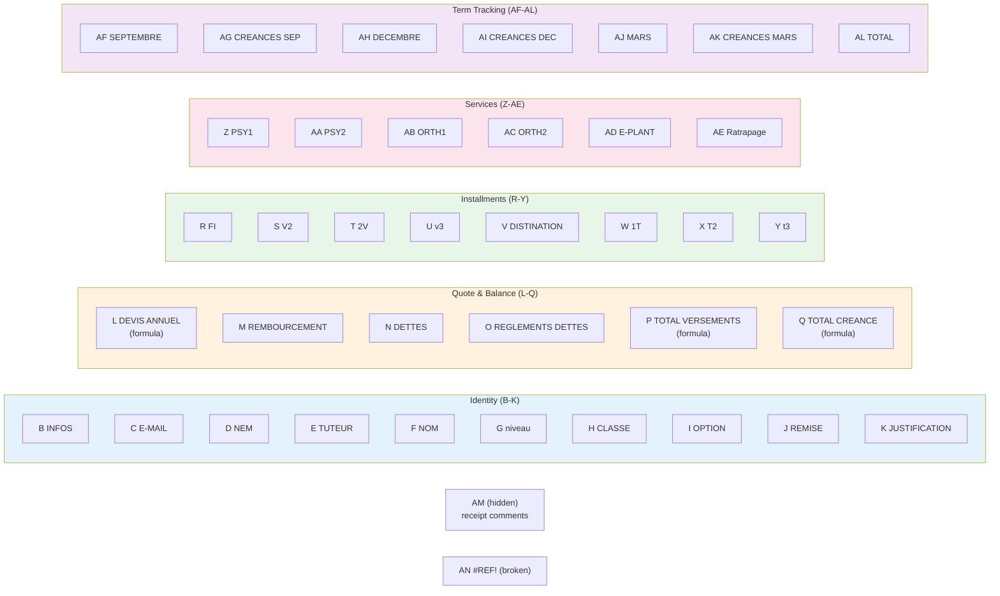

## Notes in this section

1. [[01 - Identity (B-K)]] — phone, email, tutor, name, level, class, option, discount, justification. Typed once at enrollment.
2. [[02 - Quote and Balance (L-Q)]] — the core financial calculation: annual quote (L), adjustments (M, N, O), total paid (P), balance owed (Q).
3. [[03 - Installments (R-Y)]] — the seven payment columns that feed into P.
4. [[04 - Special Services (Z-AE)]] — optional services (PSY, ORTH, E-PLANT, Ratrapage). Tracked but not in P or Q.
5. [[05 - Term Tracking (AF-AL)]] — September/December/Mars payment tracking. Almost entirely empty.
6. [[06 - Hidden Payment Log (AM)]] — cell comments containing payment receipt details. The audit trail.

## At a glance

| Group | Cols | Type | Used in formulas? |
|---|---|---|---|
| Identity | B–K | Typed at enrollment | Only J (REMISE) feeds L; only E (TUTEUR) and F (NOM) feed BON (broken) |
| Quote & Balance | L–Q | L is hand-typed formula; M, N, O typed; P, Q auto | L, P, Q are the engine — see [[01 - ETAT Core Formulas (L, P, Q)]] |
| Installments | R–Y | Typed as payments arrive | All 7 payment columns feed P |
| Services | Z–AE | Typed as services are billed | **Not used in any formula** — informational only |
| Term Tracking | AF–AL | (intended for term bucketing) | **Not used in any formula** — almost entirely empty |
| Hidden Log | AM | Cell comments | **Not used in any formula** — audit trail only |

## Related sections

- [[00 - Formulas MOC]] — how L, P, Q (and J, S) work
- [[00 - Codes MOC]] — what the codes in G, H, I, V mean
- [[00 - Hidden Logic MOC]] — named ranges, validations, formatting


========================================================================
 FILE: 03 - ETAT Columns/01 - Identity (B-K).md
   Language: markdown
========================================================================

---
tags:
  - columns
  - identity
  - sheet/ETAT
---

# Identity Columns (B–K)

The first block of columns on [[02 - ETAT - Master Ledger|ETAT 20262027]] holds the student's **identity and enrollment attributes**. These are typed by hand when the student is enrolled and rarely changed afterward.

## Column reference

| Column | Letter | Header | Type | Meaning |
|---|---|---|---|---|
| 1 | A | *(empty)* | — | Reserved / spacer column. No header, no data. |
| 2 | B | `INFOS` | text | Free-text notes about the family — typically used for special circumstances (e.g., "divorced parents", "siblings at the school", "scholarship family"). |
| 3 | C | `E-MAIL` | text | Email contact for the family. |
| 4 | D | `NEM` | text | **Numéro** (phone number). Often two numbers separated by `/` (e.g., `0663701834/0660800317` for two parents). Sometimes a single 9-digit number (e.g., `770264718`) — possibly a legacy landline. |
| 5 | E | `TUTEUR` | text | **Tutor / guardian** — the parent or legal guardian responsible for the student. Usually just the family name (e.g., `ABDELAOUI`, `BELRECHID`). This is the field used to group siblings. |
| 6 | F | `NOM` | text | **Name** — the student's full name (e.g., `ZIREG LEA`, `MERABTI RIHAM`). Always in `LASTNAME FIRSTNAME` order. |
| 7 | G | `niveau` | code | **Level** — the broad school level: PRIM (primary), COLG (collège), LYC (lycée), GS/MS (pre-school), AUTISTE. See [[01 - Level Codes (niveau)]]. |
| 8 | H | `CLASSE` | code | **Class** — the specific class within the level: CP, CE1, CM2, 1AAM, 3AP, etc. See [[02 - Class Codes (CLASSE)]]. |
| 9 | I | `OPTION` | code | **Option** — usually `TRNSP` (transport needed), occasionally `TENSP` or `TRNP` (variants, probably typos). See [[04 - Option Codes]]. |
| 10 | J | `REMISE` | number / formula | **Discount** — the discount applied to the annual quote. Often a literal number (e.g., `25500`) but frequently an arithmetic formula like `=5000+10000+10000` showing the components. See [[02 - REMISE and Installment Shortcuts (J, S)]]. |
| 11 | K | `JUSTIFICATION` | text | Free-text explanation for the discount — e.g., "3rd child", "staff family", "early payment". Currently mostly empty in the 2026/2027 file. |

## How these columns are used

### Identity (B–F) — typed once at enrollment

These are the **demographic core** of the ledger. The operator types them once when the student enrolls and rarely touches them again. They're used for:

- **Filtering** (e.g., "show me all students in CE1" → filter column H)
- **Grouping** (e.g., "show me all the ABDELAOUI children" → filter column E)
- **Contact** (phone in D, email in C)
- **Notes** (B)

### Classification (G–I) — drive pricing

These three columns determine what fee components apply to the student:

- **G (niveau)** determines the registration fee tier (PRIM uses 25,000, COLG uses 30,000, pre-school uses 18,000).
- **H (CLASSE)** determines the tuition tier (CP = 205,000, CM2 = 220,000, 1AAM = 305,000, etc.).
- **I (OPTION)** determines whether transport is added (TRNSP → add 35,000–55,000 depending on destination).

The operator uses these to decide what formula to type in column L. There's no automatic lookup — it's a manual decision based on the student's classification.

### Adjustment (J–K) — applied as a reduction

The discount in column J is subtracted from the sum of fee components in column L. The justification in K is human-readable context for why the discount exists.

## The OPTION codes

| Code | Meaning | Frequency |
|---|---|---|
| `TRNSP` | Transport — the student uses the school's transport service | 121 |
| `TENSP` | Possibly "transport + enseignement" or a typo of TRNSP | 4 |
| `TRNP` | Likely a typo of TRNSP (missing S) | 1 |
| *(empty)* | No option — student doesn't use transport | ~264 |

The vast majority of empty OPTION cells mean "no transport" rather than missing data.

See [[04 - Option Codes]] for more.

## Why column A is empty

Column A is left empty as a **spacer** — a common Excel pattern to give the sheet a left margin when printed or viewed. It's also useful because the auto-filter on `$A$1:$AN$404` uses A1 as its anchor.

## What's missing from the identity block

A few fields you might expect but won't find:

- **Date of birth** — not tracked.
- **Gender** — not tracked.
- **Address** — only the transport destination town is tracked (column V).
- **Enrollment date** — not tracked.
- **Previous school** — not tracked.
- **Emergency contact** — only the phone numbers in D.

The school clearly treats the ledger as a **financial** record, not a student record. Academic and demographic details would live in a separate system.

## Sample rows

Here's the identity block for the first 6 students (rows 2–7 of the actual file):

| Row | D (NEM) | F (NOM) | G (niveau) | H (CLASSE) | I (OPTION) | J (REMISE) |
|---|---|---|---|---|---|---|
| 2 | 0663701834/0660800317 | ZIREG LEA | PRIM | CE1 | — | 25500 |
| 3 | 799534750/558498673 | MERABTI RIHAM | PRIM | CE1 | TRNSP | 25500 |
| 4 | 770264718 | BOUAICHA ACIL | PRIM | CE1 | — | 5000 |
| 5 | 795144767 | SEDIKI ISHAK | COLG | 1AAM | TRNSP | `=5000+10000+10000` |
| 6 | 795144767 | SEDIKI YAKOUB | PRIM | CE1 | TRNSP | 10000 |
| 7 | — | ZERGANI MAHDI | — | CM2 | — | `=20000+25000` |

> [!note] Siblings share phone numbers
> Note rows 5 and 6 share the same phone number (795144767) — they're siblings in the same family. Note row 7 has no phone, no level — the operator skipped some fields.

## Where each value goes next

| Column | Used by | How |
|---|---|---|
| B (INFOS) | nowhere — purely informational | — |
| C (E-MAIL) | nowhere — purely informational | — |
| D (NEM) | nowhere — purely informational | — |
| E (TUTEUR) | BON!F8 (lookup key) | VLOOKUP — currently broken |
| F (NOM) | BON!E12/E13 (lookup key) | VLOOKUP — currently broken |
| G (niveau) | nowhere — informs operator's choice of L formula | manual |
| H (CLASSE) | nowhere — informs operator's choice of L formula | manual |
| I (OPTION) | nowhere — informs operator's choice of L formula (whether to add transport) | manual |
| J (REMISE) | L formula (subtracted) | automatic via `-J2` term |
| K (JUSTIFICATION) | nowhere — purely informational | — |

So the only identity columns that **actually drive a formula** are E (TUTEUR, used by BON's broken VLOOKUPs) and J (REMISE, used by L). The rest are informational and serve the operator's manual decision-making.

---

**See also**:
- [[02 - Quote and Balance (L-Q)]]
- [[01 - Level Codes (niveau)]]
- [[02 - Class Codes (CLASSE)]]
- [[04 - Option Codes]]
- [[02 - REMISE and Installment Shortcuts (J, S)]]
- [[06 - French Terms Glossary]]


========================================================================
 FILE: 03 - ETAT Columns/02 - Quote and Balance (L-Q).md
   Language: markdown
========================================================================

---
tags:
  - columns
  - quote
  - balance
  - sheet/ETAT
  - formula
---

# Quote and Balance Columns (L–Q)

The second block of columns on [[02 - ETAT - Master Ledger|ETAT 20262027]] holds the **core financial calculation**: the annual quote, adjustments, and the resulting balance. This is where the workbook's engine lives.

## Column reference

| Column | Letter | Header | Type | Meaning |
|---|---|---|---|---|
| 12 | L | `DEVIS ANNUEL` | formula | **Annual quote** — the total amount the family owes for this student for the year. Built from registration + tuition + transport − discount. |
| 13 | M | `REMBOURCEMENT` | number | **Reimbursement** — money the school owes back to the family (e.g., overpayment from a prior year). Note: misspelled (should be REMBOURSEMENT). |
| 14 | N | `DETTES` | number | **Debts** — unpaid amounts from prior years, carried forward. |
| 15 | O | `REGLEMENTS DETTES` | number | **Debt payments** — payments made toward the prior-year debts in N. |
| 16 | P | `TOTAL VERSEMENTS` | formula | **Total payments** — sum of all installments paid this year (R + S + T + U + W + X + Y). |
| 17 | Q | `TOTAL*CREANCE` | formula | **Total receivable** — outstanding balance owed: `L − P`. |

## Column L — DEVIS ANNUEL (the most important formula)

**Header**: "DEVIS ANNUEL" = **Annual Quote** (French: *devis annuel*).

**What it holds**: a formula that adds the registration fee, the tuition, and (if applicable) the transport, then subtracts the discount. There are **387 formulas** and 3 literal numbers in column L across the 390 active student rows.

**The formula pattern** (see [[01 - ETAT Core Formulas (L, P, Q)]] for full detail):

```
L2:  =25000+205000+35000-J2
```

Decoded:
- `25000` = registration fee (Frais d'Inscription, FI) for a primary student
- `205000` = tuition (Frais Scolarisation) for a primary student
- `35000` = transport (Transport) for a nearby town
- `-J2` = subtract the discount typed in column J of the same row
- Result = 265,000 − 25,500 = 239,500 DZD owed for the year

The numeric components are picked from the [[05 - Price Table]] based on the student's level (G), class (H), and option (I). There's no automatic lookup — the operator chooses the components and types the formula by hand.

**Where it goes next**: Q (TOTAL*CREANCE) reads L via `=L2-P2`.

## Column M — REMBOURCEMENT (reimbursement)

**Header**: "REMBOURCEMENT" — a misspelling of **Remboursement** (French for reimbursement). This misspelling is consistent across the workbook (also in Devis blocks and the REF sheet's conceptual design).

**What it holds**: a number representing money the school owes back to the family. Common reasons:
- Family overpaid last year and is owed a credit.
- Family withdrew a child mid-year and is owed a prorated refund.
- School awarded a retroactive discount.

**Where it goes next**: in the Devis sheet, the reimbursement is subtracted from the subtotal to compute the grand total: `=+I27-I29-I30` (subtotal − discount − reimbursement). On the ETAT sheet, M is **not currently used by any formula** — it's stored for reference only.

> [!note] Inconsistency between Devis and ETAT
> This is a small inconsistency between the two sheets: Devis subtracts REMBOURCEMENT from the total, but ETAT does not. If you wanted them to match, you'd change the L formula to also subtract M, e.g., `=25000+205000+35000-J2-M2`.

## Column N — DETTES (prior-year debts)

**Header**: "DETTES" = **Debts** (French: *dettes*).

**What it holds**: unpaid amounts from prior school years, carried forward into this year's balance. This typically happens when a family didn't fully pay last year's tuition and the school allowed them to enroll again this year with the balance outstanding.

**Where it goes next**: nowhere — N is not currently used by any formula. Like M, it's stored for reference.

> [!note] Conceptual vs actual formula
> If you wanted Q to include prior-year debts, you'd change the formula from `=L-P` to `=L+N-P-O` (annual quote + prior debts − payments − debt payments). The conceptual summary that inspired this vault guessed that Q already included DETTES — see [[01 - ETAT Core Formulas (L, P, Q)]] for why that's not the case in the actual file.

## Column O — REGLEMENTS DETTES (debt payments)

**Header**: "REGLEMENTS DETTES" = **Debt payments** (French: *règlements dettes*).

**What it holds**: payments made specifically toward the prior-year debts tracked in N. This is separate from current-year payments (R–Y) so the operator can see at a glance how much of the old debt has been cleared.

**Where it goes next**: nowhere — O is not used by any formula in the current file. Conceptually, it should reduce the outstanding debt in N, but no formula enforces this.

## Column P — TOTAL VERSEMENTS (total paid this year)

**Header**: "TOTAL VERSEMENTS" = **Total Payments** (French: *total versements*).

**What it holds**: a formula summing this year's payment columns. There are **403 formulas** (one per active student row).

**The formula** (see [[01 - ETAT Core Formulas (L, P, Q)]]):

```
P2:  =R2+S2+T2+U2+W2+X2+Y2
```

Decoded:
- `R2` (FI) — registration fee paid
- `S2` (V2) — 2nd installment paid
- `T2` (2V) — alternate 2nd installment paid (rarely used)
- `U2` (v3) — 3rd installment paid
- `W2` (1T) — 1st transport tranche paid
- `X2` (T2) — 2nd transport tranche paid
- `Y2` (t3) — 3rd transport tranche paid

Note: P does **not** include the special-service columns (Z–AE: PSY1, PSY2, ORTH1, ORTH2, E-PLANT, Ratrapage). Those are tracked separately and don't count toward the core annual fee payment.

**Where it goes next**: Q (TOTAL*CREANCE) reads P via `=L2-P2`.

## Column Q — TOTAL*CREANCE (balance owed)

**Header**: "TOTAL*CREANCE" — the asterisk is probably a typo or formatting artifact. Should be "TOTAL CREANCE" = **Total Receivable** (French: *total créance*).

**What it holds**: a formula computing the outstanding balance. There are **403 formulas**.

**The formula** (see [[01 - ETAT Core Formulas (L, P, Q)]]):

```
Q2:  =L2-P2
```

Decoded: `annual quote − total paid = balance owed`.

This is the **single most important output of the entire workbook**. When the school wants to know "who owes what", they look at column Q. When the operator wants to chase unpaid balances, they filter or sort by Q descending.

**Edge cases**:
- If `Q = 0`: family has paid in full.
- If `Q > 0`: family still owes money (the normal case).
- If `Q < 0`: family has overpaid (rare; should trigger a reimbursement in column M).

## How the six columns fit together

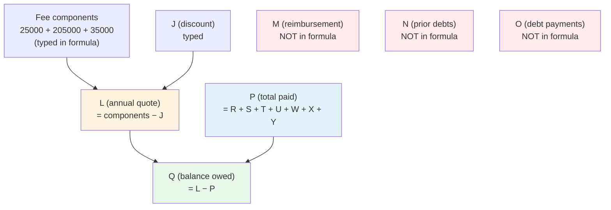

## Sample rows

Here's the L–Q block for the first 4 students (rows 2–5 of the actual file):

| Row | L (DEVIS) | M | N | O | P (PAID) | Q (BALANCE) |
|---|---|---|---|---|---|---|
| 2 | `=25000+205000+35000-J2` → 239,500 | — | — | — | `=R2+S2+T2+U2+W2+X2+Y2` | `=L2-P2` |
| 3 | `=25000+205000+35000+55000-J3` → 294,500 | — | — | — | `=R3+S3+T3+U3+W3+X3+Y3` | `=L3-P3` |
| 4 | `=25000+205000+35000-J4` → 240,000 | — | — | — | `=R4+S4+T4+U4+W4+X4+Y4` | `=L4-P4` |
| 5 | `=25000+305000+52000` → 382,000 | — | — | — | `=R5+S5+T5+U5+W5+X5+Y5` | `=L5-P5` |

Row 2: ZIREG LEA, primary, no transport, 25,500 discount → quote 239,500.
Row 3: MERABTI RIHAM, primary, with transport to DJENAT, 25,500 discount → quote 294,500 (includes 55,000 transport for the farthest tier).
Row 4: BOUAICHA ACIL, primary, no transport, 5,000 discount → quote 240,000.
Row 5: SEDIKI ISHAK, collège (1AAM), with transport to BOUDOUAOU, no discount shown in formula → quote 382,000 (25K reg + 305K tuition + 52K transport).

## Why columns M, N, O exist but aren't used

Looking at the formula structure, it's clear the workbook was designed to track prior-year debts separately (columns N and O) and reimbursements (column M) — but the L and Q formulas were never extended to actually incorporate them. So those three columns are **informational only** in the current file.

This is a common pattern in spreadsheets that have evolved over time: new columns are added to track new concepts, but the existing formulas aren't updated to use them. The result is data that's collected but doesn't affect the calculations.

If you wanted to make the ledger more accurate, you'd:

1. Update the L formula to also subtract M (reimbursement): `=25000+205000+35000-J2-M2`
2. Update the Q formula to also add N (prior debts) and subtract O (debt payments): `=L2+N2-P2-O2`

But this is a non-trivial change — you'd want to verify every row's data first.

---

**See also**:
- [[01 - Identity (B-K)]]
- [[03 - Installments (R-Y)]]
- [[01 - ETAT Core Formulas (L, P, Q)]]
- [[05 - Price Table]]
- [[06 - French Terms Glossary]]


========================================================================
 FILE: 03 - ETAT Columns/03 - Installments (R-Y).md
   Language: markdown
========================================================================

---
tags:
  - columns
  - installments
  - payments
  - sheet/ETAT
---

# Installment Columns (R–Y)

The third block of columns on [[02 - ETAT - Master Ledger|ETAT 20262027]] holds the **installment payments** — the actual money the family has paid throughout the year, broken down by tranche.

## Column reference

| Column | Letter | Header | Full French term | Meaning |
|---|---|---|---|---|
| 18 | R | `FI` | Frais d'Inscription | **Registration fee** paid (always 25,000 DZD for primary, 30,000 for collège/lycée, 18,000 for pre-school). |
| 19 | S | `V2` | Versement 2 | **2nd installment** of tuition. Usually the largest single payment. |
| 20 | T | `2V` | (unclear — possibly "2ème Versement" variant) | Alternate 2nd installment field — used when there are two separate 2nd-tranche payments. Rarely populated. |
| 21 | U | `v3` | Versement 3 | **3rd installment** of tuition. |
| 22 | V | `DISTINATION` | Destination (misspelling of "Destination") | **Transport destination town** — the town the student is bused to/from. Not a payment; an attribute. |
| 23 | W | `1T` | Tranche 1 Transport | **1st transport tranche** paid. |
| 24 | X | `T2` | Tranche 2 Transport | **2nd transport tranche** paid. |
| 25 | Y | `t3` | Tranche 3 Transport | **3rd transport tranche** paid. |

## Two parallel payment tracks

The payment columns split into two parallel tracks:

### Track 1 — Tuition (R, S, T, U)

These four columns track payments toward the **annual tuition + registration**. The standard payment plan is:

1. **R (FI)** — registration fee, due at enrollment (typically September)
2. **S (V2)** — 2nd installment, due around November/December
3. **U (v3)** — 3rd installment, due around March/April

**T (2V)** is rarely used — it appears to be a slot for an "alternate 2nd payment" when a family splits the 2nd tranche into two checks.

### Track 2 — Transport (W, X, Y)

These three columns track payments toward the **annual transport fee**. The standard payment plan mirrors the tuition:

1. **W (1T)** — 1st transport tranche, due with registration
2. **X (T2)** — 2nd transport tranche, due with V2
3. **Y (t3)** — 3rd transport tranche, due with v3

A student only has transport payments if column I (OPTION) = `TRNSP` and column V (DISTINATION) is filled in.

## Column V — DISTINATION (transport destination)

This column is unusual: it sits in the middle of the payment block but is **not a payment** — it's an attribute that determines which transport tier applies.

**Header**: "DISTINATION" — a misspelling of **Destination** (French: *destination*).

**What it holds**: the town name where the student is picked up / dropped off. Determines the transport fee tier (35,000 / 43,000 / 52,000 / 55,000 DZD based on distance from the school).

See [[03 - Town List (DISTINATION)]] for the full list of towns and their typical fee tiers.

**Where it goes next**: nowhere in a formula — V is informational. The operator uses it to decide which transport amount to add to the L formula.

> [!warning] Spelling chaos
> Because there's no working dropdown, operators type town names by hand, leading to many spelling variations. For example, "BOUMERDES" appears as `BOUMERDES`, `BOUMERDES20000`, `BOUMREDES`, `BOUMRDES` — all the same town.

## The P formula — how these columns combine

Column P (TOTAL VERSEMENTS) sums R + S + T + U + W + X + Y:

```
P2:  =R2+S2+T2+U2+W2+X2+Y2
```

So **all seven payment columns contribute to the total paid**, including the rarely-used T (2V). The formula doesn't care whether a column has a value or is blank — blank cells are treated as 0.

See [[01 - ETAT Core Formulas (L, P, Q)]] for the full breakdown.

> [!important] V (DISTINATION) is NOT in the P formula
> Even though V sits in the middle of the R–Y range, it is **not** summed into P. The operator chose to explicitly list the columns rather than use `SUM(R2:Y2)`, which would have accidentally included V (text) and broken. This is actually safer.

## What each amount typically looks like

Based on the actual 390 student rows:

| Column | Typical values | Notes |
|---|---|---|
| R (FI) | 25,000 / 30,000 / 18,000 | Matches the registration fee component of L. Paid once, early in the year. |
| S (V2) | 70,000–150,000 | The big tuition installment. Often a formula like `=122000-25000` (a base minus discount). |
| T (2V) | (mostly empty) | Used in maybe 10–20 rows total. |
| U (v3) | 70,000–90,000 | The final tuition installment. |
| W (1T) | 30,000 | First transport tranche — almost always exactly 30,000. |
| X (T2) | 15,000 | Second transport tranche — almost always exactly 15,000. |
| Y (t3) | 10,000 | Third transport tranche — almost always exactly 10,000. |

The transport tranches (W, X, Y) are highly standardized — they almost always sum to 55,000, which is the highest transport tier. This suggests the school's transport pricing is split into a 30/15/10 payment plan rather than 3 equal tranches.

## Why T (2V) exists

T (2V) is a puzzle. Looking at the actual data, it's populated in only a handful of rows, and when it is, S (V2) is often also populated. This suggests T is used for:

- **Split 2nd payments**: when a family pays the 2nd tranche in two checks (e.g., 50,000 in November + 22,000 in December), the operator puts the first amount in S and the second in T.
- **Corrective entries**: when a payment was misallocated, the operator uses T to record the adjustment without overwriting S.

There's no formula that distinguishes these cases — both flow into P identically.

## The off-by-one error in S94

One specific formula in column S has a row-reference error:

```
S94:  =110000-J95     ← should be =110000-J94
```

The operator typed `J95` (the discount for the *next* row's student) instead of `J94` (the discount for the student in row 94). This means S94's value is wrong by the difference between J94 and J95.

See [[04 - Off-by-One in S94]] for the full diagnosis and fix.

## How to read a student's payment history

For any student row, the payment history is the sequence of values across R, S, T, U, W, X, Y. For example, row 3 (MERABTI RIHAM):

| R (FI) | S (V2) | T (2V) | U (v3) | W (1T) | X (T2) | Y (t3) | P (total) |
|---|---|---|---|---|---|---|---|
| 25,000 | 71,500 | 71,500 | 71,500 | 30,000 | 15,000 | 10,000 | 294,500 |

This student paid:
- 25,000 registration
- 71,500 × 3 = 214,500 in tuition installments
- 30,000 + 15,000 + 10,000 = 55,000 in transport installments
- Total: 294,500 (matches her annual quote L3 = 294,500, so her balance Q3 = 0 — fully paid)

## Why the column headers are inconsistent (case-wise)

Notice the inconsistent capitalization:
- `FI`, `V2`, `2V` — uppercase
- `v3`, `t3` — lowercase
- `1T`, `T2` — mixed

This is just the operator's typing style — there's no semantic meaning. The headers were typed at different times by different people and never normalized.

## Where each value comes from

| Column | Source | How it's entered |
|---|---|---|
| R (FI) | Cash / check / bank transfer payment by the family | Operator types the amount after receiving payment |
| S (V2) | Same | Same — often as a formula like `=122000-25000` |
| T (2V) | Same | Same — only used when splitting the 2nd tranche |
| U (v3) | Same | Operator types the amount |
| V (DISTINATION) | Family's home town | Operator types the town name (should be dropdown — isn't) |
| W (1T) | Cash / check / bank transfer payment | Operator types the amount (almost always 30,000) |
| X (T2) | Same | Operator types the amount (almost always 15,000) |
| Y (t3) | Same | Operator types the amount (almost always 10,000) |

## Where each value goes next

| Column | Used by | How |
|---|---|---|
| R (FI) | P formula | `=R2+S2+T2+U2+W2+X2+Y2` |
| S (V2) | P formula | Same |
| T (2V) | P formula | Same |
| U (v3) | P formula | Same |
| V (DISTINATION) | nowhere in a formula | Informational — drives operator's choice of L transport component |
| W (1T) | P formula | Same |
| X (T2) | P formula | Same |
| Y (t3) | P formula | Same |

So all seven payment columns flow into exactly one formula (P), and from there into Q.

---

**See also**:
- [[01 - Identity (B-K)]]
- [[02 - Quote and Balance (L-Q)]]
- [[04 - Special Services (Z-AE)]]
- [[01 - ETAT Core Formulas (L, P, Q)]]
- [[02 - REMISE and Installment Shortcuts (J, S)]]
- [[03 - Town List (DISTINATION)]]
- [[04 - Off-by-One in S94]]
- [[03 - Payment Recording]]
- [[06 - French Terms Glossary]]


========================================================================
 FILE: 03 - ETAT Columns/04 - Special Services (Z-AE).md
   Language: markdown
========================================================================

---
tags:
  - columns
  - services
  - sheet/ETAT
---

# Special Services Columns (Z–AE)

The fourth block of columns on [[02 - ETAT - Master Ledger|ETAT 20262027]] holds **optional special services** — psychology sessions, speech therapy, e-plant sessions, and catch-up classes. These are billable services the school provides on top of the standard tuition.

## Column reference

| Column | Letter | Header | Likely meaning |
|---|---|---|---|
| 26 | Z | `PSY1` | Psychology session 1 — first session with the school psychologist |
| 27 | AA | `PSY2` | Psychology session 2 — follow-up session |
| 28 | AB | `ORTH1` | Orthophonie session 1 — first speech-therapy session |
| 29 | AC | `ORTH2` | Orthophonie session 2 — follow-up speech-therapy session |
| 30 | AD | `E-PLANT` | (unclear — possibly "Élan Plante" or "Éducation Plantaire" or a planning tool) |
| 31 | AE | `Ratrapage` | Rattrapage — catch-up / makeup classes for falling-behind students |

## What these columns are for

These six columns billable services that are **not part of the standard tuition package**. A family opts into them on an as-needed basis — for example, a student struggling in French might be enrolled in ORTH sessions, or a student with emotional difficulties might see the psychologist.

Each column holds a **payment amount** — what the family paid for that service. There's no enrollment flag elsewhere in the sheet; the presence of an amount in Z/AA/AB/AC/AD/AE implicitly means the student received that service.

## What the abbreviations mean

### PSY1 / PSY2 — Psychology

`PSY` is short for **Psychologue** (French for psychologist). The school appears to have a visiting or staff psychologist who provides one-on-one sessions to students.

- **PSY1**: first session of the year
- **PSY2**: follow-up session (or sessions) later in the year

The amount is per-session, billed to the family.

### ORTH1 / ORTH2 — Orthophonie (speech therapy)

`ORTH` is short for **Orthophonie** — the French term for speech-language therapy / speech therapy. An **orthophoniste** is a speech therapist.

- **ORTH1**: first session
- **ORTH2**: follow-up session

As with PSY, the amount is per-session.

### E-PLANT — unclear

This header is ambiguous. Possible interpretations:
- **Élan Plante** — possibly a specific educational program name
- **Éducation Plantaire** — reflexology / foot-therapy sessions (unlikely in a school context)
- **E-Planning** — an online scheduling or planning service
- **Évaluation Pédagogique** — a pedagogical assessment, abbreviated oddly

Without more context from the school, this column's meaning is uncertain. It does contain numeric values in some rows, so it's billable.

### Ratrapage — catch-up classes

`Ratrapage` is a misspelling of **Rattrapage** — French for "catching up" or "making up". In a school context, this means **remedial classes** — extra sessions for students who are falling behind in a subject.

The amount is per-session or per-term, billed to the family.

## How these columns are used

### Currently: informational only

In the current file, the special-service columns are **not used by any formula**. The P formula only sums R + S + T + U + W + X + Y (tuition + transport installments), not Z–AE.

This means:
- If a family pays for a PSY session, the payment is recorded in column Z.
- But that payment **does not reduce the balance owed** in column Q.
- The Q formula `=L-P` doesn't see Z at all.

So the special-service amounts are **stored for billing records but excluded from the running balance**. This is a deliberate design choice: the L (DEVIS ANNUEL) formula only includes the standard fee components, so the special services are tracked as extras outside the main receivable.

### In the Devis sheet

On the Devis sheet, services are listed in column G (with the amount in column H) and are included in the row total `=+SUM(A15:H15)`. So at quote time, services are part of the total — but on the ledger, they're tracked separately.

> [!warning] Inconsistency between Devis and ETAT
> This creates a small inconsistency: a family's Devis total may include a 30,000 PSY session, but their ETAT L formula probably doesn't. So the L column underestimates what they were originally quoted, and Q underestimates what they still owe.

### How it should work (intent)

The cleanest design would be:
- L (DEVIS ANNUEL) includes the standard fee components + any optional services agreed at enrollment.
- P (TOTAL VERSEMENTS) includes payments toward both standard fees and optional services.
- Q (BALANCE) = L − P captures everything.

In the current file, this isn't implemented — services are tracked but excluded from L, P, and Q.

## Sample values

From the actual file, here's the distribution of populated cells in Z–AE across the 390 students:

| Column | Populated cells | Typical amount |
|---|---|---|
| Z (PSY1) | ~10 | 2,000–5,000 DZD |
| AA (PSY2) | ~5 | 2,000–5,000 DZD |
| AB (ORTH1) | ~15 | 3,000–8,000 DZD |
| AC (ORTH2) | ~8 | 3,000–8,000 DZD |
| AD (E-PLANT) | ~5 | unclear |
| AE (Ratrapage) | ~12 | 5,000–15,000 DZD |

(Approximate counts from spot-checking the data; not exhaustively verified.)

These services are clearly used by a minority of students — most rows have all six columns empty.

## Where each value comes from

| Column | Source | How it's entered |
|---|---|---|
| Z (PSY1) | Cash / check payment for a psychology session | Operator types the amount after the session |
| AA (PSY2) | Same | Same |
| AB (ORTH1) | Cash / check payment for a speech-therapy session | Same |
| AC (ORTH2) | Same | Same |
| AD (E-PLANT) | Cash / check payment for whatever E-PLANT is | Same |
| AE (Ratrapage) | Cash / check payment for catch-up classes | Same |

## Where each value goes next

| Column | Used by | How |
|---|---|---|
| Z (PSY1) | nowhere in a formula | Informational only |
| AA (PSY2) | nowhere | Informational only |
| AB (ORTH1) | nowhere | Informational only |
| AC (ORTH2) | nowhere | Informational only |
| AD (E-PLANT) | nowhere | Informational only |
| AE (Ratrapage) | nowhere | Informational only |

## Why the headers are inconsistent (case + spelling)

Notice:
- `PSY1`, `PSY2`, `ORTH1`, `ORTH2` — uppercase with digit
- `E-PLANT` — uppercase with hyphen
- `Ratrapage` — mixed case, no abbreviation, misspelled (should be `Rattrapage`)

The first four look like systematic abbreviations (probably chosen by the operator). `E-PLANT` looks like a brand name or program name. `Ratrapage` looks like a typo that stuck — the operator typed it once, it propagated, and nobody fixed it.

## Recommendations

If you were cleaning up the workbook, you'd want to:

1. **Decide whether services should be in L** — if yes, update the L formula to include Z+AA+AB+AC+AD+AE; if no, document this clearly.
2. **Decide whether services should be in P** — same decision.
3. **Fix the spelling** of `Ratrapage` → `Rattrapage`.
4. **Clarify what `E-PLANT` means** — ask the school.
5. **Add a dropdown** for each service column so the operator can only enter valid service amounts (e.g., PSY1 must be one of {2000, 3000, 5000}).

These are recommendations, not requirements — the current setup works as long as the operator understands that special-service payments don't affect the main balance.

---

**See also**:
- [[01 - Identity (B-K)]]
- [[02 - Quote and Balance (L-Q)]]
- [[03 - Installments (R-Y)]]
- [[05 - Term Tracking (AF-AL)]]
- [[01 - ETAT Core Formulas (L, P, Q)]] — note that P does NOT include Z–AE
- [[06 - French Terms Glossary]]


========================================================================
 FILE: 03 - ETAT Columns/05 - Term Tracking (AF-AL).md
   Language: markdown
========================================================================

---
tags:
  - columns
  - term-tracking
  - sheet/ETAT
---

# Term Tracking Columns (AF–AL)

The fifth block of columns on [[02 - ETAT - Master Ledger|ETAT 20262027]] holds **term-by-term payment tracking** — a parallel view of payments grouped by school term rather than by installment type. This section is almost entirely empty in the 2026/2027 file.

## Column reference

| Column | Letter | Header | Meaning |
|---|---|---|---|
| 32 | AF | `SEPTEMBRE` | Payment made in September (start of school year) |
| 33 | AG | `CREANCES SEPTEMBRE` | Receivable for September — what was owed but not paid in September |
| 34 | AH | `DECEMBRE` | Payment made in December (end of first term) |
| 35 | AI | `CREANCES DECEMBRE` | Receivable for December |
| 36 | AJ | `MARS` | Payment made in March (end of second term) |
| 37 | AK | `CREANCES MARS` | Receivable for March |
| 38 | AL | `TOTAL` | Grand total (no formula — header only, no data) |

## The intent

These columns were designed to give the school a **term-by-term view of receivables**. Instead of asking "how much does this family owe in total?" (which is what Q answers), the term-tracking columns answer "is this family behind on this term's payment specifically?".

The French school year has three terms:

1. **September** → start of year (la rentrée)
2. **December** → end of first term (after the December holidays)
3. **March** → end of second term (before spring break)

Each term has a payment due (column AF/AH/AJ) and a receivable (column AG/AI/AK) that should compute the shortfall.

## How it was supposed to work

Based on the column structure, the intended logic was probably:

```
CREANCES SEPTEMBRE (AG) = expected September payment − actual September payment (AF)
CREANCES DECEMBRE  (AI) = expected December payment  − actual December payment  (AH)
CREANCES MARS      (AK) = expected March payment     − actual March payment     (AJ)
TOTAL              (AL) = AG + AI + AK
```

The "expected payment" per term would be something like one-third of the annual quote (L/3), or a fixed tranche amount.

## What's actually in the file

**Almost nothing**. In the 2026/2027 file:

| Column | Populated cells | Notes |
|---|---|---|
| AF (SEPTEMBRE) | 0 | Empty |
| AG (CREANCES SEPTEMBRE) | 0 | Empty (despite having a data validation rule) |
| AH (DECEMBRE) | 0 | Empty |
| AI (CREANCES DECEMBRE) | 0 | Empty |
| AJ (MARS) | 0 | Empty |
| AK (CREANCES MARS) | 0 | Empty |
| AL (TOTAL) | 0 | Empty |

The only thing in this entire block is the **one stray comment** on cell `AL531`: `50000/19/09 ======` — which appears to be a misplaced receipt note that should have gone in column AM. (See [[06 - Hidden Payment Log (AM)]].)

## Why the columns are empty

There are a few possible explanations:

1. **The operator doesn't use them.** The school may have decided that the installment-based tracking (R/S/T/U/W/X/Y) is sufficient, and the term-based view is redundant. The columns exist as a leftover from a previous design but aren't actively populated.

2. **They're populated at year-end.** The operator might fill them in at the end of the year as part of an annual reconciliation — taking the payment dates from the AM comment log and bucketing them by term. This would explain why they're empty mid-year.

3. **They were never wired up.** The columns may have been added with the intent to populate them, but the data-entry process was never implemented. The operator enters payments in R–Y and never gets around to also entering them in AF/AH/AJ.

Looking at the file's other patterns (the missing dropdowns, the broken BON sheet, the stale 2021/2022 dates), explanation #3 seems most likely — the workbook has several unfinished or half-migrated features, and this is one of them.

## The data validation on column AG

```
type=decimal  operator=lessThan  formula1=10000.0  range=AG1:AG1032
allow_blank=True  showErrorMessage=False
```

The only enforced validation rule in the entire workbook says: column AG (CREANCES SEPTEMBRE) must be a decimal less than 10,000 DZD.

But:
- `showErrorMessage=False` means Excel won't block invalid input — it silently allows values over 10,000.
- Column AG is **entirely empty**, so the rule never fires anyway.

This validation looks like a leftover from a previous design intent — possibly "September receivable should be small (under 10,000) because most families pay the registration fee in September". But since the column is unused, the validation has no effect.

See [[02 - Data Validations]] for the full analysis.

## The conceptual model (what the columns would tell you if populated)

If the term-tracking columns were filled in, the school could answer questions like:

- **"Which families are behind on their September payment?"** → filter AG > 0
- **"How much did we collect in December vs. expected?"** → sum AH vs. sum of expected December payments
- **"Which term has the biggest collection gap?"** → compare sum(AG), sum(AI), sum(AK)
- **"Show me a family that's been chronically late across all three terms"** → filter AG > 0 AND AI > 0 AND AK > 0

These are exactly the kind of management questions a school accountant would want to answer. The fact that the columns exist but are empty suggests the school is missing out on this visibility.

## What "CREANCES" means

**Créance** (French, feminine noun) means **receivable** in accounting — money owed to the school by a customer (here, a family). It's the asset side: the school has a *créance* on the family until they pay.

The opposite is **dette** (debt) — money the school owes to someone else. In this workbook, column N (DETTES) tracks prior-year debts, but the term-tracking columns use "creances" because they're tracking what's owed *to* the school, not *by* the school.

See [[06 - French Terms Glossary]].

## Why AL (TOTAL) is empty

Column AL has the header `TOTAL` but no formula and no data. If the term-tracking system were active, AL would presumably be `=AG+AI+AK` (sum of the three term receivables) — giving the total outstanding across all terms.

But since AG/AI/AK are all empty, AL has nothing to sum. The column exists as a placeholder.

## Recommendations

If you wanted to activate the term-tracking system, you'd need to:

1. **Define the expected payment per term.** Options:
   - Equal thirds: `expected_September = L/3`, `expected_December = L/3`, `expected_March = L/3`
   - Tranche-based: September = FI + 1T, December = V2 + T2, March = v3 + t3 (matches the existing installment structure)
   - Custom per family

2. **Add formulas** to AG, AI, AK that compute the shortfall:
   ```
   AG2: =MAX(0, expected_September - AF2)
   AI2: =MAX(0, expected_December  - AH2)
   AK2: =MAX(0, expected_March     - AJ2)
   ```

3. **Add a formula** to AL that sums the three:
   ```
   AL2: =AG2+AI2+AK2
   ```

4. **Train the operator** to enter payments in both R–Y (for installment tracking) and AF/AH/AJ (for term tracking) — or set up formulas to copy values automatically.

This is a non-trivial enhancement. Without it, the term-tracking columns remain dormant.

---

**See also**:
- [[01 - Identity (B-K)]]
- [[02 - Quote and Balance (L-Q)]]
- [[03 - Installments (R-Y)]]
- [[04 - Special Services (Z-AE)]]
- [[06 - Hidden Payment Log (AM)]] — note the misplaced comment on AL531
- [[02 - Data Validations]] — the AG column validation rule
- [[06 - French Terms Glossary]]


========================================================================
 FILE: 03 - ETAT Columns/06 - Hidden Payment Log (AM).md
   Language: markdown
========================================================================

---
tags:
  - columns
  - audit
  - hidden
  - sheet/ETAT
---

# Hidden Payment Log (Column AM)

> [!info] One-line summary
> Column AM on [[02 - ETAT - Master Ledger|ETAT 20262027]] has **no header and almost no cell values**, but it carries ~80 cell comments — each one a hand-typed payment receipt entry in the format `amount/date/receipt#`. This is the school's hidden audit trail, layered on top of the formal column-P totals.

## What column AM looks like

If you open the ETAT sheet and scroll to column AM (column 39), you'll see:

- **AM1**: empty (no header)
- **AM2 through AM404**: almost entirely empty (just one stray `'-'` in AM292)
- **AM405 onward**: empty (spare rows)

At first glance, the column appears unused. But if you hover over many of the AM cells, you'll see a **comment popup** with text like:

```
239500/05/05
```

or

```
250000/07/05B11
```

or even multi-line comments:

```
300000/31/05B01
312800/01/06B01
```

These comments are the **payment receipt log** for each student.

## The comment format

Every AM comment follows (roughly) this format:

```
amount/date  receipt#
```

| Component | Meaning | Example |
|---|---|---|
| `amount` | The payment amount in DZD | `239500`, `25000`, `600000` |
| `/` | Separator | |
| `date` | Payment date as `DD/MM` | `05/05` (May 5), `17/06` (June 17) |
| `B` + number | Receipt book identifier | `B01`, `B11`, `B12` |

So `250000/07/05B11` decodes as: 250,000 DZD paid on May 7th, receipt book B11.

Multi-line comments represent multiple payments:

```
300000/31/05B01
312800/01/06B01
```

This student made two payments: 300,000 on May 31 and 312,800 on June 1, both recorded in receipt book B01.

## The receipt book codes

The receipt book codes that appear in the AM comments:

| Code | Likely meaning |
|---|---|
| `B01` | Receipt book #1 — the current main book (most payments in 2026/2027) |
| `B11` | Receipt book #11 — probably the prior year's book |
| `B12` | Receipt book #12 — also prior year |

The school uses sequentially numbered physical receipt books. Each book has pre-numbered receipt slips (typically 50 or 100 per book). When a cash payment is received, the operator writes a receipt slip from the current book, gives one copy to the parent, and keeps the other copy in the book.

The `B01`, `B11`, `B12` codes in the AM comments identify which book the receipt was written in — making it possible to physically locate the receipt years later if there's a dispute.

## Why the log is in comments, not in cells

You might wonder: why not just have a "Payment Date" column, a "Receipt Number" column, and so on? Why hide the data in comments?

A few likely reasons:

1. **One payment per row constraint**: the ETAT sheet has one row per student, but a student may make 5–10 payments over the year. A single cell can't hold multiple payments — but a comment can have multiple lines.

2. **Avoiding column sprawl**: adding "Date1, Receipt1, Date2, Receipt2, …, Date10, Receipt10" would add 20 columns to an already-wide sheet. Comments keep the audit trail out of the way.

3. **Historical accident**: the operator probably started by typing receipt details in comments as a quick way to remember them, and the convention stuck.

The downside is that **comment data is hard to analyze**. You can't easily sum amounts across comments, filter by date, or search by receipt number. To do any of that, you'd need to parse the comments programmatically.

## The 80 comments extracted

The actual AM column contains approximately 80 cell comments spread across rows 2–404. See [[03 - AM Comment Samples]] for the full extracted list. Here's a sample showing the variety:

| Cell | Comment |
|---|---|
| AM2 | `239500/05/05` |
| AM8 | `600000/17/06` + `22000/07/06b01` |
| AM17 | `250000/07/05B11` |
| AM58 | `200000/14/05B11` + `64500/03/06B01` |
| AM94 | `110000/20/05B12` (note: this is the row with the S94 off-by-one bug) |
| AM191 | `1253500/25/05/B12` (large payment — 1.25 million DZD) |
| AM256 | `300000/31/05B01` + `312800/01/06B01` |
| AM281 | `920000/02/06/01` (the `/01` at the end is unclear — possibly B01 split) |

## What the log tells us

Looking at the comments as a whole, we can infer:

### Payment timing

Most payments are dated **May–June**, with a few in **September**. This suggests:
- The school year's payment cycle is concentrated in May and June (the end of the prior school year and the start of enrollment for the next).
- September payments are likely registration fees for the new year.
- There are no payments dated July–August (summer break) or October–April (the bulk of the school year) — the operator doesn't seem to log payments during those months, either because none are made or because the operator falls behind on logging.

### Payment amounts

The amounts range from 18,000 (a single pre-school registration) to 1,253,500 (a large family paying all children's fees at once). The most common amounts are:

- 25,000 (registration fee)
- 30,000 (transport tranche or larger registration)
- 100,000 (large tuition installment)
- 200,000, 300,000, 400,000, 600,000 (large lump-sum payments covering multiple installments)

### Receipt book usage

- `B11` was used heavily in May (mostly the first three weeks).
- `B12` was used in late May and early June.
- `B01` is the current book, used from late May onward.

This suggests the school cycles through receipt books roughly every few weeks during peak enrollment season.

### Operator typos

The comments contain many typos:

- Missing slashes: `14300025/05B12` (should be `143000/25/05B12`)
- Missing `B`: `170000/24/0512` (should be `170000/24/05B12`)
- Extra characters: `300008/07/06B01` (probably `30000/07/06B01`)
- Wrong separators: `136000*07/06B01` (should be `136000/07/06B01`)
- Typos in dates: `600000/70/06B01` (probably `600000/07/06B01`)

These typos make the log harder to parse programmatically but don't affect the receipt-tracking purpose — the operator can still find the receipt in the physical book.

## How this log interacts with the formulas

**It doesn't.** The AM comments are not referenced by any formula in the workbook. They're purely informational:

- The amount goes into the appropriate payment column (R/S/T/U/W/X/Y).
- The AM comment records the receipt details for audit purposes.
- P sums the payment columns; Q = L − P. Neither sees AM.

This means:

- If you enter a payment in R but forget the AM comment, P and Q update correctly — but you've lost the audit trail.
- If you enter an AM comment but forget to put the amount in R, P doesn't update — but the receipt log shows a payment was made.

> [!important] Keep them in sync
> The two should always be kept in sync. When reconciling at end-of-day, the operator should verify that every new AM comment has a corresponding entry in R/S/T/U/W/X/Y, and vice versa.

## How to read the log programmatically

If you wanted to extract the AM comments with Python:

```python
import openpyxl, zipfile, re
from lxml import etree

SRC = "Suivis clients  2026_2027 .xlsx"

with zipfile.ZipFile(SRC) as z:
    cxml = z.read("xl/comments1.xml").decode("utf-8")
    root = etree.fromstring(cxml.encode("utf-8"))

ns = {"m": "http://schemas.openxmlformats.org/spreadsheetml/2006/main"}
comments = root.findall(".//m:comment", ns)

for c in comments:
    ref = c.get("ref")  # e.g., "AM2"
    text_parts = c.findall(".//m:t", ns)
    text = "".join(t.text or "" for t in text_parts)
    print(f"{ref}: {text}")
```

This would let you build a separate "payment history" sheet from the comments, which would be useful for analysis or for including in customer statements.

## Why this matters

The AM comment log is the **only place** in the workbook where receipt-level payment details are stored. Without it:

- The school can't tie Excel entries back to physical receipts.
- Auditors can't verify that the cash the operator received matches what was entered in Excel.
- The school can't answer "when exactly did this family pay?" — only "how much have they paid total?"

The log is the workbook's **manual audit trail**, layered on top of the formal column-P totals. It's a clever workaround for the limitations of one-row-per-student spreadsheets, but it has costs: the data is hard to analyze, hard to print, and easy to forget to update.

## Recommendations

If you were modernizing the workbook, you'd want to:

1. **Move the payment log to a separate sheet** with one row per payment:
   ```
   Date | Student_Row | Amount | Receipt_Book | Receipt_Number | Method | Notes
   ```
   This would make the log filterable, sortable, and printable.

2. **Use formulas to compute P from the log**: `P = SUMIF(PayLog[Student_Row], this_row, PayLog[Amount])`. No more manual entry into R/S/T/U/W/X/Y — the log is the source of truth.

3. **Add a "Receipt Number" column** to make each payment uniquely identifiable.

4. **Print the log** as part of the customer statement (see [[04 - Customer Statement]]).

5. **Backfill the existing AM comments** into the new log format (the Python script above can do this).

This would be a significant enhancement but would make the workbook much more robust and auditable.

---

**See also**:
- [[02 - ETAT - Master Ledger]] — the sheet where AM lives
- [[01 - ETAT Core Formulas (L, P, Q)]] — the formal payment total (which AM doesn't feed into)
- [[03 - Payment Recording]] — the daily loop that creates AM comments
- [[03 - AM Comment Samples]] — the full extracted list of ~80 comments
- [[06 - French Terms Glossary]] — for terms like "Versements", "Règlements"


========================================================================
 FILE: 04 - Codes and Vocabulary/00 - Codes MOC.md
   Language: markdown
========================================================================

---
tags:
  - moc
  - codebook
  - vocabulary
---

# Codes and Vocabulary MOC

The workbook uses many short codes (PRIM, COLG, CE1, 1AAM, TRNSP, BOUMERDES, etc.) and French terms. This section is the canonical reference for all of them.

## Notes in this section

1. [[01 - Level Codes (niveau)]] — broad school levels in column G (PRIM, COLG, LYC, GS, MS, AUTISTE, etc.)
2. [[02 - Class Codes (CLASSE)]] — specific classes in column H (CP, CE1, CM2, 1AAM, 3AP, etc.)
3. [[03 - Town List (DISTINATION)]] — the 20 transport destination towns in column V
4. [[04 - Option Codes]] — the OPTION column I values (TRNSP, TENSP, TRNP)
5. [[05 - Price Table]] — the fee structure: registration, tuition, transport, discounts, services
6. [[06 - French Terms Glossary]] — every French term, abbreviation, and unusual word

## How codes drive pricing

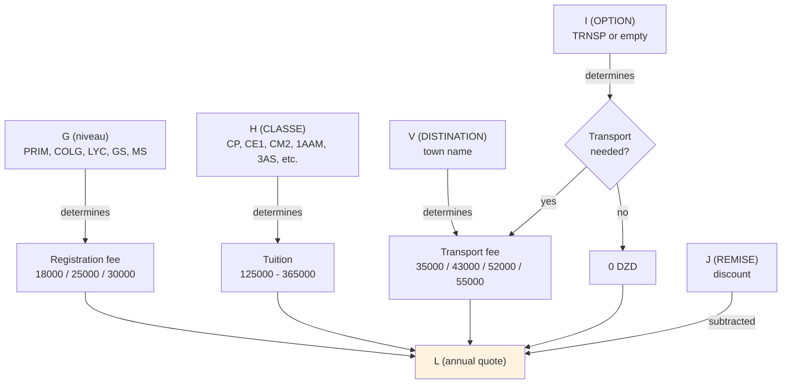

The operator looks at G, H, I, V, and J to compose the L formula by hand. There's no automatic lookup — see [[01 - ETAT Core Formulas (L, P, Q)]].

## At a glance

| Code system | Column | Code count | Notes |
|---|---|---|---|
| Level | G | ~11 distinct | PRIM, COLG, LYC, GS, MS, AUTISTE, NV2-NV5, CLYC, LYCI |
| Class | H | ~24 distinct | CP, CE1, CE2, CM1, CM2, 1AAM-4AAM, 1AP-5AP, 1AS-3AS, 1EM-3EM, 1ER, GS, MS, AUTISTE, NV2-NV5 |
| Town | V | ~30 distinct strings (20 canonical) | BOUMERDES, CORSO, BOUDOUAOU, etc. — many spelling variants |
| Option | I | 4 values | TRNSP, TENSP, TRNP, (empty) |
| Discount | J | varies | Often composed as `=5000+10000+10000` |
| Service | Devis G, ETAT Z-AE | ~6 types | Transport, PSY1, PSY2, ORTH1, ORTH2, E-PLANT, Ratrapage |

## Related sections

- [[00 - ETAT Columns MOC]] — where these codes appear
- [[00 - Formulas MOC]] — how the codes drive the L formula
- [[00 - Hidden Logic MOC]] — the (mostly broken) named ranges and dropdowns that should enforce these codes


========================================================================
 FILE: 04 - Codes and Vocabulary/01 - Level Codes (niveau).md
   Language: markdown
========================================================================

---
tags:
  - codebook
  - level-codes
  - sheet/ETAT
---

# Level Codes (niveau)

Column G (`niveau`) on [[02 - ETAT - Master Ledger|ETAT 20262027]] classifies each student by **broad school level**. The values are short codes derived from French educational terminology.

> [!warning] Naming confusion
> The header is lowercase `niveau` (not `NIVEAU`) — that's just the operator's typing style. The named range `NIVEAU` (uppercase) points to `REF!$B:$B` and contains **class-level codes**, not these broad-level codes — confusingly, the same word is used for two related but different concepts.

## The codes used in column G

| Code | Full French term | English meaning | Frequency in 2026/2027 |
|---|---|---|---|
| `PRIM` | Primaire | Primary school (ages 6–10) | 204 |
| `COLG` | Collège | Middle school (ages 11–15) | 113 |
| `LYC` | Lycée | High school (ages 16–18) | 40 |
| `GS` | Grande Section | Senior pre-school (age 5) | 21 |
| `MS` | Moyenne Section | Middle pre-school (age 4) | 4 |
| `AUTISTE` | Autiste | Special-needs class (autism spectrum) | 2 |
| `NV2` | Niveau 2 | "Level 2" — possibly a non-standard placement | 1 |
| `NV3` | Niveau 3 | "Level 3" | 1 |
| `NV4` | Niveau 4 | "Level 4" | 2 |
| `NV5` | Niveau 5 | "Level 5" | 1 |
| `CLYC` | (unclear — possibly "Collège/Lycée") | Mixed or transitional class | 1 |
| `LYCI` | (unclear — possibly "Lycée Integration") | Lycée with integration support | 1 |
| **Total** | | | **390** |

## What each level means in the Algerian school system

Algeria follows a French-influenced educational structure:

### Pre-school (optional)

- **MS** (Moyenne Section) — age 3–4. Optional pre-school.
- **GS** (Grande Section) — age 5. Optional pre-school, the year before primary.

The school also has the codes **PS** (Petite Section, age 2–3) and **TPS** (Très Petite Section, age 2) defined in `REF!B:B` but doesn't appear to have any students at those levels in 2026/2027.

### Primary school (PRIM, ages 6–10)

Five years: CP, CE1, CE2, CM1, CM2. See [[02 - Class Codes (CLASSE)]].

### Middle school / Collège (COLG, ages 11–15)

Four years: 1AM, 2AM, 3AM, 4AM (in Arabic: السنة الأولى متوسط etc.). The school uses codes like `1AAM`, `2AAM`, `3AAM`, `4AAM` — see [[02 - Class Codes (CLASSE)]] for the explanation of the double-A.

### High school / Lycée (LYC, ages 16–18)

Three years: 1AS, 2AS, 3AS (in Arabic: السنة الأولى ثانوي etc.). The school uses codes like `1AS`, `2AS`, `3AS`.

### Other codes

- **AUTISTE** — A special-needs class for students on the autism spectrum. The school appears to have a small inclusive program (2 students in 2026/2027).
- **NV2–NV5** — "Niveau" (Level) 2 through 5. These are non-standard codes that may indicate:
  - A student who is repeating a year (held back)
  - A student in a multi-age classroom
  - A non-gradeable placement (e.g., a transfer student whose level is being assessed)
- **CLYC** — Possibly a transitional class between collège and lycée.
- **LYCI** — Possibly a lycée integration class (for students with special needs mainstreamed into lycée).

## How the level drives pricing

The level code in column G is one of the factors the operator uses to choose the formula in column L:

| Level | Registration fee (FI) | Typical tuition |
|---|---|---|
| MS / GS (pre-school) | 18,000 | 125,000 |
| PRIM (primary) | 25,000 | 205,000–220,000 |
| COLG (collège) | 25,000 or 30,000 | 305,000–330,000 |
| LYC (lycée) | 30,000 | 340,000–365,000 |

So a PRIM student typically has `L = 25000+205000+...` while a COLG student has `L = 25000+305000+...` and a LYC student has `L = 30000+340000+...`. The level code doesn't drive a lookup — it just informs the operator's manual choice of L formula.

See [[01 - ETAT Core Formulas (L, P, Q)]] and [[05 - Price Table]] for the full pricing structure.

## The naming convention

The codes follow a pattern:

- **Pre-school**: French acronym (MS, GS, PS, TPS)
- **Primary**: French acronym (CP, CE1, CE2, CM1, CM2)
- **Middle school (collège)**: French + Arabic mix (1AAM, 2AAM, etc.)
- **High school (lycée)**: French + Arabic mix (1AS, 2AS, 3AS)

The "A" in `1AAM` is the French *année* (year). The "AM" is Arabic *أوسط متوسط* (awwasṭ mutawassiṭ) meaning "middle year" — so `1AAM` = "Year 1 Middle". Similarly, "AS" is Arabic *ثانوي* (thanawī) meaning "secondary" — so `1AS` = "Year 1 Secondary".

## How this differs from REF!B:B

The named range `NIVEAU` (which points to `REF!$B:$B`) actually contains the **class codes** (CP, CE1, CM2, 1AAM, etc.), not the broad-level codes (PRIM, COLG, LYC). This is a naming inconsistency:

- Column G on ETAT is called `niveau` but holds broad-level codes (PRIM, COLG, etc.).
- The named range `NIVEAU` points to class-specific codes (CP, CE1, 1AAM).
- Column H on ETAT is called `CLASSE` and holds the same class-specific codes as `REF!B:B`.

So `niveau` (the column) and `NIVEAU` (the named range) refer to different things despite the same word. This is a confusion trap if you're trying to wire up dropdowns.

## Where this value comes from

The operator types the level code by hand when enrolling a student. There's no dropdown — column G has no data validation. So spelling and capitalization vary slightly (e.g., `PRIM` vs `Prim` vs `prim`).

## Where this value goes next

| Used by | How |
|---|---|
| The L formula | Operator chooses the L formula components based on G |
| Nowhere else | No formula reads G |

The level code is **informational** — it doesn't drive any automatic calculation, only the operator's manual choice.

## Recommendations

- Add a dropdown to column G with the valid level codes.
- Standardize the spelling (e.g., always uppercase: PRIM, COLG, LYC, GS, MS, AUTISTE).
- Clarify what NV2–NV5 mean (ask the school).
- Consider renaming the `NIVEAU` named range to `CLASSE_CODES` to avoid the confusion with the `niveau` column.

---

**See also**:
- [[02 - Class Codes (CLASSE)]] — the more specific codes in column H
- [[01 - ETAT Core Formulas (L, P, Q)]] — how G drives the L formula choice
- [[05 - Price Table]] — fees per level
- [[06 - French Terms Glossary]]
- [[01 - REF - Foundation]] — what the `NIVEAU` named range actually holds


========================================================================
 FILE: 04 - Codes and Vocabulary/02 - Class Codes (CLASSE).md
   Language: markdown
========================================================================

---
tags:
  - codebook
  - class-codes
  - sheet/ETAT
---

# Class Codes (CLASSE)

Column H (`CLASSE`) on [[02 - ETAT - Master Ledger|ETAT 20262027]] classifies each student by **specific class** within their level. These are the codes that appear in `REF!B:B` (the `NIVEAU` named range, despite the confusing name).

## The codes used in column H

Based on the 390 active student rows, here are the codes that actually appear:

| Code | Level | Frequency | Meaning |
|---|---|---|---|
| **CP** | PRIM | 51 | Cours Préparatoire — 1st year primary (age 6) |
| **CE1** | PRIM | 34 | Cours Élémentaire 1 — 2nd year primary (age 7) |
| **CE2** | PRIM | 31 | Cours Élémentaire 2 — 3rd year primary (age 8) |
| **CM1** | PRIM | 29 | Cours Moyen 1 — 4th year primary (age 9) |
| **CM2** | PRIM | 34 | Cours Moyen 2 — 5th year primary (age 10) |
| **1AAM** | COLG | 33 | 1st year middle school (age 11) |
| **2AAM** | COLG | 21 | 2nd year middle school (age 12) |
| **3AAM** | COLG | 41 | 3rd year middle school (age 13) |
| **4AAM** | COLG | 18 | 4th year middle school (age 14) |
| **1AP** | COLG | 3 | 1st year middle school (variant code) |
| **2AP** | COLG | 1 | 2nd year middle school (variant) |
| **3AP** | COLG | 6 | 3rd year middle school (variant) |
| **4AP** | COLG | 6 | 4th year middle school (variant) |
| **5AP** | COLG | 7 | (possibly 5th year, or variant of 4AP) |
| **1AS** | LYC | — | 1st year high school (age 15) |
| **2AS** | LYC | — | 2nd year high school (age 16) |
| **3AS** | LYC | — | 3rd year high school (age 17) — final year |
| **1EM** | LYC | 12 | (variant of 1AS? "1ère année secondaire") |
| **2EM** | LYC | 16 | (variant of 2AS) |
| **3EM** | LYC | 13 | (variant of 3AS) |
| **1ER** | LYC | 12 | (variant of 1AS — "1ère") |
| **GS** | pre-school | 22 | Grande Section (age 5) |
| **MS** | pre-school | 5 | Moyenne Section (age 4) |
| **NV2, NV3, NV4, NV5** | special | 5 | Non-standard placement codes |
| **AUTISTE** | special | 1 | Special-needs class |

## Decoding the naming convention

### Primary school — French acronyms

| Code | French | English | Age |
|---|---|---|---|
| CP | Cours Préparatoire | Preparatory course | 6 |
| CE1 | Cours Élémentaire 1 | Elementary course 1 | 7 |
| CE2 | Cours Élémentaire 2 | Elementary course 2 | 8 |
| CM1 | Cours Moyen 1 | Middle course 1 | 9 |
| CM2 | Cours Moyen 2 | Middle course 2 | 10 |

These are pure French. The Algerian primary system inherited these names from the French colonial period and has kept them.

### Middle school — French + Arabic

| Code | Decoded | Arabic | English | Age |
|---|---|---|---|---|
| 1AAM | Année 1 Moyen (Mutawassit) | السنة الأولى متوسط | Year 1 Middle | 11 |
| 2AAM | Année 2 Moyen | السنة الثانية متوسط | Year 2 Middle | 12 |
| 3AAM | Année 3 Moyen | السنة الثالثة متوسط | Year 3 Middle | 13 |
| 4AAM | Année 4 Moyen | السنة الرابعة متوسط | Year 4 Middle | 14 |

The "A" is French *année* (year). The "AM" is the operator's shorthand — likely **A**nnée **M**oyenne, where "Moyenne" is the French for the Arabic *mutawassit* (middle). So `1AAM` literally means "Year 1 Middle-Middle" — the double "M" is redundant but has become the operator's standard.

There are also variant codes `1AP`, `2AP`, `3AP`, `4AP`, `5AP` that appear in a smaller number of rows. The "P" likely stands for **P**édagogique or **P**rofessionnel — these may be a different track of middle school (perhaps a vocational or specialized stream). The school only has a few students in each.

### High school — French + Arabic

| Code | Decoded | Arabic | English | Age |
|---|---|---|---|---|
| 1AS | Année 1 Secondaire | السنة الأولى ثانوي | Year 1 Secondary | 15 |
| 2AS | Année 2 Secondaire | السنة الثانية ثانوي | Year 2 Secondary | 16 |
| 3AS | Année 3 Secondaire | السنة الثالثة ثانوي | Year 3 Secondary | 17 |

The "AS" is **A**nnée **S**econdaire (Secondary Year). The `1EM`/`2EM`/`3EM` codes appear to be variants — possibly "École Moyenne" or just the operator's alternative spelling. Similarly `1ER` (probably "1ère" — French feminine ordinal for "first").

### Pre-school — French acronyms

| Code | French | English | Age |
|---|---|---|---|
| TPS | Très Petite Section | Very small section | 2 |
| PS | Petite Section | Small section | 3 |
| MS | Moyenne Section | Middle section | 4 |
| GS | Grande Section | Large section | 5 |

These come from the French pre-school (*école maternelle*) naming convention. Only MS and GS appear in the 2026/2027 file, but REF!B:B also lists TPS and PS.

### Special codes

- **AUTISTE** — Student on the autism spectrum, in a special-needs class.
- **NV2, NV3, NV4, NV5** — Non-standard placement codes. The "NV" likely stands for **Niveau** (level). These may indicate students who are:
  - Repeating a year
  - In a multi-age classroom
  - Transfer students whose placement is being assessed
  - In an alternate curriculum track

## What's in REF!B:B (the full list of valid class codes)

The named range `NIVEAU` (which, despite its name, holds class codes) contains these 26 codes:

```
MS, GS, PS, TPS, CP, CE1, CE2, CM1, CM2,
1AP, 2AP, 3AP, 4AP, 5AP,
1AAM, 2AAM, 3AAM, 4AAM,
1AS, 2AS, 3AS,
1CS, 2CS, 3CS, 4CS,
autiste
```

> [!note] Mismatch between REF and ETAT
> Note that REF!B:B includes some codes that don't appear in column H of ETAT 20262027:
> - **PS, TPS** — pre-school levels the school doesn't currently serve
> - **1CS, 2CS, 3CS, 4CS** — possibly "Cours Secondaire" or another high-school track
>
> And column H has codes that aren't in REF!B:B:
> - **1EM, 2EM, 3EM** — variant high-school codes
> - **1ER** — variant high-school code
> - **NV2, NV3, NV4, NV5** — non-standard placement
>
> This mismatch suggests the operator isn't strictly using the dropdown — they're typing class codes by hand and inventing new variants as needed.

## How the class code drives pricing

The class code is the **most important driver of tuition** in column L:

| Class | Typical tuition (DZD) |
|---|---|
| MS, GS | 125,000 |
| CP | 205,000 |
| CE1, CE2 | 205,000–220,000 |
| CM1, CM2 | 220,000 |
| 1AAM–4AAM | 305,000 |
| 1AP–5AP | 305,000 |
| 1AS, 1EM, 1ER | 340,000 |
| 2AS, 2EM | 340,000–355,000 |
| 3AS, 3EM | 355,000–365,000 |

The exact amount can vary by a few thousand based on family circumstances, but the broad tiers are stable.

See [[05 - Price Table]] for the full pricing structure.

## The CLASSE column is the most under-validated field

Despite being the most important driver of pricing, column H has **no data validation**. The operator types class codes by hand, leading to:

- Inconsistent capitalization (`CE1` vs `ce1` vs `Ce1`)
- Variant codes (`1AAM` vs `1AM` vs `1AP`)
- Made-up codes (`NV2`, `NV3`, etc. that aren't in REF)

If you wanted to improve the workbook, the highest-leverage change would be to add a dropdown to column H that pulls from `REF!$B$1:$B$26`. This would force consistency and make per-class analysis reliable.

## Where this value comes from

The operator types the class code by hand when enrolling a student, based on the family's registration form. There's no automatic lookup or validation.

## Where this value goes next

| Used by | How |
|---|---|
| The L formula | Operator chooses the L formula's tuition component based on H |
| The Devis sheet (column D) | Should be the same code — operator types it again when generating a quote |
| Nowhere else | No formula reads H |

Like the level code (G), the class code is **informational** — it doesn't drive any automatic calculation, only the operator's manual choice.

## Recommendations

- Add a dropdown to column H (and Devis column D) that pulls from `REF!$B$1:$B$26`.
- Standardize the variant codes — decide whether to use `1AAM` or `1AM`, `1AS` or `1EM` or `1ER`, and stick to one.
- Consider adding a `Class_Code` column to REF that's properly bounded (e.g., `$B$1:$B$30`) rather than whole-column.
- Document what `NV2`–`NV5` mean.

---

**See also**:
- [[01 - Level Codes (niveau)]] — the broad-level codes in column G
- [[01 - ETAT Core Formulas (L, P, Q)]] — how H drives the L formula choice
- [[05 - Price Table]] — fees per class
- [[01 - REF - Foundation]] — where the valid class codes live
- [[02 - Missing Devis Dropdowns]] — why the Devis column D dropdown is broken
- [[06 - French Terms Glossary]]


========================================================================
 FILE: 04 - Codes and Vocabulary/03 - Town List (DISTINATION).md
   Language: markdown
========================================================================

---
tags:
  - codebook
  - town-list
  - transport
  - sheet/ETAT
---

# Town List (DISTINATION)

Column V (`DISTINATION`) on [[02 - ETAT - Master Ledger|ETAT 20262027]] holds the **transport destination town** — the town where the student is picked up or dropped off. It's only filled in when column I (OPTION) = `TRNSP`.

> [!warning] Misspelling
> The header is misspelled: `DISTINATION` should be **DESTINATION** (French: *destination*). The misspelling has propagated through the workbook and is now the canonical header.

## The 20 canonical towns (from REF!D1:D20)

These are the town names the school officially recognizes, stored in column D of [[01 - REF - Foundation|the REF sheet]]:

| # | Town | Notes |
|---|---|---|
| 1 | BOUMERDES | The school's home town — provincial capital |
| 2 | CORSO | Coastal town just east of Boumerdès |
| 3 | SAHEL | Hillside area near Boumerdès |
| 4 | FIGUIER | Neighborhood near Boumerdès (literally "fig tree") |
| 5 | ZEMOURI | Coastal town ~20 km east |
| 6 | BOUDOUAOU | Town ~25 km southwest of Boumerdès |
| 7 | REGHIAA | (Reghaia) — town ~30 km southwest, near Rouiba |
| 8 | ROUIBA | District ~30 km south of Boumerdès |
| 9 | BORDJ MNAIL | (Bordj Ménaïl) — town ~40 km east |
| 10 | SI MUSTAPHA | Town ~35 km east |
| 11 | ISSER | Town ~50 km east |
| 12 | THENIA | (Thénia) — town ~20 km west |
| 13 | BENI AMRANE | Town ~30 km south, inland |
| 14 | OULED MOUSSA | Town ~25 km south |
| 15 | OULED HEDDAJ /HOUCHE MEKHEFI | Two adjacent areas combined |
| 16 | KHEMIS KHENCHELA | (Khemis el-Khechna) — town ~20 km south |
| 17 | TIDJELABINE | Town ~25 km southwest |
| 18 | BENYOUNES | Neighborhood in Boumerdès |
| 19 | SOUK ELHAD | Town ~30 km east |
| 20 | CAP DJENET | Coastal town ~25 km east |

All 20 are in or near **Boumerdès Province** in northern Algeria, confirming the school's location.

## How the town drives the transport fee

The transport fee component in column L is determined by the town's distance from the school. Based on the actual L formulas in the file:

| Transport amount (DZD) | Towns (canonical) |
|---|---|
| 35,000 | BOUMERDES, CORSO, SAHEL, FIGUIER, BENYOUNES (nearby) |
| 43,000 | (rarely used — possibly ZEMOURI, THENIA) |
| 52,000 | BOUDOUAOU, OULED MOUSSA, KHEMIS KHENCHELA, TIDJELABINE (medium distance) |
| 55,000 | DJENAT (Cap Djenet), BORDJ MNAIL, ISSER, SI MUSTAPHA, REGHIAA, ROUIBA (far) |

> [!note] Tier inconsistency
> 43,000 appears frequently on the Devis sheet but rarely on the ETAT sheet — the operator may have switched to a 4-tier system (35K / 43K / 52K / 55K) at quote time but consolidated to 3 tiers (35K / 52K / 55K) when entering into the ledger.

## Inconsistent spellings in column V

Because there's no working dropdown, operators type town names by hand, leading to many spelling variations of the same town. Here are some examples from the actual data:

| Canonical (REF) | Variants found in column V |
|---|---|
| BOUMERDES | BOUMERDES, BOUMERDES20000, BOUMREDES, BOUMRDES, BOUMREDES |
| BOUDOUAOU | BOUDOUAOU |
| OULED MOUSSA | OULEDMOUSSA, OULED MOUSSA, OULEDMOUSA |
| OULED HEDDAJ | OULEDHEDADJ, OULEDHDADADJ, OULEDHADADJ, OULEDHEDADJ |
| KHEMIS KHENCHELA | KHEMIS KHCHNA, KHEMISKHCHNA, KHEMISELKHCHNA, KHEMIS KHECHNA |
| ZEMOURI | ZEMMOURI, ZEMOURI |
| BORDJ MNAIL | BORDJMNAIL |
| REghaia | REGHAIA |
| DJENAT | DJENAT |
| THENIA | THENIA |

The variants are mostly:
- Removing spaces (`BOUMERDES` vs `BOUMERDES 20000`)
- Phonetic spelling (`KHEMIS KHENCHELA` vs `KHEMIS KHCHNA`)
- Adding a postal code (`BOUMERDES20000` — 20000 is Boumerdès's postal code)
- Lowercase vs uppercase
- Trailing spaces

This inconsistency means you can't reliably group students by town — a filter for `BOUMERDES` won't catch `BOUMERDES20000` or `BOUMREDES`. If the school wanted to analyze "how many students come from each town?", they'd first need to normalize the spellings.

## The 30 distinct town strings in column V

The actual unique values found in column V of the 2026/2027 file (with student counts):

| Town string (as typed) | Count |
|---|---|
| BOUMERDES | 35 |
| CORSO | 17 |
| BOUDOUAOU | 16 |
| OULEDMOUSSA | 12 |
| THENIA | 6 |
| BORDJMNAIL | 5 |
| REGHAIA | 5 |
| ZEMMOURI | 4 |
| SAHEL | 4 |
| ZEMOURI | 4 |
| OULEDHEDADJ | 3 |
| CHABET | 3 |
| DJENAT | 2 |
| OULED MOUSSA | 2 |
| BOUMRDES | 2 |
| CHABAT | 1 |
| KHEMISELKHCHNA | 1 |
| KHEMIS KHECHNA | 1 |
| ISSER | 1 |
| BENIAMRAN | 1 |
| BOUMERDES20000 | 1 |
| ERBATACHE | 1 |
| LAGATA | 1 |
| OULEDHDADADJ | 1 |
| OULEDHADADJ | 1 |
| OULEDMOUSA | 1 |
| TIDJELABINE | 1 |
| KHEMISKHCHNA | 1 |
| FIGUIER | 1 |

Note that some towns in column V aren't in REF!D:D at all:
- **CHABET** / **CHABAT** — possibly Chabet Ameur, a neighborhood
- **ERBATACHE** — possibly "Arba Ta Achra" (literally "Wednesday 10" — a market town)
- **LAGATA** — unclear
- **BENIAMRAN** — variant of BENI AMRANE

The operators are inventing new town codes as the school expands to serve new areas.

## Where the town value comes from

The operator types the town name by hand based on the family's address on their registration form. There's no dropdown — column V has no data validation. This is what causes the spelling inconsistency.

## Where the town value goes next

| Used by | How |
|---|---|
| The L formula | Operator chooses the transport tier (35K / 43K / 52K / 55K) based on the town |
| Nowhere else | No formula reads V |

Like the level and class codes, the town is **informational** — it doesn't drive any automatic calculation, only the operator's manual choice of transport amount.

## Recommendations

- Add a dropdown to column V that pulls from `REF!$D$1:$D$30` (or extend REF with new towns as needed).
- Standardize the spellings — pick one canonical form for each town.
- Consider adding a `Transport_Tier` column that auto-looks-up the fee tier from the town (using VLOOKUP against REF).
- Normalize existing data — replace `BOUMERDES20000` → `BOUMERDES`, `OULEDMOUSSA` → `OULED MOUSSA`, etc.

## Why this column matters for the school

Even though column V doesn't drive any formula directly, it's still important because it determines the transport fee component of L. Without accurate town data:

- The operator might choose the wrong transport tier when typing L.
- The school can't analyze "which towns generate the most students?" for marketing/routing.
- The school can't verify that transport fees cover the cost of bus service to each town.

Fixing the town data would unlock a lot of management insight that's currently hidden by the spelling chaos.

---

**See also**:
- [[03 - Installments (R-Y)]] — where column V sits
- [[01 - ETAT Core Formulas (L, P, Q)]] — how V drives the transport component of L
- [[05 - Price Table]] — transport fee tiers
- [[01 - REF - Foundation]] — where the canonical town list lives
- [[06 - French Terms Glossary]]


========================================================================
 FILE: 04 - Codes and Vocabulary/04 - Option Codes.md
   Language: markdown
========================================================================

---
tags:
  - codebook
  - option-codes
  - sheet/ETAT
---

# Option Codes

Column I (`OPTION`) on [[02 - ETAT - Master Ledger|ETAT 20262027]] indicates whether the student uses the school's transport service. It's a single coded value, usually either `TRNSP` or empty.

## The codes

| Code | Meaning | Frequency |
|---|---|---|
| `TRNSP` | Transport — the student uses the school's transport service | 121 |
| `TENSP` | Possibly "transport + enseignement" or a typo of TRNSP | 4 |
| `TRNP` | Likely a typo of TRNSP (missing S) | 1 |
| *(empty)* | No option — student doesn't use transport | ~264 |

The vast majority of empty OPTION cells mean "no transport" rather than missing data.

## How the option code is used

The OPTION column is one of the inputs the operator uses when composing the L formula (DEVIS ANNUEL). Specifically:

- If `OPTION = TRNSP` → the operator adds a transport component (35,000 / 43,000 / 52,000 / 55,000 DZD) to the L formula, based on the town in column V.
- If `OPTION` is empty → no transport component is added to L (just registration + tuition − discount).

For example:

```
With transport:    L7: =30000+250000+20000+52000-J7+1000
Without transport: L4: =25000+205000+35000-J4   (no +52000 transport term)
```

Wait — that L4 formula has a 35,000 transport term. Let me re-check... Actually, looking at the data, some students without TRNSP still have a transport amount in L, possibly because the operator includes it for sibling consistency. The OPTION column is a **declared option**, but the operator may add transport to L regardless. Use judgment when reading the data.

## Where this value comes from

The operator types the option code by hand when enrolling a student, based on whether the family requested transport on their registration form. There's no dropdown — column I has no data validation.

## Where this value goes next

| Used by | How |
|---|---|
| The L formula | Operator decides whether to add transport to L based on I |
| Nowhere else | No formula reads I |

Like the other identity columns (G, H, V), the OPTION code is **informational** — it doesn't drive any automatic calculation, only the operator's manual choice.

## The variant codes (TENSP, TRNP)

These appear so rarely (4 + 1 = 5 occurrences out of 390) that they're almost certainly typos:

- **TENSP** — possibly "Transport + Enseignement" (transport + teaching), but more likely just a typo of TRNSP with an extra E.
- **TRNP** — missing the S from TRNSP.

If you were cleaning the data, you'd normalize all three variants to `TRNSP`.

## Recommendations

- Add a dropdown to column I with just two options: `TRNSP` and (empty).
- Standardize the spelling — only `TRNSP` (uppercase, no variants).
- Consider adding a `Transport_Needed` boolean column that's TRUE/FALSE instead of a coded text field.
- Normalize the existing variants: replace `TENSP` and `TRNP` with `TRNSP`.

## Related codes

The OPTION column is the only "flag" column in the identity block (B–K). It's distinct from:

- [[01 - Level Codes (niveau)]] — column G
- [[02 - Class Codes (CLASSE)]] — column H
- [[03 - Town List (DISTINATION)]] — column V (only filled when OPTION = TRNSP)

Together, G + H + I + V form the "classification quartet" that drives the L formula composition.

---

**See also**:
- [[01 - Identity (B-K)]] — where column I sits
- [[01 - Level Codes (niveau)]]
- [[02 - Class Codes (CLASSE)]]
- [[03 - Town List (DISTINATION)]]
- [[01 - ETAT Core Formulas (L, P, Q)]] — how I affects the L formula
- [[05 - Price Table]] — transport tiers
- [[06 - French Terms Glossary]]


========================================================================
 FILE: 04 - Codes and Vocabulary/05 - Price Table.md
   Language: markdown
========================================================================

---
tags:
  - codebook
  - price-table
  - reference
---

# Price Table

> [!info] One-line summary
> The school's fee structure, reconstructed from the L formulas in [[02 - ETAT - Master Ledger|ETAT 20262027]] and the typed values in [[03 - Devis - Quote Engine|Devis]]. There's no single authoritative price list in the workbook — these are the values that consistently appear across both sheets.

## Registration fees (Frais d'Inscription, FI)

The registration fee is a one-time annual charge, paid at enrollment. It varies by level:

| Amount (DZD) | Level | Notes |
|---|---|---|
| 18,000 | Pre-school (MS, GS) | Lower rate for pre-school |
| 25,000 | Primary (PRIM) | Standard rate, most common |
| 28,000 | (variant) | Seen on Devis — possibly a promo or older-student rate |
| 30,000 | Collège (COLG) / Lycée (LYC) | Higher rate for older students |
| 33,000 | (variant) | Seen on Devis — possibly a special class |

The registration fee always appears as the **first component** of the L formula (e.g., `=25000+205000+...`) and is also recorded in column R (FI) when paid.

## Tuition (Frais Scolarisation)

The tuition is the largest component of the annual fee. It varies by class:

### Pre-school

| Amount (DZD) | Class |
|---|---|
| 125,000 | MS (Moyenne Section) |
| 125,000 | GS (Grande Section) |

### Primary (PRIM)

| Amount (DZD) | Class | Notes |
|---|---|---|
| 165,000 | (variant) | Sometimes used — possibly a sibling rate |
| 170,000 | (variant) | Seen on Devis |
| 180,000 | (variant) | Sometimes used |
| 185,000 | (PRIM, various) | Common |
| 205,000 | CP, CE1, CE2 | Most common primary rate |
| 210,000 | CM1, CM2 | Slightly higher for older primary |
| 220,000 | (with transport) | Sometimes used |
| 230,000 | (with transport) | Sometimes used |
| 248,000 | (variant) | Seen on Devis |

### Collège (COLG)

| Amount (DZD) | Class | Notes |
|---|---|---|
| 250,000 | (variant) | Sometimes used |
| 280,000 | (variant) | Sometimes used |
| 285,000 | (variant) | Sometimes used |
| 305,000 | 1AAM, 2AAM, 3AAM, 4AAM | Most common collège rate |
| 320,000 | (variant) | Sometimes used |
| 330,000 | (variant) | Sometimes used |

### Lycée (LYC)

| Amount (DZD) | Class | Notes |
|---|---|---|
| 340,000 | 1AS, 1EM, 1ER | 1st year lycée |
| 340,000–355,000 | 2AS, 2EM | 2nd year lycée |
| 355,000–365,000 | 3AS, 3EM | 3rd year lycée (final year, highest) |

The tuition always appears as the **second component** of the L formula.

## Transport fees

Transport is an optional service, added when column I (OPTION) = `TRNSP`. The fee depends on the town's distance from the school:

| Amount (DZD) | Tier | Towns |
|---|---|---|
| 35,000 | Tier 1 (nearby) | Boumerdès, Corso, Sahel, Figuier, Benyounes |
| 43,000 | Tier 2 | (seen on Devis, rarely on ETAT) |
| 52,000 | Tier 3 (medium) | Boudouaou, Ouled Moussa, Khemis Khenchela, Tidjelabine |
| 55,000 | Tier 4 (far) | Cap Djenet, Bordj Mnaïl, Isser, Si Mustapha, Reghaia, Rouiba |

See [[03 - Town List (DISTINATION)]] for the full town list and their tiers.

The transport amount always appears as the **third component** of the L formula (when present). It's typically paid in 3 tranches: 30,000 (1T) + 15,000 (T2) + 10,000 (t3) = 55,000 for the highest tier.

## Discount (REMISE)

Discounts are subtracted from the fee total. They're typed in column J and appear as the `-J` term in the L formula. Common discount amounts and their likely meanings:

| Amount (DZD) | Likely reason |
|---|---|
| 5,000 | Sibling discount (small) |
| 10,000 | Sibling discount (medium) or early-payment |
| 15,000 | Staff-family discount |
| 18,000 | Hardship discount |
| 20,000 | Larger sibling discount |
| 22,000 | Negotiated discount |
| 25,000 | Promotional discount |
| 30,000 | Large negotiated discount |
| 33,000 | (unclear) |
| 35,000 | (unclear) |
| 50,000 | Major discount (full transport waiver?) |

Discounts are often composed of multiple components, typed as a formula: `=5000+10000+10000` = 25,000 total. See [[02 - REMISE and Installment Shortcuts (J, S)]].

## Special services (paid separately)

These are billed per session and tracked in columns Z–AE on ETAT. They're **not included in the L formula** — they're extras:

| Service | Column | Typical amount (DZD) |
|---|---|---|
| Psychology session 1 | Z (PSY1) | 2,000–5,000 |
| Psychology session 2 | AA (PSY2) | 2,000–5,000 |
| Speech therapy session 1 | AB (ORTH1) | 3,000–8,000 |
| Speech therapy session 2 | AC (ORTH2) | 3,000–8,000 |
| E-PLANT (unclear) | AD | varies |
| Catch-up class | AE (Ratrapage) | 5,000–15,000 |

## 5% early-payment bonus

On the Devis sheet, each block computes a 5% bonus discount if the family pays in full before June 30:

```
D35: =+SUM(F15:F26)*0.05
```

This is 5% of total tuition (column F), not 5% of the grand total. It's a promotional discount to encourage early full payment.

The bonus is **not automatically applied** — it's shown as a note on the printed quote, and the operator manually subtracts it from the family's L if they qualify.

## Example annual quotes (from real data)

Here are some real L formulas from the ETAT sheet, with their meanings:

| L formula | Decoded | Student profile |
|---|---|---|
| `=25000+205000+35000-J2` | 25K reg + 205K tuition (CP) + 35K transport (nearby) − discount | Primary student with transport |
| `=25000+205000+35000+55000-J3` | 25K + 205K + 35K + 55K transport (far) − discount | Primary with far transport (possibly two transport components?) |
| `=25000+305000+52000` | 25K + 305K tuition (collège) + 52K transport (medium) | Collège student with medium transport, no discount |
| `=30000+250000+20000-J7+1000` | 30K reg + 250K tuition + 20K transport + 1K adjustment − discount | Lycée student with small transport, special adjustment |
| `=25000+330000-J24` | 25K + 330K tuition (collège) − discount | Collège student, no transport |
| `=180000+165000-J14` | 180K + 165K − discount | (Unusual — no registration fee, possibly a credit) |
| `=30000+340000+55000-J58` | 30K + 340K tuition (lycée) + 55K transport (far) − discount | Lycée student with far transport |

## How to read an L formula

To decode any L formula:

1. **Identify the components**: split the formula by `+` and `-` operators.
2. **Match each component to the price table**:
   - 18,000 / 25,000 / 28,000 / 30,000 / 33,000 → registration fee (by level)
   - 125,000 → pre-school tuition
   - 165,000–230,000 → primary tuition (varies by class)
   - 250,000–330,000 → collège tuition (varies by class)
   - 340,000–365,000 → lycée tuition (varies by year)
   - 35,000 / 43,000 / 52,000 / 55,000 → transport (by distance)
   - `J2`, `J3`, etc. → discount subtraction
3. **Verify against the student's profile** (columns G, H, I, V):
   - Does the registration fee match the level in G?
   - Does the tuition match the class in H?
   - If OPTION (I) = TRNSP, is there a transport component? Does it match the town in V?
   - Is the discount in J subtracted?

If anything doesn't match, the L formula may have a typo or use a non-standard price.

## Why the price table isn't in the workbook

You might expect a "Prices" sheet listing all these amounts — but there isn't one. The prices live only in:

1. The L formulas on ETAT (each formula contains hardcoded amounts).
2. The typed values in the Devis blocks (each block has hardcoded amounts).
3. The operator's memory.

This is a significant design weakness. If the school raises prices, the operator has to:

- Update every L formula on ETAT (or at least every new one going forward).
- Update every Devis block.
- Remember the new prices when typing future formulas.

A cleaner design would have a "Prices" sheet with a lookup table, and the L formula would use VLOOKUP against it. But the current design prioritizes flexibility (the operator can charge any amount to any family) over consistency.

## The 2nd installment (V2) base amounts

For column S (V2 — the 2nd tuition installment), the operator has a mental price menu of "base" amounts that they then adjust with discounts:

| Base amount | Level | Notes |
|---|---|---|
| 66,000 | Primary | Seen in `S14: =66000-5000` |
| 82,000 | Primary | Seen in `S4: =82000+10000`, `S83: =82000` |
| 100,000 | Primary (with discount) | Seen in `S56: =100000-J56` |
| 110,000 | Primary (higher tier) | Seen in `S94: =110000-J95` (the buggy one) |
| 122,000 | Collège | Seen in `S5: =122000-25000`, `S58: =122000-J58` |
| 128,000 | Collège | Seen in `S63: =128000-15000` |
| 132,000 | Collège | Seen in `S80: =132000-18000` |
| 142,000 | Lycée | Seen in `S79: =142000-18000` |
| 146,000 | Lycée | Seen in `S19: =146000-15000` |

These don't perfectly match the tuition tiers in L — they're specific to the 2nd installment and reflect the school's tranche pricing (the 2nd installment is typically about 40% of annual tuition).

See [[02 - REMISE and Installment Shortcuts (J, S)]] for the full S-column analysis.

---

**See also**:
- [[01 - ETAT Core Formulas (L, P, Q)]] — how these prices are combined
- [[02 - Class Codes (CLASSE)]] — what each class code means
- [[01 - Level Codes (niveau)]] — what each level code means
- [[03 - Town List (DISTINATION)]] — what each transport tier covers
- [[02 - REMISE and Installment Shortcuts (J, S)]] — how discounts are structured
- [[03 - Devis Block Formulas]] — how the Devis sheet uses these prices


========================================================================
 FILE: 04 - Codes and Vocabulary/06 - French Terms Glossary.md
   Language: markdown
========================================================================

---
tags:
  - codebook
  - glossary
  - french
---

# French Terms Glossary

The workbook is written primarily in French (with some English shorthand and Arabic-derived class codes). This glossary defines every French term, abbreviation, and unusual word you'll encounter.

## A

| Term | French full | English meaning | Where it appears |
|---|---|---|---|
| `AAM` | Année Moyenne (Mutawassit) | "Middle Year" — middle school year code | Class codes: 1AAM, 2AAM, 3AAM, 4AAM |
| `AS` | Année Secondaire | "Secondary Year" — high school year code | Class codes: 1AS, 2AS, 3AS |
| `ANNUEL` | Annuel | Annual / yearly | `DEVIS ANNUEL` (column L header) |
| `AUTISTE` | Autiste | Autistic / autism-spectrum student | Level code in column G; class code in REF!B:B |

## B

| Term | French full | English meaning | Where it appears |
|---|---|---|---|
| `BON` | Bon (de situation) | "Slip" or "voucher" — here, a one-page client statement | Sheet name `BON ` |
| `BORDJ MNAIL` | Bordj Ménaïl | Town name (literally "Tower of Ménaïl") | REF!D:D, column V |

## C

| Term | French full | English meaning | Where it appears |
|---|---|---|---|
| `CLASSE` | Classe | Class (specific class within a level) | Column H header |
| `CM1`, `CM2` | Cours Moyen 1 / 2 | "Middle course" — 4th/5th year primary | Class codes |
| `CE1`, `CE2` | Cours Élémentaire 1 / 2 | "Elementary course" — 2nd/3rd year primary | Class codes |
| `CLIENT` | Client | Customer (here: the family) | Named range pointing to REF!A:A; used on BON sheet |
| `COLG` | Collège | Middle school (ages 11–15) | Level code in column G |
| `CP` | Cours Préparatoire | "Preparatory course" — 1st year primary | Class code |
| `CREANCE` / `CREANCES` | Créance(s) | Receivable(s) — money owed *to* the school | `TOTAL*CREANCE` (column Q), `CREANCES SEPTEMBRE` (AG), `CREANCES DECEMBRE` (AI), `CREANCES MARS` (AK) |
| `CS` | Cours Secondaire? | "Secondary course" — possibly another lycée track | Class codes 1CS–4CS in REF!B:B |

## D

| Term | French full | English meaning | Where it appears |
|---|---|---|---|
| `DECEMBRE` | Décembre | December — second school term | Column AH, AI headers |
| `DETTES` | Dettes | Debts — money owed (here, prior-year debts) | Column N header |
| `DEVIS` | Devis | Quote / estimate (business document) | Sheet name `Devis`; column L header `DEVIS ANNUEL` |
| `DEVIS ANNUEL` | Devis annuel | Annual quote | Column L header |
| `DISTINATION` | (misspelling of) Destination | Destination (transport destination town) | Column V header (misspelled) |

## E

| Term | French full | English meaning | Where it appears |
|---|---|---|---|
| `E-MAIL` | E-mail | Email address | Column C header |
| `E-PLANT` | (unclear) | Possibly "Élan Plante" or "Éducation Plantaire" | Column AD header |
| `ELEVES` | Élèves | Students | BON!E10 |
| `EM` | (variant) | "École Moyenne"? — variant of middle-school class code | Class codes 1EM, 2EM, 3EM |
| `ER` | (variant) | "1ère" (French ordinal "first") — variant of 1AS | Class code 1ER |
| `ETAT` | État | State / statement | Sheet name `ETAT 20262027` |
| `Etat General Versement` | État Général Versement | "General statement of payments" — old name of the main ledger sheet | Referenced (broken) in BON formulas |

## F

| Term | French full | English meaning | Where it appears |
|---|---|---|---|
| `FI` | Frais d'Inscription | Registration fee (literally "inscription fee") | Column R header; Devis column E header |
| `FIGUIER` | Figuier | Fig tree — neighborhood name | REF!D:D, column V |
| `FRAISSCOLAIRE` | Frais de Scolarisation | Schooling fee / tuition | Missing named range (referenced by Devis F dropdown) |

## G

| Term | French full | English meaning | Where it appears |
|---|---|---|---|
| `GS` | Grande Section | "Large section" — senior pre-school (age 5) | Level and class code |

## H

| Term | French full | English meaning | Where it appears |
|---|---|---|---|
| `HISTORIQUE` | Historique | History / log | `Historique Reglements` (BON!A20) |

## I

| Term | French full | English meaning | Where it appears |
|---|---|---|---|
| `INFOS` | Infos (Informations) | Information / notes | Column B header |
| `INSCRIPTION` | Inscription | Enrollment / registration | BON!A13; column R (FI) |

## J

| Term | French full | English meaning | Where it appears |
|---|---|---|---|
| `JUSTIFICATION` | Justification | Reason / explanation (for a discount) | Column K header |

## L

| Term | French full | English meaning | Where it appears |
|---|---|---|---|
| `LYC` | Lycée | High school (ages 16–18) | Level code in column G |
| `LYCI` | (unclear) | Possibly "Lycée Integration" | Level code in column G (rare) |

## M

| Term | French full | English meaning | Where it appears |
|---|---|---|---|
| `MARS` | Mars | March — third school term | Column AJ, AK headers |
| `MONTANT TOTAL DZD` | Montant Total (Dinars) | Total amount in Algerian Dinars | Devis!G31 (grand total label) |
| `MS` | Moyenne Section | "Middle section" — pre-school (age 4) | Level and class code |

## N

| Term | French full | English meaning | Where it appears |
|---|---|---|---|
| `NEM` | (unclear — possibly "Numéro") | Phone number or client reference | Column D header |
| `niveau` | Niveau | Level (broad school level) | Column G header (lowercase) |
| `NIVEAU` | Niveau | Level — but the named range actually holds class codes | Named range pointing to REF!B:B |
| `NOM` | Nom | Name (here, the student's name) | Column F header |
| `NV2`, `NV3`, `NV4`, `NV5` | Niveau 2/3/4/5 | Non-standard placement level codes | Level code in column G (rare) |

## O

| Term | French full | English meaning | Where it appears |
|---|---|---|---|
| `OPTION` | Option | Option (typically transport) | Column I header |
| `ORTH1`, `ORTH2` | Orthophonie 1 / 2 | Speech therapy session 1 / 2 | Columns AB, AC headers |

## P

| Term | French full | English meaning | Where it appears |
|---|---|---|---|
| `PAR PARENT` | Par Parent | "By parent" — a (deleted) summary sheet that grouped students by parent | Referenced (broken) in BON formulas |
| `PS` | Petite Section | "Small section" — pre-school (age 3) | REF!B:B (no current students) |
| `PSY1`, `PSY2` | Psychologue 1 / 2 | Psychology session 1 / 2 | Columns Z, AA headers |

## R

| Term | French full | English meaning | Where it appears |
|---|---|---|---|
| `Ratrapage` | (misspelling of) Rattrapage | Catch-up / remedial classes | Column AE header (misspelled) |
| `RÉDUCTION` | Réduction | Discount / reduction | Devis!G29 |
| `REGLEMENTS DETTES` | Règlements Dettes | Debt payments | Column O header |
| `REMBOURCEMENT` | (misspelling of) Remboursement | Reimbursement / refund | Column M header; Devis!G126 (misspelled) |
| `REMISE` | Remise | Discount | Column J header |
| `RESTE VERSE` | Reste Versé | Remaining paid (balance still owed) | BON!I10 |
| `ROUMBOURSSEMENT` | (misspelling of) Remboursement | Reimbursement (severe misspelling) | Devis!G318, G367 |

## S

| Term | French full | English meaning | Where it appears |
|---|---|---|---|
| `SEPTEMBRE` | Septembre | September — first school term | Column AF, AG headers |
| `SERVICE` | Service | Service (additional service like transport, PSY, ORTH) | Missing named range; Devis column G header |
| `SITUATION CLIENT` | Situation Client | Customer statement / account status | BON!A4 (`Situation Client 2021-2022`) |
| `SOUS-TOTAL` | Sous-total | Subtotal | Devis!G27 |
| `TUTEUR` | Tuteur / Tutrice | Tutor / guardian (parent or legal guardian) | Column E header; named range (broken) |

## T

| Term | French full | English meaning | Where it appears |
|---|---|---|---|
| `1T`, `T2`, `t3` | Tranche 1/2/3 Transport | Transport tranche 1/2/3 | Columns W, X, Y headers |
| `2V` | (unclear) | Possibly "2ème Versement" variant — alternate 2nd installment | Column T header |
| `TPS` | Très Petite Section | "Very small section" — pre-school (age 2) | REF!B:B (no current students) |
| `TOTAL VERSE` | Total Versé | Total paid | BON!H10 |
| `TOTAL VERSEMENTS` | Total Versements | Total payments (made this year) | Column P header |
| `TOTAL*CREANCE` | Total Créance | Total receivable (balance owed) | Column Q header (with stray asterisk) |
| `transport` | Transport | Transport | Missing named range; Devis column H header |
| `TRNSP` | Transport (abbreviated) | Transport option | Column I (OPTION) value |
| `TRNP` | (typo of TRNSP) | Transport (misspelled) | Column I (rare) |
| `TENSP` | (unclear) | Possibly typo of TRNSP | Column I (rare, 4 occurrences) |

## V

| Term | French full | English meaning | Where it appears |
|---|---|---|---|
| `V2` | Versement 2 | 2nd installment (of tuition) | Column S header |
| `VALIDITÉ` | Validité | Validity (date the quote expires) | Devis!F11 |
| `VERSEMENTS` | Versements | Payments / installments | Column P header; BON!A7 "Etat des versements" |
| `v3` | Versement 3 | 3rd installment (of tuition) | Column U header (lowercase) |

## Common French accounting terms you'll see

| French | English |
|---|---|
| Créance | Receivable (money owed to the school) |
| Dette | Debt (money owed by the school) |
| Règlement | Payment / settlement |
| Remboursement | Refund / reimbursement |
| Versement | Installment / payment |
| Tranche | Slice / tranche (a portion of a payment) |
| Devis | Quote / estimate |
| Facture | Invoice (not used in this workbook) |
| Montant | Amount |
| Réduction | Discount / reduction |
| Remise | Discount (synonym of réduction) |
| Sous-total | Subtotal |

## Common spelling errors in the workbook

These are misspellings that have propagated and become canonical within the workbook:

| Correct French | Workbook spelling | Where |
|---|---|---|
| Destination | DISTINATION | Column V header |
| Rattrapage | Ratrapage | Column AE header |
| Remboursement | REMBOURCEMENT (and ROUMBOURSSEMENT) | Column M header; Devis!G318 |
| Boumerdès | BOUMERDES (also BOUMREDES, BOUMRDES) | Column V |
| Ouled Moussa | OULEDMOUSSA, OULED MOUSSA, OULEDMOUSA | Column V |
| Khemis Khenchela | KHEMIS KHENCHELA, KHEMIS KHCHNA, KHEMISKHCHNA | Column V |
| Bordj Ménaïl | BORDJ MNAIL | Column V |
| Réghaia | REGHAIA, REGHIAA | Column V |
| 1ère (ordinal) | 1ER (wrong gender) | Class code 1ER (should be 1RE or 1ère) |

The operators are clearly typing fast and not proofreading. This is normal in small-business spreadsheets but makes data analysis harder.

## Algerian-specific terms

| Term | Meaning |
|---|---|
| DZD | Algerian Dinar — the currency. 1 EUR ≈ 145 DZD (2024). |
| RIB | Relevé d'Identité Bancaire — Bank account identifier (similar to IBAN). The school's RIB is `00400141400004179159`. |
| Sarl | Société à responsabilité limitée — Limited liability company. The school operates as "Sarl Elimtiyaz". |
| Wilaya | Province. Boumerdès is a wilaya. |
| Daïra | District (subdivision of a wilaya). |

## Receipt book codes (in column AM comments)

The receipt comments in [[06 - Hidden Payment Log (AM)]] use codes like `B01`, `B11`, `B12`:

| Code | Likely meaning |
|---|---|
| `B01` | Receipt book #01 (probably the current main book) |
| `B11` | Receipt book #11 (probably from a prior year) |
| `B12` | Receipt book #12 (probably the most recent prior year) |

The number after `B` is the receipt book's identifier. Each book has sequentially numbered receipts, and the school cycles through books as they fill up.

---

**See also**:
- [[00 - Home]]
- [[01 - Level Codes (niveau)]]
- [[02 - Class Codes (CLASSE)]]
- [[03 - Town List (DISTINATION)]]
- [[06 - Hidden Payment Log (AM)]]


========================================================================
 FILE: 05 - Formulas/00 - Formulas MOC.md
   Language: markdown
========================================================================

---
tags:
  - moc
  - formula
---

# Formulas MOC

The workbook has ~1,513 formulas. Most of them (1,422) live on [[02 - ETAT - Master Ledger|ETAT 20262027]]. This section explains every formula pattern.

## Notes in this section

1. [[01 - ETAT Core Formulas (L, P, Q)]] — the three formulas that drive the entire system: L (annual quote), P (total paid), Q (balance owed).
2. [[02 - REMISE and Installment Shortcuts (J, S)]] — the arithmetic shortcuts the operator types in J (discount) and S (2nd installment) to make calculations auditable.
3. [[03 - Devis Block Formulas]] — the five formula patterns used in each of the 10 Devis quote blocks.

## Formula map

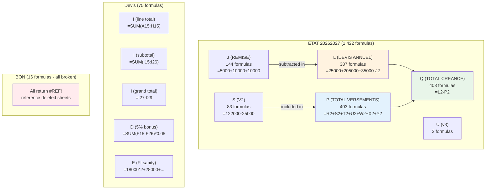

## The core formula chain

The three formulas that matter most:

```
L (DEVIS ANNUEL)     = 25000 + 205000 + 35000 - J2     ← annual quote
P (TOTAL VERSEMENTS) = R2 + S2 + T2 + U2 + W2 + X2 + Y2 ← total paid
Q (TOTAL CREANCE)    = L2 - P2                          ← balance owed
```

That's it. The whole accounting system runs on these three formulas. Everything else is auxiliary. See [[01 - ETAT Core Formulas (L, P, Q)]] for the full breakdown.

## At a glance

| Sheet | Formula count | Status |
|---|---|---|
| ETAT 20262027 | 1,422 | Working |
| Devis | 75 | Working |
| BON | 16 | **All broken** (`#REF!`) |
| REF | 0 | n/a (pure data) |
| **Total** | **1,513** | |

## ETAT formulas by column

| Column | Header | Formula count | Pattern |
|---|---|---|---|
| J | REMISE | 144 | `=5000+10000+10000` (additive) |
| L | DEVIS ANNUEL | 387 | `=25000+205000+35000-J2` (hand-typed arithmetic) |
| P | TOTAL VERSEMENTS | 403 | `=R2+S2+T2+U2+W2+X2+Y2` (row sum) |
| Q | TOTAL*CREANCE | 403 | `=L2-P2` (subtraction) |
| S | V2 | 83 | `=122000-25000` or `=100000-J56` (base ± adjustment) |
| U | v3 | 2 | `=79000`, `=27000+64500` (rare) |
| **Total** | | **1,422** | |

Other columns have 0 formulas (all values are typed literals).

## Related sections

- [[00 - ETAT Columns MOC]] — where these formulas live
- [[00 - Issues MOC]] — known formula bugs (S94 off-by-one, BON #REF!)
- [[00 - Workflows MOC]] — how operators use these formulas in practice


========================================================================
 FILE: 05 - Formulas/01 - ETAT Core Formulas (L, P, Q).md
   Language: markdown
========================================================================

---
tags:
  - formula
  - core
  - sheet/ETAT
---

# ETAT Core Formulas (L, P, Q)

> [!info] One-line summary
> Three formulas drive the entire [[02 - ETAT - Master Ledger|ETAT 20262027]] sheet: **L** computes the annual quote, **P** sums the payments, **Q** subtracts P from L to get the outstanding balance. Together they form the engine of the workbook.

## The three formulas at a glance

```
L2:  =25000+205000+35000-J2           ← DEVIS ANNUEL (annual quote)
P2:  =R2+S2+T2+U2+W2+X2+Y2            ← TOTAL VERSEMENTS (total paid)
Q2:  =L2-P2                            ← TOTAL*CREANCE (balance owed)
```

That's it. The whole accounting system runs on these three formulas. Everything else in the workbook is auxiliary.

## Formula ① — Column L: DEVIS ANNUEL (annual quote)

### The formula

```
L2:  =25000+205000+35000-J2
```

That's it. No `SUM()`, no `VLOOKUP()`, no named ranges. Just a hand-typed arithmetic expression that the operator writes fresh for each student.

### Decoded

| Component | Meaning |
|---|---|
| `25000` | Registration fee (FI) for a primary-school student |
| `205000` | Tuition (Frais Scolarisation) for a primary-school student |
| `35000` | Transport fee (Tranche 1 of 3, but here the full annual transport cost) |
| `-J2` | Subtract the discount typed in column J of this row |
| Result | Annual quote for this student = 265,000 − 25,500 = 239,500 DZD |

The numeric components are picked from the [[05 - Price Table]] based on:

- Column G (`niveau`) → determines the registration fee tier (25K for PRIM, 30K for COLG/LYC, 18K for pre-school)
- Column H (`CLASSE`) → determines the tuition tier (205K for CP, 305K for 1AAM, 340K for 1AS, etc.)
- Column I (`OPTION`) → determines whether transport is added (only if `TRNSP`)
- Column V (`DISTINATION`) → determines the transport tier (35K / 43K / 52K / 55K by distance)
- Column J (`REMISE`) → the discount to subtract

There's **no automatic lookup** — the operator looks at the student's G/H/I/V values and types the appropriate numbers into the L formula by hand. This makes L the most labor-intensive column to maintain.

### Variants found in the file

The 387 L formulas break into many variants. Here are the most common patterns (with their approximate frequency):

| Pattern | Frequency | Meaning |
|---|---|---|
| `=25000+205000+35000-J*` | 26 | Primary with transport (nearby town), simplest case |
| `=25000+330000-J*` | 16 | Collège without transport |
| `=25000+305000-J*` | 15 | Collège without transport, slightly cheaper tier |
| `=25000+220000+35000-J*` | 13 | Primary with transport (medium-distance town) |
| `=30000+250000+20000-J*` | 11 | High school with transport |
| `=245000-J*` | 10 | Simplified formula — just total minus discount |
| `=355000-J*` | 10 | Same idea — total minus discount, for a lycée student |

About 26 rows omit the `-J*` term entirely, meaning the family gets no discount:

```
L5:   =25000+305000+52000         (collège with transport, no discount)
L6:   =25000+205000+35000+52000   (primary with two transport tiers? unusual)
L14:  =180000+165000-J14          (no registration fee — only tuition)
```

These variants reflect the operator's flexibility — they can compose any combination of fee components.

### The price menu (cheat sheet)

When the operator types an L formula, they're picking from a mental menu. See [[05 - Price Table]] for the full breakdown. Quick reference:

**Registration fees (FI):**
- 18,000 = pre-school
- 25,000 = primary (most common)
- 30,000 = collège/lycée

**Tuition:**
- 125,000 = pre-school
- 205,000 = primary CP/CE1/CE2
- 220,000 = primary CM1/CM2
- 305,000 = collège AAM series
- 340,000–365,000 = lycée

**Transport:**
- 35,000 = Tier 1 (Boumerdès, Corso, Sahel, Figuier, Benyounes)
- 43,000 = Tier 2 (rarely used on ETAT)
- 52,000 = Tier 3 (Boudouaou, Ouled Moussa, Khemis Khenchela, Tidjelabine)
- 55,000 = Tier 4 (Cap Djenet, Bordj Mnaïl, Isser, Si Mustapha, Reghaia, Rouiba)

### Where the input values come from

| Input | Source | How it's chosen |
|---|---|---|
| Registration amount | [[05 - Price Table]] | Operator looks at G (niveau) and picks the matching amount |
| Tuition amount | [[05 - Price Table]] | Operator looks at H (CLASSE) and picks the matching amount |
| Transport amount | [[05 - Price Table]] | Operator looks at V (DISTINATION) and picks the matching tier |
| Discount (J) | Typed in column J, sometimes as a formula | Operator composes from discount components |

### Where the output goes

| Used by | How |
|---|---|
| Column Q formula | `Q2: =L2-P2` — L is the starting balance, P is what's been paid, Q is what's still owed |
| BON sheet (broken) | `C10: =+VLOOKUP(F8,'PAR PARENT'!A4:E785,2,0)` — should pull the family's total L, but the lookup is broken |
| Operator's manual review | The operator glances at L to verify the family's quote |

So L flows directly into Q via the simplest formula in the workbook. That's it. One input, one output.

### Why the formula is hand-typed instead of looked up

You might wonder: why not use a `VLOOKUP` against the [[05 - Price Table]] to automatically pick the right registration fee, tuition, and transport based on G/H/V? That would be much less error-prone.

The answer is **flexibility**. The school's pricing isn't perfectly rigid — they negotiate discounts, offer promo rates, adjust for siblings, and handle special cases. A fixed lookup table can't accommodate "this family gets 5,000 off because the father is a teacher" or "this student's tuition is 215,000 because we prorated it for mid-year enrollment."

By making L a hand-typed formula, the operator can express any pricing variation. The cost is that they have to remember the standard prices and apply them consistently — which doesn't always happen (see the many variants in the file).

### Common mistakes to watch for

1. **Forgetting the `-J` term**: if the operator types `=25000+205000+35000` and forgets to subtract the discount, the family is overcharged by the discount amount. This happens in about 26 rows where there's no `-J` (sometimes intentionally, sometimes not).

2. **Typo in the discount cell reference**: e.g., `=110000-J95` when the operator meant `=110000-J94`. This is exactly what happened in S94 — see [[04 - Off-by-One in S94]].

3. **Using the wrong tuition tier**: e.g., typing 205,000 for a 1AAM student who should be 305,000. The operator would lose 100,000 DZD of revenue on that student.

4. **Forgetting transport**: if the student has `OPTION = TRNSP` but the operator forgets to add the transport amount, the family is undercharged by 35,000–55,000 DZD.

5. **Adding transport twice**: if the operator adds both `35000` and `52000` (thinking they're different tranches), the family is overcharged. The single transport amount in L represents the **full annual transport cost**, not one tranche.

### The relationship to the Devis sheet

The L formula on ETAT should **mirror** the grand total on the corresponding Devis block. For example, if a family's Devis block computes a grand total of 643,000 DZD for three children, the operator should type three L formulas on ETAT (one per child row) that sum to 643,000.

This is a **manual reconciliation** — there's no formula linking the two sheets. If the operator makes a mistake on one of the L formulas, the sum won't match the Devis total, and nobody will notice unless they explicitly check.

### Recommendations

If you wanted to make L more robust without losing flexibility:

1. **Add helper columns** for the registration, tuition, and transport components (e.g., put 25,000 in a `Reg_Fee` column, 205,000 in a `Tuition` column, 35,000 in a `Transport` column).
2. **Make L a real formula**: `=Reg_Fee + Tuition + Transport - J`
3. **Use VLOOKUP against the Price Table** to auto-populate Reg_Fee, Tuition, and Transport based on G/H/V — but allow manual override for special cases.
4. **Add a validation** that flags rows where L doesn't match the expected `Reg_Fee + Tuition + Transport - J`.

This would reduce typos while preserving flexibility.

## Formula ② — Column P: TOTAL VERSEMENTS (total paid)

### The formula

```
P2:  =R2+S2+T2+U2+W2+X2+Y2
```

There are **403** P formulas — one per active student row (rows 2 through 404).

### Decoded

| Component | Column | Meaning |
|---|---|---|
| `R2` | R (FI) | Registration fee paid |
| `S2` | S (V2) | 2nd tuition installment paid |
| `T2` | T (2V) | Alternate 2nd installment paid (rarely used) |
| `U2` | U (v3) | 3rd tuition installment paid |
| `W2` | W (1T) | 1st transport tranche paid |
| `X2` | X (T2) | 2nd transport tranche paid |
| `Y2` | Y (t3) | 3rd transport tranche paid |
| Result | | Total payments made this year |

### Why these specific seven columns?

The formula sums **all the installment columns for the standard annual fee** — registration + 3 tuition tranches + 3 transport tranches. These are the payments that count toward the L (DEVIS ANNUEL) total.

It deliberately **excludes**:

- **Columns Z–AE** (PSY1, PSY2, ORTH1, ORTH2, E-PLANT, Ratrapage) — special services that are billed separately and aren't part of the standard fee.
- **Columns AF–AL** (SEPTEMBRE, DECEMBRE, MARS) — term-tracking columns that are unused in this file.
- **Columns M, N, O** (REMBOURCEMENT, DETTES, REGLEMENTS DETTES) — adjustments that aren't part of this year's payment total.

This means **P only captures the "core" annual fee payments**. If a family pays for a PSY session, that payment is recorded in column Z but doesn't reduce their balance Q. This is a deliberate design choice — see [[04 - Special Services (Z-AE)]] for the implications.

### Why a sum of 7 cells instead of `SUM(R2:Y2)`?

You might expect the formula to be `=SUM(R2:Y2)` — much shorter. But that would also include column V (DISTINATION), which is a **town name** (text), not a number. While Excel silently ignores text in SUM ranges, the operator chose to explicitly list the columns to be summed.

This is actually safer because:

1. It documents which columns are included.
2. It won't break if someone moves column V or inserts a column.
3. It explicitly excludes V (which is in the middle of the range R–Y).

### Sample calculations

#### Row 2 — ZIREG LEA (paid in full)

| R (FI) | S (V2) | T (2V) | U (v3) | W (1T) | X (T2) | Y (t3) | P (TOTAL) |
|---|---|---|---|---|---|---|---|
| 25,000 | 71,500 | 71,500 | 71,500 | — | — | — | **239,500** |

P2 = 25,000 + 71,500 + 71,500 + 71,500 + 0 + 0 + 0 = **239,500 DZD**

This matches her L2 (annual quote) exactly, so Q2 (balance) = 0. She's paid in full.

#### Row 4 — BOUAICHA ACIL (partial payment)

| R (FI) | S (V2) | T (2V) | U (v3) | W (1T) | X (T2) | Y (t3) | P (TOTAL) |
|---|---|---|---|---|---|---|---|
| 25,000 | `=82000+10000` (92,000) | — | — | — | — | — | **117,000** |

P4 = 25,000 + 92,000 + 0 + 0 + 0 + 0 + 0 = **117,000 DZD**

Her L4 = 240,000, so Q4 = 240,000 − 117,000 = **123,000 DZD still owed**.

### Edge cases

#### All payment columns empty (P = 0)

If no payments have been recorded yet, all of R/S/T/U/W/X/Y are blank, and P = 0. This is the case for the bottom ~13 rows of the active range (rows 391–404), which are spare rows or newly enrolled students with no payments.

In this case, Q = L − 0 = L — the family owes the full annual quote.

#### Overpayment (P > L)

If a family accidentally pays more than the annual quote (e.g., writes a check for 300,000 when they only owed 250,000), P will exceed L, and Q becomes negative:

```
Q = L − P = 250,000 − 300,000 = −50,000
```

A negative Q means the school owes the family money. The operator should record this in column M (REMBOURCEMENT) and arrange a refund. In practice, the operator might just leave Q negative as a credit toward next year's tuition.

#### Special-service payments (not in P)

If a family pays 5,000 for a PSY session, that goes in column Z (PSY1), not in P. So the family's Q (balance) doesn't change — they still owe the full L amount. The PSY payment is tracked separately in column Z for billing records.

This is by design but can be confusing. See [[04 - Special Services (Z-AE)]] for the implications.

### Common mistakes to watch for

1. **Putting a special-service payment in the wrong column**: if the operator accidentally types a PSY payment into column S (V2), it gets counted in P and reduces Q — making it look like the family paid tuition when they actually paid for a PSY session.

2. **Forgetting to enter a payment**: if a check arrives and the operator forgets to type it into R/S/T/U/W/X/Y, P doesn't update and Q stays too high. The AM comment log ([[06 - Hidden Payment Log (AM)]]) is the audit trail that catches this — if AM has a receipt entry but no corresponding amount in R–Y, something's wrong.

3. **Typing the amount in the wrong row**: if two students have similar names, the operator might type the payment in the wrong row. This would make one student's P too high and the other's too low.

4. **Using T (2V) when you meant S (V2)**: since T is rarely used, the operator might overlook it. If they put a payment in T instead of S, P still captures it (good), but the per-tranche analysis is wrong (bad).

### The relationship to the AM comment log

Every payment that goes into R/S/T/U/W/X/Y should also have a corresponding entry in the AM comment for that row. The AM comment captures the **receipt details** (amount, date, receipt book number) that aren't stored elsewhere.

So a properly recorded payment has two entries:

1. The amount in the appropriate payment column (R/S/T/U/W/X/Y) — picked up by P.
2. A comment on the AM cell with `amount/date/receipt#` — for audit purposes.

If the operator only does one of these, the data is incomplete.

## Formula ③ — Column Q: TOTAL*CREANCE (balance owed)

### The formula

```
Q2:  =L2-P2
```

That's the entire formula. There are **403** Q formulas — one per active student row.

### Decoded

| Component | Column | Meaning |
|---|---|---|
| `L2` | L (DEVIS ANNUEL) | Annual quote — the total amount the family owes for the year |
| `P2` | P (TOTAL VERSEMENTS) | Total payments made this year |
| Result | Q (TOTAL*CREANCE) | Outstanding balance — what's still owed |

### What the result means

| Q value | Meaning |
|---|---|
| `Q = 0` | Family has paid in full — nothing owed |
| `Q > 0` | Family still owes money (the normal case) — amount is the balance |
| `Q < 0` | Family has overpaid — school owes them a refund (rare) |

### Sample calculations

#### Row 2 — ZIREG LEA (paid in full)

- L2 = 239,500 (annual quote)
- P2 = 239,500 (total paid)
- Q2 = L2 − P2 = **0**

Family owes nothing. Fully paid.

#### Row 4 — BOUAICHA ACIL (partial payment)

- L4 = 240,000
- P4 = 117,000
- Q4 = L4 − P4 = **123,000**

Family still owes 123,000 DZD.

#### Row 5 — SEDIKI ISHAK (larger balance)

- L5 = 382,000
- P5 = 152,000
- Q5 = L5 − P5 = **230,000**

Family still owes 230,000 DZD — a large balance.

#### Hypothetical overpayment

If a family had L = 250,000 and accidentally paid P = 300,000:

- Q = L − P = 250,000 − 300,000 = **−50,000**

A negative Q means the school owes the family 50,000 DZD. The operator should record this in column M (REMBOURCEMENT) and arrange a refund.

### What Q does NOT include

The formula is deliberately simple — it only subtracts P from L. It does **not** include:

| Adjustment column | What it tracks | Why it's not in Q |
|---|---|---|
| M (REMBOURCEMENT) | Refunds owed to the family | Should reduce Q, but doesn't |
| N (DETTES) | Prior-year debts carried forward | Should increase Q, but doesn't |
| O (REGLEMENTS DETTES) | Payments toward prior debts | Should reduce Q, but doesn't |
| Z–AE (special services) | PSY/ORTH/E-PLANT/Ratrapage payments | Tracked separately, not part of standard fee |

So Q only captures the **current-year standard fee** balance. If a family has prior-year debts (N > 0) or is owed a refund (M > 0), the true balance is different from Q.

#### The "correct" formula (if you wanted to include everything)

If you wanted Q to capture all the adjustments, the formula would be:

```
Q_corrected = L + N − M − P − O
            = annual_quote + prior_debts − refund − payments − debt_payments
```

But the current file uses just `=L−P`. This is probably intentional — the school treats prior-year debts and refunds as **separate concerns** tracked in their own columns, not as part of the current-year balance.

> [!note] Conceptual guess was wrong
> The conceptual summary that inspired this vault guessed that the formula was `=L+DETTES−REMISE−P` — i.e., that it included prior-year debts and subtracted the discount again. That's not accurate. The actual formula is just `=L−P`, and the discount is already baked into L (via `-J` in the L formula). The discount is subtracted inside L rather than in Q.

### Why the header has an asterisk

The header reads `TOTAL*CREANCE` (with an asterisk between TOTAL and CREANCE). This is probably:

- A typo (the operator meant to type a space)
- A formatting artifact (maybe a wildcard or marker that got typed by mistake)
- A separator the operator used for visual clarity

It has no semantic meaning. The header should be `TOTAL CREANCE` or `TOTAL_CRÉANCE`.

### Where the inputs come from

| Input | Source |
|---|---|
| L | The L formula (`=25000+205000+35000-J2` etc.) — see above |
| P | The P formula (`=R2+S2+T2+U2+W2+X2+Y2`) — see above |

Both L and P are themselves formulas, so Q is a formula of formulas. The whole chain is:

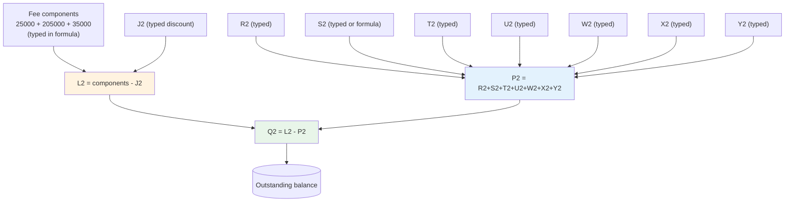

### Where the output goes

| Used by | How |
|---|---|
| Operator's primary view | Q is the **single most important column** in the workbook — it tells the school at a glance who owes what |
| Conditional formatting | The green-to-white color scale applies to Q values — larger balances are more intensely green |
| BON sheet (broken) | `I12: =+VLOOKUP(E12,'PAR PARENT'!A4:K786,6,0)` should pull Q (or P) into the customer statement, but the lookup is broken |
| Management reporting | The operator can sum Q across all rows to get the school's total outstanding receivables |

### Why Q is the most important formula in the workbook

The school's accounting question, asked daily, is: **"How much does each family still owe?"** Q answers that question for every student in one column.

From Q, the school can:

- **Identify late payers** — sort Q descending to see the biggest balances
- **Compute total receivables** — `=SUM(Q2:Q404)` gives the school's total outstanding
- **Track collection progress** — watch Q decrease over time as families pay
- **Forecast cash flow** — multiply Q by historical collection rates to estimate future inflows
- **Generate reminders** — filter Q > some_threshold to find families who need a phone call

All of this from a one-line formula. Q is the workbook's reason for existing.

### How Q updates in real time

Because Q depends on L and P, and P depends on R/S/T/U/W/X/Y, any change to a payment cell immediately updates Q:

1. Operator types `50000` into S7 (2nd installment for row 7).
2. P7 recalculates: was 0, now 50,000.
3. Q7 recalculates: was L7, now L7 − 50,000.
4. The conditional-formatting green fill appears on S7 and propagates the row's visual emphasis.

This is the **daily operating loop** of the workbook. See [[03 - Payment Recording]].

### Common mistakes to watch for

1. **Forgetting that Q doesn't include prior-year debts**: if a family has N = 50,000 of prior-year debt, their true balance is Q + N − O, not just Q. The operator must remember to check columns N and O for the full picture.

2. **Treating a negative Q as a problem**: if Q < 0, it doesn't mean the formula is broken — it means the family overpaid. The correct response is to record a refund in M, not to "fix" Q.

3. **Assuming Q is real-time accurate**: Q is only as accurate as the data in R/S/T/U/W/X/Y. If a check arrives and the operator forgets to enter it, Q is too high. The AM comment log is the cross-reference — every AM comment should correspond to a payment in R–Y.

4. **Comparing Q across rows with different L formulas**: because L is hand-typed with different component combinations, two students with the same Q might have very different L and P values. Q is comparable across rows, but only if you trust that L was typed correctly for each row.

### Recommendations

If you wanted to enhance Q without breaking anything:

1. **Add a "true balance" column** that incorporates M, N, O:
   ```
   True_Balance = L + N − M − P − O
   ```
   This would give the operator a more complete view of each family's account.

2. **Add a "status" column** that buckets Q into categories:
   ```
   =IF(Q=0, "Paid in full", IF(Q<0, "Credit", IF(Q>L*0.5, "Behind", "On track")))
   ```

3. **Add a chart** that visualizes Q across all rows — e.g., a histogram of balances, or a top-10 list of biggest debtors.

4. **Add conditional formatting** that highlights negative Q (overpayments) in red so they're not missed.

---

**See also**:
- [[02 - REMISE and Installment Shortcuts (J, S)]] — the auxiliary formulas in J and S
- [[03 - Devis Block Formulas]] — how the Devis sheet computes the equivalent total
- [[02 - Quote and Balance (L-Q)]] — the full L–Q column block
- [[05 - Price Table]] — the menu of fee components
- [[03 - Payment Recording]] — the daily loop that updates Q


========================================================================
 FILE: 05 - Formulas/02 - REMISE and Installment Shortcuts (J, S).md
   Language: markdown
========================================================================

---
tags:
  - formula
  - shortcuts
  - sheet/ETAT
---

# REMISE and Installment Shortcuts (J, S)

> [!info] One-line summary
> Columns J (REMISE/discount) and S (V2/2nd installment) on [[02 - ETAT - Master Ledger|ETAT 20262027]] often contain arithmetic formulas like `=5000+10000+10000` instead of literal numbers. The operator does this to make the calculation **auditable** — you can see at a glance how a discount or installment was derived.

## Column J — REMISE (discount)

### What column J holds

There are three patterns:

#### Pattern 1 — Literal number

```
J2:  25500
J4:  5000
J6:  10000
```

Just a number — the total discount. No breakdown of what it's composed of.

#### Pattern 2 — Arithmetic formula

```
J5:  =5000+10000+10000      (= 25,000)
J7:  =20000+25000           (= 45,000)
J48: =3500+10000+22500      (= 36,000)
J58: =10000+10000+30500+15000  (= 65,500)
```

An addition of components, each representing a different discount reason:

- `5000` — sibling discount
- `10000` — early-payment discount
- `10000` — staff-family discount
- `20000` — financial-aid discount
- `3500` — small adjustment
- `22500` — promotional discount
- `30500` — negotiated discount
- `15000` — hardship discount

The operator types these as formulas so they can see at a glance **why** the discount is what it is. If a manager asks "why did we give this family a 25,000 discount?", the operator can expand the formula and answer "5,000 sibling + 10,000 early-payment + 10,000 staff."

#### Pattern 3 — Subtraction formula (in S, not J)

```
S5:  =122000-25000     (= 97,000)
S56: =100000-J56       (= 100,000 minus the discount)
S94: =110000-J95       (= 110,000 minus J95 — off-by-one, see [[04 - Off-by-One in S94]])
```

Some formulas subtract rather than add. These typically compute an **installment amount** (in column S) by starting from a base and subtracting the discount. For example, "the 2nd installment is 100,000 minus the discount" means the family gets the entire discount applied to the 2nd installment rather than spread across all installments.

Note: these subtraction formulas appear in column S (V2), not in column J — but they reference J, so they're related.

### How many J formulas are there

There are **144 J formulas** (arithmetic) and ~246 literal numbers in column J across the 390 active student rows.

So about **37% of students have a formula-based discount**, and the rest have a literal number. The formula-based ones are the discounts with multiple components; the literals are simple one-off discounts.

### What the discount components mean

Based on the patterns observed in the actual file:

| Amount | Likely reason | Frequency |
|---|---|---|
| 5,000 | Sibling discount (small) | Common |
| 10,000 | Sibling discount (medium) or early-payment | Common |
| 15,000 | Staff-family discount | Common |
| 18,000 | Hardship discount | Occasional |
| 20,000 | Larger sibling discount | Occasional |
| 22,000 | Negotiated discount | Rare |
| 25,000 | Promotional discount | Occasional |
| 30,000 | Large negotiated discount | Rare |
| 33,000 | (unclear) | Rare |
| 35,000 | (unclear) | Rare |
| 50,000 | Major discount (full transport waiver?) | Rare |

These are educated guesses based on the patterns — the workbook doesn't have a discount-reason codebook. Column K (JUSTIFICATION) sometimes has a free-text reason, but it's mostly empty.

### Where the J value goes next

| Used by | How |
|---|---|
| Column L formula | `L2: =25000+205000+35000-J2` — J is subtracted from the fee total |
| Some column S formulas | `S56: =100000-J56` — J is subtracted from a base installment amount |

So J has two downstream effects:

1. **Primary**: reduces L (the annual quote), which reduces Q (the balance owed).
2. **Secondary**: in some rows, also reduces S (the 2nd installment), which means the discount is "spent" on the 2nd payment rather than spread across all payments.

> [!danger] The secondary effect can cancel the primary
> The secondary effect is unusual — it means the family's P (total paid) is also reduced by the discount, not just their L. So Q stays roughly the same as if there were no discount. This is confusing and probably reflects the operator's ad-hoc approach to applying discounts. See "Double-counting the discount" below.

### Sample formulas decoded

#### `J5: =5000+10000+10000` → 25,000

SEDIKI ISHAK, a collège student (1AAM) with transport. The 25,000 discount is composed of three 5K–10K components, likely:

- 5,000 sibling discount (he has a brother SEDIKI YAKOUB in row 6)
- 10,000 early-payment discount
- 10,000 staff or promotional discount

#### `J7: =20000+25000` → 45,000

ZERGANI MAHDI, a CM2 student. The 45,000 discount is composed of two larger components, possibly:

- 20,000 sibling discount (3 siblings in the school)
- 25,000 promotional or staff discount

#### `J48: =3500+10000+22500` → 36,000

A student with three discount components of varying sizes. The 36,000 total is unusually specific — probably reflects a negotiation with the family.

#### `J58: =10000+10000+30500+15000` → 65,500

A large multi-component discount. The 30,500 component is unusually precise — possibly a prorated refund that was converted into a discount.

### Why formulas instead of just numbers

The operator could just type `25500` directly. Why bother with `=5000+10000+10000`?

Three reasons:

1. **Auditability**: when someone later asks "why is this discount 25,000?", the formula shows the breakdown. A literal number tells you nothing.

2. **Documentation**: the formula acts as a record of the discount agreement. If the family disputes the discount, the operator can show the breakdown.

3. **Mental arithmetic**: the operator may be computing the discount on the fly (e.g., "sibling discount 5K + early payment 10K + staff 10K = 25K") and typing the formula is faster than adding it up in their head and typing the result.

The downside is that the formula is opaque to anyone who doesn't know the discount codebook. Without context, `=3500+10000+22500` could mean anything.

### Common mistakes to watch for

1. **Forgetting the `-J` term in L**: if the operator types `=25000+205000+35000` and forgets `-J2`, the discount in J2 has no effect — the family is charged full price. This happens in about 26 rows where there's no `-J` term in L (sometimes intentionally, sometimes not).

2. **Typo in the cell reference**: e.g., `=110000-J95` when the operator meant `=110000-J94`. This is exactly what happened in [[04 - Off-by-One in S94]]. The discount from the wrong row gets applied.

3. **Negative discount**: if the operator types a negative number in J (e.g., `-5000`), it actually **increases** L (because L subtracts J, and subtracting a negative is adding). This would be a surcharge, not a discount. Probably not intended.

4. **Discount larger than the fee**: if J > 25000+205000+35000 = 265000, the L formula goes negative. The family would be owed money. Probably a data-entry error.

### Recommendations

If you wanted to make J more structured:

1. **Add a discount-reason codebook** to REF: e.g., a table with columns `Code | Description | Default_Amount`:
   - `SIB` | Sibling discount | 5000
   - `EARLY` | Early payment | 10000
   - `STAFF` | Staff family | 15000
   - `PROMO` | Promotional | 25000
   - `NEGO` | Negotiated | varies

2. **Add a `Discount_Reason` column** next to J where the operator picks a code from the dropdown.

3. **Replace the J formula with a `SUMIF`** that sums all discount components logged elsewhere — but this is more complex than the current approach.

4. **At minimum, document the discount convention** in a comment on J1 explaining what each typical amount means.

The current approach (arithmetic formulas) is actually quite good for auditability — it just lacks documentation of what each amount represents.

## Column S — V2 (2nd installment) shortcuts

### What column S holds

There are three patterns:

#### Pattern 1 — Literal number

```
S2:  71500
S6:  87000
```

Just a number — the 2nd installment amount. No breakdown.

#### Pattern 2 — Addition formula

```
S4:  =82000+10000        (= 92,000)
S20: =70000+20000        (= 90,000)
S21: =74000+15000        (= 89,000)
```

The 2nd installment is composed of two amounts added together. Probably reflects a split payment — e.g., the family paid 82,000 in November and 10,000 in December, totaling 92,000.

#### Pattern 3 — Subtraction from a base

```
S5:  =122000-25000       (= 97,000 — base 122,000 minus 25,000 discount)
S56: =100000-J56         (= 100,000 minus the discount typed in J56)
S57: =132000-J57         (= 132,000 minus J57)
S58: =122000-J58         (= 122,000 minus J58)
S63: =128000-15000       (= 113,000)
S79: =142000-18000       (= 124,000)
S80: =132000-18000       (= 114,000)
S94: =110000-J95          off-by-one — should be =110000-J94
```

The 2nd installment is computed as `base − discount`. This means the family gets the entire discount applied to the 2nd installment (rather than spread across all installments).

For example, S5 = `=122000-25000` = 97,000. The "base" 2nd installment for a collège student is 122,000 DZD, but SEDIKI ISHAK gets a 25,000 discount, so his 2nd installment is reduced to 97,000.

#### Pattern 4 — Just the base, no subtraction

```
S82: =122000-20000       (= 102,000)
S83: =82000              (= 82,000 — single value as a formula, for no clear reason)
```

Some operators type a single number as a formula — possibly out of habit, possibly to leave room for future adjustments.

### How many S formulas are there

There are **83 S formulas** (arithmetic) and ~307 literal numbers in column S across the 390 active student rows.

So about **21% of students have a formula-based 2nd installment**, and the rest have a literal number. The formula-based ones are concentrated in rows where the family has a discount and the operator chose to apply it to the 2nd installment specifically.

There are also **2 U column formulas** (`U9: =79000` and `U58: =27000+64500`) — same idea, but for the 3rd installment. These are rare.

### Why the 2nd installment (S) gets special treatment

Looking at the data, S (V2) is the **largest single payment** for most families — typically 70,000–150,000 DZD, compared to R (FI) at 25,000–30,000 and U (v3) at 70,000–90,000.

Because S is the biggest payment, it's where the operator has the most flexibility to apply discounts. Reducing S by 25,000 has a big impact on what the family pays at the 2nd tranche, which is when most families feel the cash-flow pinch (after the registration fee but before the end-of-year payment).

The 3rd installment (U) is less commonly discounted because by then the family has usually paid most of what they're going to pay.

### Where the S value goes next

| Used by | How |
|---|---|
| Column P formula | `P2: =R2+S2+T2+U2+W2+X2+Y2` — S is one of the seven summed cells |
| Column Q (indirectly) | P flows into Q via `Q2: =L2-P2` |

So S contributes to P (total paid), which contributes to Q (balance owed). Every dinar entered in S reduces Q by one dinar.

### Sample formulas decoded

#### `S4: =82000+10000` → 92,000

BOUAICHA ACIL, primary. The 82,000 is the standard primary 2nd installment; the additional 10,000 might be a catch-up payment or an extra service paid at the same time.

#### `S5: =122000-25000` → 97,000

SEDIKI ISHAK, collège. The 122,000 is the standard collège 2nd installment; 25,000 is subtracted because that's his discount (J5 = 25,000). So his 2nd installment is reduced by the full discount amount.

#### `S56: =100000-J56` → 100,000 − discount

A primary student with a 100,000 base 2nd installment. The discount in J56 is subtracted, so if J56 = 5,000, S56 = 95,000.

#### `S94: =110000-J95` → 110,000 − J95 (**bug**)

This formula has an off-by-one error — it references J95 (the discount for the student in row 95) instead of J94 (the discount for the student in row 94, which is this row). So the S94 value is wrong by the difference between J94 and J95.

See [[04 - Off-by-One in S94]] for the full diagnosis.

### The "base" amounts used in S formulas

Based on the patterns, the operator has a mental price menu for the 2nd installment:

| Base amount | Level | Notes |
|---|---|---|
| 66,000 | Primary | Seen in `S14: =66000-5000` and `S99: =66000-J99` |
| 82,000 | Primary | Seen in `S4: =82000+10000`, `S83: =82000` |
| 100,000 | Primary (with discount) | Seen in `S56: =100000-J56` |
| 110,000 | Primary (higher tier) | Seen in `S94: =110000-J95` (the buggy one) |
| 122,000 | Collège | Seen in `S5: =122000-25000`, `S58: =122000-J58` |
| 128,000 | Collège | Seen in `S63: =128000-15000` |
| 132,000 | Collège | Seen in `S80: =132000-18000` |
| 142,000 | Lycée | Seen in `S79: =142000-18000` |
| 146,000 | Lycée | Seen in `S19: =146000-15000` |

These don't perfectly match the tuition tiers in [[05 - Price Table|the L formula]] — they're specific to the 2nd installment and reflect the school's tranche pricing (the 2nd installment is typically about 40% of annual tuition).

> [!danger] Double-counting the discount
> 4. **Double-counting the discount**: if the operator subtracts the discount in S (`=100000-J56`) AND the L formula also subtracts it (`=25000+205000+35000-J56`), the discount is applied twice. The family gets a 2× discount.
>
> This is actually what happens in some rows! For row 56:
> - L56 = `=25000+220000+35000-J56` → 285,000 − J56 (the discount reduces the annual quote)
> - S56 = `=100000-J56` → 100,000 − J56 (the discount also reduces the 2nd installment)
> - P56 = R56 + S56 + ... = R56 + (100,000 − J56) + ...
> - Q56 = L56 − P56 = (285,000 − J56) − (R56 + 100,000 − J56 + ...) = 185,000 − R56 − ...
>
> The J56 cancels out! So the discount has **no net effect** on Q in these rows. The family pays the same regardless of the discount.
>
> This is almost certainly a bug — the operator probably meant to subtract the discount only once, but accidentally subtracts it in both L and S. The result is that the discount is "fake" — it shows up on paper but doesn't actually reduce what the family pays.

### Recommendations

If you wanted to clean up column S:

1. **Standardize the base amounts** in a lookup table on REF.
2. **Decide where the discount applies** — once, in L (the annual quote) — and remove the `-J` from S formulas.
3. **Use a consistent formula** like `=VLOOKUP(H2, S_Bases, 2, FALSE)` (no discount subtraction).
4. **Fix the S94 off-by-one** — see [[04 - Off-by-One in S94]].

The current ad-hoc formulas work for the operator who typed them, but they're fragile and create the double-counting issue described above.

---

**See also**:
- [[01 - ETAT Core Formulas (L, P, Q)]] — where J is subtracted in L
- [[03 - Installments (R-Y)]] — the full payment-column block
- [[04 - Off-by-One in S94]] — a specific J-reference typo
- [[06 - French Terms Glossary]] — REMISE = discount


========================================================================
 FILE: 05 - Formulas/03 - Devis Block Formulas.md
   Language: markdown
========================================================================

---
tags:
  - formula
  - devis
  - quote
---

# Devis Block Formulas

> [!info] One-line summary
> The [[03 - Devis - Quote Engine|Devis sheet]] contains 10 quote blocks, each 48 rows tall. Every block uses the same five formula patterns to compute per-student line totals, a family subtotal, a grand total, a 5% early-payment bonus, and a sanity-check sum of registration fees.

## The five formula patterns

### Pattern 1 — Line total (column I, per student row)

**Formula**:

```
I15: =+SUM(A15:H15)
```

**Decoded**: Sum all values in columns A through H of this row.

**What's in A–H**:

- A: student first name (text — ignored by SUM)
- B–C: (usually empty)
- D: class code (text — ignored by SUM)
- E: registration fee (F I)
- F: tuition (Frais Scolarisation)
- G: service type (text — ignored by SUM)
- H: service amount

**So the effective calculation**: `I15 = E15 + F15 + H15` (registration + tuition + service).

**Where it appears**: in each block, rows 15–26 (the student-data rows). With 10 blocks, that's 10 × 12 = 120 potential line-total formulas, but only ~25 are actually populated (the rest are empty rows waiting for siblings).

**Example** (Block 1, MAHAMED OUSSAID family):

```
I15: =+SUM(A15:H15)  = 28000 + 210000 + 43000 = 281000
I16: =+SUM(A16:H16)  = 18000 + 125000 + 43000 = 186000
I17: =+SUM(A17:H17)  = 18000 + 125000 + 43000 = 186000
```

### Pattern 2 — Subtotal (column I, row 27 of each block)

**Formula**:

```
I27: =+SUM(I15:I26)
```

**Decoded**: Sum all the line totals in this block.

**Where it appears**: in cell I27, I75, I123, I172, I220, I270, I316, I365, I412, I460 (one per block).

**Example** (Block 1):

```
I27: =+SUM(I15:I26)  = 281000 + 186000 + 186000 = 653000
```

So the MAHAMED OUSSAID family's subtotal is 653,000 DZD for three children.

### Pattern 3 — Grand total (column I, row 31 of each block)

**Formula (basic version)**:

```
I31: =+I27-I29
```

**Decoded**: `subtotal (I27) − discount (I29)`.

**Formula (with reimbursement)** — used in blocks that have a refund row:

```
I128: =+I123-I125-I126
```

**Decoded**: `subtotal − discount − reimbursement`.

**Where it appears**: in cells I31, I79, I128, I177, I225, I275, I321, I370, I417, I465.

**Example** (Block 1, basic version):

```
I31: =+I27-I29  = 653000 - 10000 = 643000
```

The MAHAMED OUSSAID family's grand total is 643,000 DZD after a 10,000 discount.

**Example** (Block 3, DJAOUD family, with reimbursement):

```
I123: =+SUM(I111:I122)  = 511000     (subtotal)
I125: 32500                          (discount, typed literal)
I126: 70000                          (reimbursement, typed literal)
I128: =+I123-I125-I126  = 511000 - 32500 - 70000 = 408500
```

The DJAOUD family's grand total is 408,500 DZD after a 32,500 discount and a 70,000 reimbursement (probably a credit from the prior year).

### Pattern 4 — 5% early-payment bonus (column D, row 35 of each block)

**Formula**:

```
D35: =+SUM(F15:F26)*0.05
```

**Decoded**: `5% of total tuition (column F) across all students in this block`.

**Where it appears**: in cells D35, D83, D132, D181, D229, D279, D325, D374 (some blocks omit this).

**Example** (Block 1):

```
F15 = 210000    (MAHDI's tuition)
F16 = 125000    (AMINE's tuition)
F17 = 125000    (3rd child's tuition)
D35: =+SUM(F15:F26)*0.05  = (210000 + 125000 + 125000) × 0.05 = 460000 × 0.05 = 23000
```

So if the MAHAMED OUSSAID family pays in full before June 30, 2021, they get an additional 23,000 DZD discount (5% of total tuition).

> [!note] Bonus is not auto-applied
> This bonus is **not** automatically subtracted from the grand total in I31. It's a separate calculation shown in the printed notes ("Nb 01: une remise de 5% sois..."). The operator would manually apply it if the family qualifies.

### Pattern 5 — FI sanity check (column E, row 39 of each block)

**Formula**:

```
E39: =18000*2+28000+21000+25000
```

**Decoded**: an arithmetic expression that recomputes the sum of registration fees (column E) for all students in the block.

**What it's for**: a manual verification that the operator typed the correct FI amounts. After typing the per-student FIs in column E, the operator writes a formula in E39 that should produce the same total. If the two don't match, they know they made a typo.

**Example** (Block 1):

- E15 = 28000 (MAHDI's FI)
- E16 = 18000 (AMINE's FI)
- E17 = 18000 (3rd child's FI)
- Sum = 28000 + 18000 + 18000 = 64000
- E39 formula: `=18000*2+28000` would give 64000

But the actual E39 formula is `=18000*2+28000+21000+25000` = 110000, which doesn't match 64000. So either:

- The operator included FIs from another block (cross-block contamination).
- The 21000 and 25000 are FIs from students who were planned but didn't enroll.
- The formula is just wrong.

This is a minor data-quality issue — the sanity check is broken but it doesn't affect the quote's grand total (which uses column I, not E).

**Where it appears**: in cells E39, E87, E136, E185, E233, E283, E329, E378, E425, E473.

## The other formulas (TODAY and the I9 date)

Each block also has:

```
I9: =TODAY()
```

This auto-fills today's date in the quote header. There are 10 of these (one per block), bringing the total formula count to ~75.

## Block-by-block summary

Here's the grand total for each of the 10 blocks (as computed by Pattern 3):

| Block | Client | Subtotal | Discount | Reimb. | Grand total |
|---|---|---|---|---|---|
| 1 | MAHAMED OUSSAID | 653,000 | 10,000 | — | **643,000** |
| 2 | KOUBA | (computed) | 41,500 | — | (computed) |
| 3 | DJAOUD | 511,000 | 32,500 | 70,000 | **408,500** |
| 4 | LOUNA | (computed) | — | 0 | (computed) |
| 5 | NEGACHE | (computed) | — | — | (computed) |
| 6 | HEBBAZ | (computed) | — | — | (computed) |
| 7 | FOUIDI | (computed) | — | 0 | (computed) |
| 8 | OUERDAN | (computed) | — | 0 | (computed) |
| 9 | MEDJKANE | (computed) | 5,000 | — | (computed) |
| 10 | KOROGLI | (computed) | 5,000 | — | (computed) |

(Some blocks' exact totals depend on the populated student rows; the formulas are present but only some rows have data.)

## How the Devis formulas differ from the ETAT formulas

| Aspect | Devis sheet | ETAT sheet |
|---|---|---|
| Per-student total | `=SUM(A15:H15)` (row total) | `=25000+205000+35000-J2` (hand-typed arithmetic) |
| Family total | `=SUM(I15:I26)` (subtotal of row totals) | (no equivalent — each student has their own L) |
| Grand total | `=I27-I29` (subtotal − discount) | (no equivalent — L is the per-student annual quote) |
| 5% bonus | `=SUM(F15:F26)*0.05` (5% of tuition) | (not calculated) |

The Devis formulas are **more structured** (using `SUM` and clear cell references) because the Devis sheet is a clean template that gets copied for each new family. The ETAT formulas are **more ad-hoc** (hand-typed arithmetic) because the operator has to compose the L formula for each student individually based on their fee components.

## Where the Devis output goes next

The grand total from each Devis block (cell I31, I79, I128, etc.) is **the number the operator reads off the printed quote**. They then take this number and reconstruct it as an L formula on the ETAT sheet for each enrolled student.

There is **no automatic link** between Devis and ETAT. The handoff is purely manual — the operator looks at the Devis total, breaks it down into registration + tuition + transport − discount, and types the corresponding L formula for each child on the ETAT sheet.

This is the most error-prone step in the entire workflow. If the operator misreads the Devis total or types the wrong components into L, the student's annual quote will be wrong, and the error may not be caught until the family complains at the end of the year.

## The two embedded side formulas (M399, M400)

Block 9 (MEDJKANE family) has two unusual formulas in column M:

```
M399: =200000+8000+6000+6000  (= 220,000)
M400: =200000+12000+9000+9000  (= 230,000)
```

These don't fit the standard Devis template. They appear to be the operator's side calculation — possibly comparing two scenarios for the family's annual cost. The 200,000 base + tiered extras suggests these are total-cost projections for two different children or two different service combinations.

They have no effect on the quote's grand total (which lives in column I).

---

**See also**:
- [[03 - Devis - Quote Engine]] — the sheet itself
- [[01 - ETAT Core Formulas (L, P, Q)]] — how the Devis total is reconstructed on ETAT
- [[05 - Price Table]] — what each fee amount means
- [[01 - New Family Inquiry]] — how the operator uses Devis in practice
- [[02 - Missing Devis Dropdowns]] — why the Devis input cells don't have working dropdowns


========================================================================
 FILE: 06 - Workflows/00 - Workflows MOC.md
   Language: markdown
========================================================================

---
tags:
  - moc
  - workflow
---

# Workflows MOC

The workbook is operated through four recurring workflows. Each one is a step-by-step procedure that the school's accounting/admin staff follows.

## The four workflows

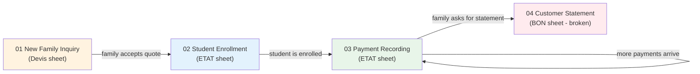

## Notes in this section

1. [[01 - New Family Inquiry]] — produce a printed quote for a prospective family (Devis sheet).
2. [[02 - Student Enrollment]] — create rows in ETAT for enrolled students with L formulas (ETAT sheet).
3. [[03 - Payment Recording]] — record a payment and update the balance (ETAT sheet, AM comments).
4. [[04 - Customer Statement]] — print a balance statement for a family (BON sheet, or ETAT workaround when BON is broken).

## Which sheet does what

| Workflow | Primary sheet | Output |
|---|---|---|
| 1 — New Family Inquiry | Devis | Printed quote (PDF or paper) |
| 2 — Student Enrollment | ETAT | New row(s) with L/P/Q formulas |
| 3 — Payment Recording | ETAT | Updated R-Y cells, AM comment, recalculated P and Q |
| 4 — Customer Statement | BON (broken) → ETAT | Printed statement (PDF or paper) |

## The most common workflow

Workflow 3 (Payment Recording) is by far the most common — it happens dozens of times per week during peak enrollment season (May–June). The other three are less frequent:

- Workflow 1 (New Family Inquiry): a few times per week during enrollment season
- Workflow 2 (Student Enrollment): a few times per week during enrollment season
- Workflow 4 (Customer Statement): occasionally, on demand

## At a glance

| Workflow | Time per occurrence | Frequency |
|---|---|---|
| 1 New Family Inquiry | 5–10 minutes | A few per week during enrollment |
| 2 Student Enrollment | 5–10 minutes per student | A few per week during enrollment |
| 3 Payment Recording | 1–2 minutes per payment | Many per day during peak season |
| 4 Customer Statement | 1 minute (if BON worked) or 5–10 minutes (workaround) | On demand |

## Related sections

- [[00 - Sheets MOC]] — the sheets these workflows operate on
- [[00 - Formulas MOC]] — the formulas that fire during these workflows
- [[00 - Issues MOC]] — what's broken and how to work around it


========================================================================
 FILE: 06 - Workflows/01 - New Family Inquiry.md
   Language: markdown
========================================================================

---
tags:
  - workflow
  - devis
  - quote
---

# Workflow 1 — New Family Inquiry

> [!info] At a glance
> - **Trigger**: A prospective family calls or visits the school to ask about enrollment costs.
> - **Goal**: Produce a printed annual price quote for the family to take home and consider.
> - **Sheet used**: [[03 - Devis - Quote Engine|Devis]] (and indirectly [[01 - REF - Foundation|REF]] for dropdowns, but they're broken).
> - **Output**: A printed one-page quote specifying the family's annual total for the school year.

## Step-by-step

### Step 1 — Open the Devis sheet

Open the workbook and click the `Devis` tab. You'll see 10 existing quote blocks (for MAHAMED OUSSAID, KOUBA, DJAOUD, LOUNA, NEGACHE, HEBBAZ, FOUIDI, OUERDAN, MEDJKANE, KOROGLI). These are last year's quotes kept for reference.

### Step 2 — Copy an existing block to use as a template

Scroll to the bottom of the last block (row 480). Select rows 435–480 (block 10, KOROGLI). Copy. Paste below row 480 to create a new block 11.

> [!warning] Clear the old data
> The new block will inherit KOROGLI's data — you'll need to overwrite it. Don't forget to clear the student rows (A15:H26 of the new block) before typing the new family's data.

### Step 3 — Fill in the family name and quote number

In the new block:

| Cell | What to type | Example |
|---|---|---|
| B2 (well, B of row 2 of the new block) | Family name | `BENALI` |
| I7 | Quote number | `0108/2026/2027` (use today's year, not 2021!) |
| I9 | (leave the `=TODAY()` formula — it auto-fills today's date) | |
| F11 + I11 | Payment validity date | `30/06/2027` |

> [!danger] Don't repeat the stale-date mistake
> The existing blocks say "Validité 30/06/2021" and use devis numbers like `0101/2021/2022`. Use the current school year (2026/2027) in your new quote. See [[03 - Stale 2021-2022 Dates]].

### Step 4 — Add one row per child

For each child the family is considering enrolling, fill in a row in the block's student section (rows 15–26 of the block):

| Column | What to type | Example |
|---|---|---|
| A | Child's first name | `YASMINE` |
| D | Class code | `CE2` (pick from [[02 - Class Codes (CLASSE)]]) |
| E | Registration fee (FI) | `28000` (per [[05 - Price Table]]) |
| F | Tuition (Frais Scolarisation) | `205000` (per [[05 - Price Table]]) |
| G | Service type | `Transport` (or `PSY`, `ORTH`, etc.) |
| H | Service amount | `35000` (per [[03 - Town List (DISTINATION)]] distance tier) |

> [!warning] Dropdowns are broken
> The dropdowns on columns D, E, F, G, H are **broken** (they reference named ranges that don't exist). You'll have to type the values by hand. See [[02 - Missing Devis Dropdowns]].

The line total in column I will auto-compute: `=SUM(A15:H15)`. You should see it update as you type.

### Step 5 — Enter the discount (if any)

If the family qualifies for a discount (sibling, staff, early-payment, etc.), enter the discount amount in cell I29 of the block (the "Réduction" row). You can:

- Type a literal number: `10000`
- Type an arithmetic formula showing the components: `=5000+5000` (5K sibling + 5K staff)

See [[02 - REMISE and Installment Shortcuts (J, S)]] for the discount convention on the ETAT sheet — the same logic applies here.

### Step 6 — Enter the reimbursement (if any)

If the family has a credit from the prior year (they overpaid and are owed money), enter the reimbursement amount in cell I30 of the block (the "REMBOURCEMENT" row). The grand total formula will subtract it from the subtotal.

If there's no reimbursement, leave I30 blank or enter `0`.

### Step 7 — Verify the grand total

Check cell I31 (or I128 in blocks with reimbursement, like Block 3). The formula is `=I27-I29` (or `=I27-I29-I30` with reimbursement). Verify the result matches your mental math:

```
grand_total = (sum of line totals) − discount − reimbursement
```

Also check cell D35, which computes the 5% early-payment bonus: `=SUM(F15:F26)*0.05`. If the family pays everything before the validity date, they get this additional discount.

### Step 8 — Print the quote

Select the block's rows (e.g., rows 482–528 for the new block 11). Set the print area. Print to PDF or paper.

The printed quote should look like:

```
                                        Devis
Devis n°: 0108/2026/2027                Date: [today]
                                        Validité: 30/06/2027

Client: BENALI

Prenom élève | Classe | F I  | Frais Scolarisation | Services  | Total
YASMINE      | CE2    | 28000| 205000              | Transport | 281000
...

Sous-total:                                          281000
Réduction:                                            10000
Montant Total DZD:                                   271000

Nb 01: une remise de 5% sois 10250 est rajoutée si le paiement est effectué
       en totalité avant le 30 juin 2027
Nb 02: Toute inscription doit etre confirmée par un versement
       (frais d'inscription + 1er tranche)

Note:
 Paiement par chèque, bien notifié l'ordre "Sarl Elimtiyaz"
 Versement ou du virement bancaire nous renvoyer par mail une copie du bordereau de versement
 RIB:00400141400004179159
```

### Step 9 — Hand the quote to the family

The family takes the printed quote home, considers it, and (hopefully) decides to enroll. If they do, proceed to [[02 - Student Enrollment]].

## What can go wrong

1. **You forget to update the year** — the quote says 2021/2022 instead of 2026/2027. Easy to miss because the existing blocks all say 2021/2022.
2. **You copy a block without clearing the student rows** — the new quote accidentally includes the previous family's children.
3. **You type the wrong tuition tier** — e.g., 205,000 for a 1AAM student (should be 305,000). The family is undercharged.
4. **You forget to subtract the discount** — the grand total formula `=I27-I29` requires I29 to be filled in; if you leave it blank, no discount is subtracted (which may be correct or not).
5. **The dropdowns don't work** — you have to remember the valid class codes and fee tiers by heart. See [[02 - Missing Devis Dropdowns]].

## What this workflow does NOT do

- It does **not** enroll the student. That's [[02 - Student Enrollment]].
- It does **not** create a row on the ETAT sheet. The operator must do that manually in Workflow 2.
- It does **not** reserve a seat. The quote is just a price quote — enrollment is a separate step.
- It does **not** automatically carry the grand total to the ETAT sheet. The operator must reconstruct it as an L formula manually.

## Time required

A trained operator can produce a quote in 5–10 minutes per family. Most of the time is spent:

- Looking up the correct fee tiers in the [[05 - Price Table]]
- Typing the student rows carefully
- Verifying the grand total

## Tools and references needed

- The [[05 - Price Table]] (mental or printed reference card)
- The [[02 - Class Codes (CLASSE)]] list
- The [[03 - Town List (DISTINATION)]] and corresponding transport tiers
- The discount convention (see [[02 - REMISE and Installment Shortcuts (J, S)]])

---

**See also**:
- [[03 - Devis - Quote Engine]] — the sheet itself
- [[03 - Devis Block Formulas]] — the formulas that fire in this workflow
- [[02 - Student Enrollment]] — what happens when the family accepts the quote
- [[05 - Price Table]] — the fee menu
- [[02 - Missing Devis Dropdowns]] — why the input cells don't have working dropdowns
- [[03 - Stale 2021-2022 Dates]] — the year-label issue to avoid


========================================================================
 FILE: 06 - Workflows/02 - Student Enrollment.md
   Language: markdown
========================================================================

---
tags:
  - workflow
  - etat
  - enrollment
---

# Workflow 2 — Student Enrollment

> [!info] At a glance
> - **Trigger**: A family accepts the quote from [[01 - New Family Inquiry]] and decides to enroll their child(ren).
> - **Goal**: Create one row per child on the [[02 - ETAT - Master Ledger|ETAT 20262027]] sheet, with identity data and the annual quote (L) formula.
> - **Sheets used**: ETAT 20262027 (primary), Devis (reference).
> - **Output**: One or more new rows on ETAT with all identity fields filled and L/P/Q formulas in place.

## Step-by-step

### Step 1 — Open the ETAT 20262027 sheet

Click the `ETAT 20262027` tab. Scroll to the bottom of the active data (around row 404 — the auto-filter ends there). Below row 404 are ~628 spare rows for new enrollments.

### Step 2 — Find the next empty row

Scroll past the last populated row. The first empty row after row 404 is your starting point. (If you're enrolling multiple siblings, claim one row per child, in consecutive rows.)

> [!note] Auto-filter range
> The auto-filter range is `$A$1:$AN$404`. If you add rows below row 404, they won't appear in filtered views until you extend the filter range. To do this: Data → Filter → re-apply, or manually drag the filter handle down.

### Step 3 — Fill in the identity block (columns B–K)

For each new student row, fill in:

| Column | Field | What to type | Example |
|---|---|---|---|
| B | INFOS | Free-text notes (optional) | `3rd child, staff family` |
| C | E-MAIL | Family email | `benali@example.com` |
| D | NEM | Phone number(s) — slash-separated for two parents | `0661234567/0770123456` |
| E | TUTEUR | Parent/guardian family name | `BENALI` |
| F | NOM | Student full name (LASTNAME FIRSTNAME) | `BENALI YASMINE` |
| G | niveau | Level code (see [[01 - Level Codes (niveau)]]) | `PRIM` |
| H | CLASSE | Class code (see [[02 - Class Codes (CLASSE)]]) | `CE2` |
| I | OPTION | `TRNSP` if transport needed, else blank | `TRNSP` |
| J | REMISE | Discount amount or formula (see [[02 - REMISE and Installment Shortcuts (J, S)]]) | `=5000+5000` |
| K | JUSTIFICATION | Free-text reason for discount | `sibling + staff` |

> [!warning] No dropdowns on G or H
> Column G (niveau) and H (CLASSE) have **no dropdown** — type the codes carefully. Inconsistencies here will make per-class analysis unreliable later.

> [!important] TUTEUR spelling matters
> The TUTEUR in column E is the field used to group siblings. Make sure all children in the same family have the **exact same spelling** of the parent name in column E. Otherwise they won't group correctly when filtering.

### Step 4 — Compose the L (DEVIS ANNUEL) formula

This is the most important step. Look at the [[05 - Price Table]] and pick the correct components based on the student's level (G), class (H), option (I), and transport destination (V).

#### Sub-step 4a — Pick the registration fee

Based on column G (niveau):

| Level | Registration fee (FI) |
|---|---|
| Pre-school (MS, GS) | 18,000 |
| Primary (PRIM) | 25,000 |
| Collège (COLG) | 25,000 or 30,000 |
| Lycée (LYC) | 30,000 |

#### Sub-step 4b — Pick the tuition

Based on column H (CLASSE):

| Class | Tuition (Frais Scolarisation) |
|---|---|
| MS, GS | 125,000 |
| CP | 205,000 |
| CE1, CE2 | 205,000–220,000 |
| CM1, CM2 | 220,000 |
| 1AAM–4AAM | 305,000 |
| 1AP–5AP | 305,000 |
| 1AS, 1EM, 1ER | 340,000 |
| 2AS, 2EM | 340,000–355,000 |
| 3AS, 3EM | 355,000–365,000 |

See [[05 - Price Table]] for the full menu.

#### Sub-step 4c — Pick the transport (if applicable)

If column I (OPTION) = `TRNSP`, also fill in column V (DISTINATION) with the town name. Then pick the transport tier based on the town:

| Tier | Amount | Towns |
|---|---|---|
| Tier 1 (nearby) | 35,000 | Boumerdès, Corso, Sahel, Figuier, Benyounes |
| Tier 2 | 43,000 | (rarely used) |
| Tier 3 (medium) | 52,000 | Boudouaou, Ouled Moussa, Khemis Khenchela, Tidjelabine |
| Tier 4 (far) | 55,000 | Cap Djenet, Bordj Mnaïl, Isser, Si Mustapha, Reghaia, Rouiba |

See [[03 - Town List (DISTINATION)]] for the full town list.

#### Sub-step 4d — Type the L formula

Combine the components into a formula like:

```
L405: =25000+205000+35000-J405
```

Decoded:

- `25000` = registration (primary)
- `205000` = tuition (CP)
- `35000` = transport (Boumerdès, tier 1)
- `-J405` = subtract the discount typed in J405

If the family has no discount, omit the `-J` term: `=25000+205000+35000`.

If the family has no transport, omit the transport component: `=25000+205000-J405`.

See [[01 - ETAT Core Formulas (L, P, Q)]] for the full pattern.

### Step 5 — Verify the L formula matches the Devis quote

Open the Devis sheet and find the block for this family. The grand total on the Devis block (cell I31, or I128 for blocks with reimbursement) should equal the sum of L values for all the children of this family on the ETAT sheet.

Example: if the Devis block says the BENALI family's grand total is 271,000 DZD for one child, then `L405` should be 271,000 (after subtracting the discount).

If you're enrolling multiple children, sum their L values and compare to the Devis grand total.

> [!important] Manual reconciliation
> This is a **manual reconciliation step**. There's no formula that checks it for you. If the numbers don't match, you have a typo somewhere — fix it before moving on.

### Step 6 — Verify the P and Q formulas auto-populated

If you copied the row from an existing student row, the P and Q formulas should already be in place:

```
P405: =R405+S405+T405+U405+W405+X405+Y405
Q405: =L405-P405
```

If you started from a completely blank row, you'll need to type these formulas manually. They follow the standard pattern — see [[01 - ETAT Core Formulas (L, P, Q)]].

### Step 7 — Verify the conditional formatting kicks in

As soon as you type something in any cell of the new row, the green conditional-formatting fill should appear (see [[03 - Conditional Formatting]]). If it doesn't, you may be outside the conditional-formatting range (`A1:AL1032`) — but that's unlikely if you're adding rows below row 404.

### Step 8 — Initial state

At this point, the new student row should look like:

| Field | Value |
|---|---|
| Identity (B–K) | filled in |
| L (DEVIS ANNUEL) | formula typed |
| M, N, O | empty (no reimbursement, no prior debts) |
| P (TOTAL VERSEMENTS) | `=R+S+T+U+W+X+Y` → 0 (nothing paid yet) |
| Q (TOTAL*CREANCE) | `=L-P` → equals L (full balance owed) |
| R, S, T, U, W, X, Y | empty (no payments yet) |
| V (DISTINATION) | filled in if transport |
| Z–AE | empty (no special services) |
| AF–AL | empty (term tracking unused) |
| AM | no comment yet |

The student is now enrolled in the ledger. The next step is to record their first payment — see [[03 - Payment Recording]].

## What can go wrong

1. **Typo in the L formula components** — e.g., typing 205,000 for a 1AAM student (should be 305,000). The student is undercharged by 100,000 DZD.

2. **Forgetting the `-J` term** — the discount in J has no effect on L, so the family is overcharged by the discount amount.

3. **Forgetting to fill in V (DISTINATION) for transport students** — the L formula includes a transport amount, but there's no record of which town. This makes per-town analysis impossible later.

4. **Inconsistent spelling of the parent name in E** — siblings won't group correctly when filtering.

5. **L formula doesn't match the Devis total** — the family's quote on ETAT doesn't match what they were promised on the Devis sheet.

6. **Typo in the P or Q formula** — if you started from a blank row and mistyped the formula, P or Q won't update as payments come in.

7. **Forgetting to extend the auto-filter range** — new rows below row 404 won't show up in filtered views until the filter is extended.

## Time required

A trained operator can enroll one student in 5–10 minutes. The bulk of the time is spent:

- Looking up the correct fee tiers
- Composing the L formula carefully
- Verifying it matches the Devis total

Enrolling multiple siblings takes proportionally longer (one row per child, each with its own L formula).

## Tools and references needed

- The [[05 - Price Table]] (mental or printed reference card)
- The [[02 - Class Codes (CLASSE)]] list
- The [[03 - Town List (DISTINATION)]] and transport tiers
- The discount convention (see [[02 - REMISE and Installment Shortcuts (J, S)]])
- The Devis sheet (to verify the grand total)

---

**See also**:
- [[02 - ETAT - Master Ledger]] — the sheet you're enrolling into
- [[01 - ETAT Core Formulas (L, P, Q)]] — the formula you're typing
- [[03 - Payment Recording]] — what happens after
- [[01 - New Family Inquiry]] — what happens before


========================================================================
 FILE: 06 - Workflows/03 - Payment Recording.md
   Language: markdown
========================================================================

---
tags:
  - workflow
  - etat
  - payment
  - audit
---

# Workflow 3 — Payment Recording

> [!info] At a glance
> - **Trigger**: A family makes a payment (cash, check, or bank transfer) toward their child's school fees.
> - **Goal**: Record the payment on the [[02 - ETAT - Master Ledger|ETAT 20262027]] sheet, log the receipt in the AM comment, and verify the balance (Q) updates correctly.
> - **Sheets used**: ETAT 20262027 only.
> - **Output**: An updated payment column (R/S/T/U/W/X/Y), an updated AM comment, and an automatically reduced Q (balance).

## Step-by-step

### Step 1 — Identify the student's row

Open the ETAT 20262027 sheet. Find the student's row by:

- **Filtering column F (NOM)** by the student's name, or
- **Filtering column E (TUTEUR)** by the parent's family name (if multiple siblings), or
- **Scrolling** if you know the row number

> [!tip] Filter by parent name
> If you filter by parent name (column E), all siblings appear together. You can then record payments for all of them in one session.

### Step 2 — Determine which payment column to use

Based on what the payment is for:

| If the payment is for… | Use column | Header | Notes |
|---|---|---|---|
| Registration fee | R | FI | Usually 25,000 / 30,000 / 18,000 — paid once at enrollment |
| 2nd tuition installment | S | V2 | The big one — usually 70,000–150,000 |
| (alternate 2nd installment) | T | 2V | Only if splitting the 2nd tranche into two checks |
| 3rd tuition installment | U | v3 | Usually 70,000–90,000 |
| 1st transport tranche | W | 1T | Almost always exactly 30,000 |
| 2nd transport tranche | X | T2 | Almost always exactly 15,000 |
| 3rd transport tranche | Y | t3 | Almost always exactly 10,000 |
| Psychology session | Z | PSY1 | Special service — does NOT affect Q |
| Psychology follow-up | AA | PSY2 | Same |
| Speech therapy session | AB | ORTH1 | Same |
| Speech therapy follow-up | AC | ORTH2 | Same |
| E-PLANT session | AD | E-PLANT | Same |
| Catch-up class | AE | Ratrapage | Same |

> [!important] Only R–Y affect the balance Q
> Payments in Z–AE are tracked separately and don't reduce what the family owes on the standard fee. See [[04 - Special Services (Z-AE)]].

### Step 3 — Type the payment amount

Click the cell at the intersection of the student's row and the chosen column. Type the amount.

You can type:

- A literal number: `71500`
- An arithmetic formula: `=82000+10000` (if the payment is composed of two checks)
- A formula that references J: `=100000-J56` (if the 2nd installment is the base minus the discount)

See [[02 - REMISE and Installment Shortcuts (J, S)]] for the formula patterns used in column S.

### Step 4 — Verify P and Q updated

After typing the amount:

1. Look at column P (TOTAL VERSEMENTS) on the same row. It should now include the new amount.
   - Formula: `=R+S+T+U+W+X+Y`
   - The new value should be `old_P + new_amount`.
2. Look at column Q (TOTAL*CREANCE) on the same row. It should now be lower by the new amount.
   - Formula: `=L-P`
   - The new value should be `old_Q - new_amount`.

If P or Q didn't update, the formula in that cell may be missing or broken. Check that the formula matches the standard pattern.

### Step 5 — Log the receipt in the AM comment

Right-click the AM cell on the same row (e.g., AM405 if the student is in row 405). Click "Insert Comment" (or "New Note" in some Excel versions). Type the receipt details in this format:

```
amount/date  receipt#
```

For example:

```
71500/05/05B11
```

Decoded:

- `71500` — the amount paid (in DZD)
- `05/05` — the payment date (May 5th)
- `B11` — receipt book 11 (the physical book the receipt was written in)

### Step 5a — Multiple payments on the same row

If the family makes multiple payments throughout the year, add a new line to the same AM comment:

```
25000/05/05B11
100000/10/05B11
30000/15/05B11
```

Each line is one payment. The comment grows over the year as more payments come in.

Some operators use multi-line format with extra context:

```
25000/05/05B11
100000/10/05B11
30000/15/05B11
45000/03/06B12
```

(B11 = receipt book 11; B12 = receipt book 12, started after B11 was filled.)

See [[06 - Hidden Payment Log (AM)]] for the full convention and many real examples.

### Step 6 — Verify the green conditional formatting appeared

As soon as you type a value in any cell of the row, the conditional-formatting green fill should appear on that cell. This is a visual confirmation that the data was entered. See [[03 - Conditional Formatting]].

### Step 7 — Handle special cases

#### Case A — Payment by check

If the family pays by check, the receipt log entry should note the check number. Some operators include it in the AM comment:

```
71500/05/05B11  chq 12345
```

#### Case B — Bank transfer

If the family pays by bank transfer, the receipt log entry should note the transfer reference:

```
71500/05/05  virement BNPA 9876543
```

#### Case C — Cash

For cash payments, just the receipt book number is enough:

```
71500/05/05B11
```

#### Case D — Refund (school owes family)

If the school is refunding money to the family (e.g., they overpaid), don't enter a negative number in R/S/T/U/W/X/Y. Instead:

1. Enter the refund amount in column M (REMBOURCEMENT).
2. Leave a note in the AM comment with the refund details.
3. Note that **M is not currently used by any formula**, so Q won't automatically reflect the refund. The operator must remember to account for it manually.

#### Case E — Partial payment

If the family pays less than the full tranche amount, just enter what they paid. The Q balance will reflect the remaining amount. The AM comment should note the partial nature:

```
50000/05/05B11  partial V2
```

#### Case F — Wrong column

If you accidentally enter a payment in the wrong column (e.g., typed in T when it should have been S):

- The P total will still be correct (both T and S are in the P formula).
- The per-tranche analysis will be wrong.
- To fix: cut the value from T and paste into S.

### Step 8 — End-of-day reconciliation

At the end of each day (or each cash-handling session), the operator should:

1. Sum all the new payment amounts entered today.
2. Compare to the cash drawer and check stack.
3. Verify each new AM comment corresponds to a physical receipt in the receipt book.
4. Investigate any discrepancies.

The AM comment log is the **audit trail** that makes this reconciliation possible. Without it, the operator would have only the column totals, which can't be tied back to individual receipts.

## Example — recording a full payment cycle

Let's say the BENALI family pays their child YASMINE's full annual fee in three installments:

### Payment 1 — Registration + 1st transport tranche (May 5)

1. Find YASMINE's row (say row 405).
2. Type `25000` in R405 (FI).
3. Type `30000` in W405 (1T).
4. Verify P405 = 55,000 and Q405 = L405 − 55,000.
5. Right-click AM405 → Insert Comment → type:
   ```
   25000/05/05B11
   30000/05/05B11
   ```

### Payment 2 — 2nd tuition installment + 2nd transport tranche (December 10)

1. Find row 405 again.
2. Type `71500` in S405 (V2).
3. Type `15000` in X405 (T2).
4. Verify P405 = 55,000 + 86,500 = 141,500. Q405 = L405 − 141,500.
5. Edit the AM405 comment to add:
   ```
   71500/10/12B11
   15000/10/12B11
   ```
   (Or use a single combined line: `86500/10/12B11`)

### Payment 3 — 3rd tuition installment + 3rd transport tranche (March 15)

1. Find row 405.
2. Type `71500` in U405 (v3).
3. Type `10000` in Y405 (t3).
4. Verify P405 = 141,500 + 81,500 = 223,000. Q405 = L405 − 223,000.
5. Add to the AM405 comment:
   ```
   71500/15/03B12
   10000/15/03B12
   ```

If L405 was 223,000 (i.e., 25K reg + 180K tuition + 55K transport − 37K discount), then Q405 = 0. The family is fully paid.

## Common mistakes to watch for

1. **Typing the amount in the wrong row** — if two students have similar names, you might enter the payment in the wrong row. Always verify the student name in column F before typing.

2. **Forgetting the AM comment** — the payment is recorded in R/S/T/U/W/X/Y but there's no audit trail. If the receipt book is lost, the payment can't be verified.

3. **Forgetting the receipt book code** — without `B11` or `B12` in the comment, you can't tie the payment back to a physical receipt.

4. **Typing the amount in the wrong column** — e.g., typing a transport payment in S (V2) instead of W (1T). P will be correct but per-tranche analysis will be wrong.

5. **Negative amounts** — never type a negative amount in R/S/T/U/W/X/Y. If you need to correct a mistake, either:
   - Enter the correction as a positive amount in a different cell (e.g., if you over-typed R, enter the negative difference in T as `=-5000`), or
   - Delete the wrong value and re-enter the correct one.

6. **Overwriting instead of editing** — if a payment changes (e.g., the family replaces a bounced check with cash), don't overwrite the original amount. Add a new line to the AM comment documenting the change, and update the cell value with the correct total.

## Time required

A trained operator can record a single payment in 1–2 minutes. The bulk of the time is spent:

- Finding the student's row
- Determining which column to use
- Typing the AM comment carefully

A busy day with 20 payments takes about 30–40 minutes.

## Tools and references needed

- The receipt book (physical, for cross-referencing)
- A pen (for the AM comment, though it's typed into Excel)
- The student's enrollment info (to find their row)

---

**See also**:
- [[02 - ETAT - Master Ledger]] — the sheet you're working in
- [[03 - Installments (R-Y)]] — what each payment column means
- [[06 - Hidden Payment Log (AM)]] — the receipt log convention
- [[01 - ETAT Core Formulas (L, P, Q)]] — the formula that updates when you type
- [[02 - Student Enrollment]] — what happens before this workflow
- [[04 - Customer Statement]] — what happens when the family asks for a statement


========================================================================
 FILE: 06 - Workflows/04 - Customer Statement.md
   Language: markdown
========================================================================

---
tags:
  - workflow
  - bon
  - statement
---

# Workflow 4 — Customer Statement

> [!info] At a glance
> - **Trigger**: A family asks for a printed statement of their account — what they've paid and what they still owe.
> - **Goal**: Produce a one-page printable summary for the family.
> - **Sheets used (in theory)**: [[04 - BON - Client Statement|BON]] (the print template).
> - **Sheets used (in practice)**: [[02 - ETAT - Master Ledger|ETAT 20262027]] (because BON is broken).
> - **Output**: A printed statement showing annual quote, total paid, and remaining balance.

## The intended workflow (using BON)

The BON sheet was designed to make this workflow trivial. Here's how it was supposed to work:

### Step 1 — Open the BON sheet

Click the `BON ` tab (note the trailing space in the sheet name).

### Step 2 — Type the family name

In cell `F8`, type the parent's family name (e.g., `ABDELAOUI`). The data-validation dropdown should offer a list of valid parents — but it's broken (references the missing `parent` named range), so you'll have to type the name exactly as it appears in ETAT column E.

### Step 3 — Type the children's names

In cells `E12` and `E13`, type the names of the children you want to include on the statement (e.g., `ABDELAOUI INES` and `ABDELAOUI SAMY`).

### Step 4 — The formulas should auto-populate

The 16 VLOOKUP formulas on the BON sheet should pull from the (now-missing) `'PAR PARENT'` and `'Etat General Versement'` sheets:

| Cell | Should pull | From |
|---|---|---|
| C10 | Family's annual quote | `'PAR PARENT'!A4:E785` |
| H12, I12 | Student 1's quote and total paid | `'PAR PARENT'!A4:E785` and `'PAR PARENT'!A4:K786` |
| H13, I13 | Student 2's quote and total paid | Same |
| A22:A31 | 10 lines of payment history | `'Etat General Versement'!G7:AS1255` columns 33–42 |

### Step 5 — Print

Print the BON sheet (rows 4–31). The result should be a one-page customer statement.

## Why this workflow is currently broken

Every formula on the BON sheet returns `#REF!` because:

- `'PAR PARENT'` sheet was deleted (it was a summary-by-parent sheet that no longer exists).
- `'Etat General Versement'` sheet was renamed to `ETAT 20262027` (the new year's name).

The `F8` dropdown is also broken because it uses the `parent` named range, which itself points to `#REF!`.

See [[01 - Broken BON Sheet]] for the full diagnosis.

## The actual workflow (using ETAT directly)

Since BON is broken, operators print statements directly from the ETAT sheet. Here's the workaround:

### Step 1 — Open the ETAT 20262027 sheet

Click the `ETAT 20262027` tab.

### Step 2 — Filter by parent name

Click the auto-filter dropdown on column E (TUTEUR). Type the parent's family name (e.g., `ABDELAOUI`) and click OK. Now only the rows for that family are visible.

> [!warning] Spelling must match
> Make sure the parent name is spelled **exactly** as it appears in column E. Inconsistent spelling will cause some children to be missed. See [[03 - Town List (DISTINATION)]] for similar spelling-variation issues.

### Step 3 — Verify the visible rows

You should see one row per child in the family. Verify:

- All the children are present (column F shows their names).
- The L (DEVIS ANNUEL) values look right.
- The P (TOTAL VERSEMENTS) values reflect what they've paid.
- The Q (TOTAL*CREANCE) values show what they still owe.

### Step 4 — Set the print area

Select the visible rows (after filtering). Set the print area to:

- Columns B through Q (the identity + quote/balance block).
- The filtered rows only.

> [!tip] Hide columns you don't need
> You may want to hide columns you don't need on the statement (e.g., hide C, D if you don't want phone/email on the printout). Right-click the column header → Hide.

### Step 5 — Add a title and date

Since the ETAT sheet doesn't have a built-in title for printing, you may want to:

- Add a header row above the data: "Situation Client 2026/2027 — Family: ABDELAOUI — Date: [today]"
- Or use Excel's Page Layout → Print Titles to add a header that prints on every page.

### Step 6 — Print

Print to PDF or paper. Hand to the parent.

### Step 7 — Optional: include the AM comment log

If the parent wants to see the payment history (receipt numbers, dates), you can:

- Unhide column AM (if hidden) — but it has no values, only comments. Comments don't print by default.
- Or manually copy the AM comments to a separate sheet and print that as a "payment history" attachment.

To print cell comments: Page Layout → Page Setup → Sheet → Comments: "At end of sheet" or "As displayed on sheet".

## What the printed statement should look like

A typical customer statement should include:

```
================================================================
              SITUATION CLIENT 2026/2027
              Sarl Elimtiyaz
================================================================
Family: ABDELAOUI                              Date: 21/07/2026

Student         | Class | Annual Quote | Total Paid | Balance Owed
----------------|-------|--------------|------------|--------------
ABDELAOUI INES  | CE1   | 239,500      | 239,500    | 0
ABDELAOUI SAMY  | CP    | 215,000      | 150,000    | 65,000
----------------|-------|--------------|------------|--------------
TOTAL           |       | 454,500      | 389,500    | 65,000

Payment history:
- 25,000 / 05/09/2025 / receipt B11-01   (INES registration)
- 71,500 / 10/12/2025 / receipt B11-15  (INES V2)
- 25,000 / 05/09/2025 / receipt B11-02   (SAMY registration)
- 100,000 / 10/12/2025 / receipt B11-16  (SAMY V2 partial)
- 50,000 / 15/03/2026 / receipt B12-03   (SAMY V2 continued)

Status: INES fully paid. SAMY owes 65,000 DZD (3rd installment).
```

The exact format depends on what the operator chooses to include. The ETAT sheet doesn't enforce a template — the operator has to format the printout themselves.

## How to repair BON so this workflow works as designed

To make BON functional again, you'd need to:

### Fix 1 — Repoint the VLOOKUP formulas

Replace every `'PAR PARENT'!` reference with `'ETAT 20262027'!` (using the correct column ranges).

For example:

- `C10: =+VLOOKUP(F8,'ETAT 20262027'!$E$2:$L$404, 8, 0)` — looks up the family's total L by parent name in column E
- `H12: =+VLOOKUP(E12,'ETAT 20262027'!$F$2:$L$404, 7, 0)` — looks up a student's L by name in column F
- `I12: =+VLOOKUP(E12,'ETAT 20262027'!$F$2:$P$404, 11, 0)` — looks up a student's P

### Fix 2 — Recreate the `parent` named range

Point it to `'ETAT 20262027'!$E$2:$E$404` (the TUTEUR column) — but this has duplicates. A cleaner approach: create a new sheet `Parents_Unique` with one row per parent, then point `parent` to that sheet's column A.

### Fix 3 — Update the title

Change `A4` from `"Situation Client 2021-2022"` to `"Situation Client 2026-2027"`.

### Fix 4 — Recreate the missing `PAR PARENT` summary sheet (optional)

If you want BON to show family-level totals (one line per family summing all children), create a new `PAR PARENT` sheet with:

- Column A: unique parent names (use `=UNIQUE(...)` if you have Excel 365, or Advanced Filter → Unique records)
- Column B: family annual quote total `=SUMIF('ETAT 20262027'!E:E, A2, 'ETAT 20262027'!L:L)`
- Column C: family total paid `=SUMIF('ETAT 20262027'!E:E, A2, 'ETAT 20262027'!P:P)`
- Column D: family balance `=SUMIF('ETAT 20262027'!E:E, A2, 'ETAT 20262027'!Q:Q)`

Then BON's C10 formula can simply VLOOKUP into `PAR PARENT` column B.

See [[01 - Broken BON Sheet]] for the full step-by-step repair guide.

## Time required

- **With a working BON sheet**: 1 minute per statement. Type the name, print.
- **Using the ETAT workaround**: 5–10 minutes per statement. Filter, format, print.

The workaround is 5–10× slower, which is significant if the school gets many statement requests.

## What this workflow does NOT do

- It does **not** update any data. It's purely a read-only print operation.
- It does **not** send the statement electronically (no email integration). The operator would need to print to PDF and attach manually.
- It does **not** include the AM comment log by default. The operator must manually include the receipt history if desired.

## Tools and references needed

- The parent's family name (to filter or look up)
- The student names (if using BON's per-student lookup)
- A printer (or PDF printer)
- Optionally: the AM comment log for the payment history attachment

---

**See also**:
- [[04 - BON - Client Statement]] — the sheet that should be used
- [[01 - Broken BON Sheet]] — why BON is broken and how to fix it
- [[02 - ETAT - Master Ledger]] — the workaround sheet
- [[01 - Named Ranges]] — why the `parent` named range is broken
- [[03 - Stale 2021-2022 Dates]] — the year-label issue in BON's title
- [[03 - Payment Recording]] — what created the data being printed


========================================================================
 FILE: 07 - Hidden Logic/00 - Hidden Logic MOC.md
   Language: markdown
========================================================================

---
tags:
  - moc
  - hidden-logic
---

# Hidden Logic MOC

The workbook has several layers of "hidden logic" — things that aren't immediately visible when you look at the data but affect how the workbook behaves: named ranges, data validations, conditional formatting, and the hidden AM comment log.

## Notes in this section

1. [[01 - Named Ranges]] — the four user-defined names (2 working, 2 broken) plus 5 that should exist but don't.
2. [[02 - Data Validations]] — the seven validation rules across three sheets (mostly broken).
3. [[03 - Conditional Formatting]] — the two rules on ETAT that highlight populated cells.

> [!note] AM comment log
> Column AM (the hidden receipt log) is documented in [[06 - Hidden Payment Log (AM)]] because it's a column, not a hidden-logic feature.

## At a glance

| Feature | Sheet | Count | Working? |
|---|---|---|---|
| Named ranges | workbook | 4 user + 1 hidden | 2 working, 2 broken (plus 5 missing) |
| Data validations | ETAT | 1 (decimal <10000 on AG) | Ineffective (column AG is empty) |
| Data validations | BON | 1 (list = `parent`) | Broken (`parent` is `#REF!`) |
| Data validations | Devis | 5 (lists = CLASSE, FI, FRAISSCOLAIRE, SERVICE, transport) | All broken (named ranges don't exist) |
| Data validations | REF | 0 | n/a |
| Conditional formatting | ETAT | 2 rules | Working (with one quirk: Rule 1 overrides Rule 2) |
| Conditional formatting | BON, Devis, REF | 0 | n/a |

## The "should work but doesn't" pattern

A recurring theme in this section: the workbook has the **infrastructure** for proper data validation (named ranges, dropdown lists, conditional formatting), but the **wiring is broken**. Sheets were renamed, lists were deleted, but the references weren't updated.

This is the single biggest improvement opportunity in the workbook — see [[02 - Missing Devis Dropdowns]] for the fix.

## Related sections

- [[00 - ETAT Columns MOC]] — where validations and formatting apply
- [[00 - Issues MOC]] — the broken pieces, with repair guides
- [[00 - Sheets MOC]] — the sheets these features live on


========================================================================
 FILE: 07 - Hidden Logic/01 - Named Ranges.md
   Language: markdown
========================================================================

---
tags:
  - hidden-logic
  - named-ranges
---

# Named Ranges

> [!info] One-line summary
> The workbook has **four user-defined named ranges** (plus one auto-generated hidden one). Two are working (`CLIENT`, `NIVEAU`), two are broken (`parent`, `TUTEUR`). The Devis sheet also references **five named ranges that don't exist at all** (`CLASSE`, `FI`, `FRAISSCOLAIRE`, `SERVICE`, `transport`) — see [[02 - Missing Devis Dropdowns]].

## What is a named range?

A named range is a friendly name that points to a cell or range. Instead of writing `REF!$A:$A` in a formula or data validation, you can write `CLIENT` — easier to read and easier to maintain.

Named ranges live in `xl/workbook.xml` inside the `.xlsx` archive. They can be:

- **Workbook-scoped** — available from any sheet.
- **Sheet-scoped** — only available from one specific sheet.

All four user-defined names in this workbook are workbook-scoped.

## The four user-defined named ranges

Extracted from `xl/workbook.xml`:

```xml
<definedNames>
  <definedName name="CLIENT">REF!$A:$A</definedName>
  <definedName name="NIVEAU">REF!$B:$B</definedName>
  <definedName name="parent">#REF!</definedName>
  <definedName name="TUTEUR">#REF!</definedName>
  <definedName hidden="1" localSheetId="0" name="_xlnm._FilterDatabase">
    'ETAT 20262027'!$A$1:$AN$404
  </definedName>
</definedNames>
```

### `CLIENT` — Working (but unused)

| Property | Value |
|---|---|
| **Name** | `CLIENT` |
| **Refers to** | `REF!$A:$A` |
| **Scope** | Workbook |
| **Status** | Working |
| **Contains** | 8 parent/tutor family names (BELRECHID, HARBI, MOULFI, HAMADACHE, HASSAIN, SLIMANI, MERDAS SAMIR, TALAOOURAR YOUNES) |
| **Used by** | Nothing actively. The BON sheet's `F8` dropdown uses `parent` (which is broken), not `CLIENT`. |

This named range exists but is **not actually used** by any formula or data validation in the current file. It was probably intended for use in dropdowns but never wired up.

### `NIVEAU` — Working (but unused)

| Property | Value |
|---|---|
| **Name** | `NIVEAU` |
| **Refers to** | `REF!$B:$B` |
| **Scope** | Workbook |
| **Status** | Working |
| **Contains** | 26 class codes (MS, GS, CP, CE1, CM2, 1AAM, 2AAM, 3AAM, 4AAM, 1AP–5AP, 1AS–3AS, 1CS–4CS, PS, TPS, autiste) |
| **Used by** | Nothing actively. The Devis sheet's column D dropdown uses `CLASSE` (which doesn't exist), not `NIVEAU`. |

This named range also exists but is **not used**. Confusingly, `NIVEAU` (the named range) holds **class codes** (CP, CE1, etc.), while column G on ETAT (whose header is `niveau`) holds **level codes** (PRIM, COLG, LYC). The same word is used for two different concepts — see [[01 - Level Codes (niveau)]] for the disambiguation.

### `parent` — Broken

| Property | Value |
|---|---|
| **Name** | `parent` |
| **Refers to** | `#REF!` |
| **Scope** | Workbook |
| **Status** | Broken |
| **Should contain** | A list of valid parent names for the BON dropdown |
| **Used by** | BON!F8, BON!E12:E13 (data validation dropdown) |

The named range points to `#REF!` — meaning the range it originally pointed to was deleted. The BON dropdown that uses it is therefore empty.

**How it broke**: the `parent` named range probably originally pointed to a range like `'PAR PARENT'!$A$2:$A$250` or `'Lists'!$A$2:$A$250`. When that sheet was deleted (during the 2026/2027 restructuring), the reference became `#REF!`.

**How to fix**: repoint `parent` to a valid range containing parent names. The cleanest fix is to point it at `'ETAT 20262027'!$E$2:$E$404` (the TUTEUR column) — but that has duplicates. Better: create a new sheet `Parents_Unique` with one row per parent, then point `parent` to `'Parents_Unique'!$A$2:$A$300`. See [[01 - Broken BON Sheet]].

### `TUTEUR` — Broken (and unused)

| Property | Value |
|---|---|
| **Name** | `TUTEUR` |
| **Refers to** | `#REF!` |
| **Scope** | Workbook |
| **Status** | Broken |
| **Should contain** | A list of valid tutor/parent names |
| **Used by** | Nothing actively — but was probably used by an old version of the ETAT column E dropdown |

Like `parent`, this named range points to `#REF!`. Unlike `parent`, it's **not referenced by any visible formula or data validation** in the current file. It's a leftover from an earlier version.

**How to fix**: either repoint it (same approach as `parent`) or delete it. Since nothing uses it, deleting is safe.

## The auto-generated hidden named range

### `_xlnm._FilterDatabase` — Working (hidden)

| Property | Value |
|---|---|
| **Name** | `_xlnm._FilterDatabase` |
| **Refers to** | `'ETAT 20262027'!$A$1:$AN$404` |
| **Scope** | Sheet 0 (ETAT 20262027) |
| **Status** | Working |
| **Hidden** | Yes (`hidden="1"`) |
| **Used by** | Excel's auto-filter feature |

This is an internal Excel name that stores the auto-filter range. The `_xlnm.` prefix indicates it's a system-generated name (not user-created). It's automatically updated when the operator changes the filter range via Data → Filter.

You won't see this name in the Name Manager by default (it's hidden), but it's there. To see it: Formulas → Name Manager → Filter → Hidden names.

## The five named ranges that don't exist (but should)

The Devis sheet's data validations reference five named ranges that **are not defined anywhere** in the workbook:

| Name | Used by | Should contain | Status |
|---|---|---|---|
| `CLASSE` | Devis column D dropdown | Class codes (CP, CE1, 1AAM, etc.) | Not defined |
| `FI` | Devis column E dropdown | Registration fee tiers (18000, 25000, 30000, etc.) | Not defined |
| `FRAISSCOLAIRE` | Devis column F dropdown | Tuition tiers (125000, 205000, 305000, etc.) | Not defined |
| `SERVICE` | Devis column G dropdown | Service types (Transport, PSY, ORTH, etc.) | Not defined |
| `transport` | Devis column H dropdown | Transport tiers (35000, 43000, 52000, 55000) | Not defined |

These are all referenced in `Devis` data validations but cause empty dropdowns because the names don't resolve. See [[02 - Missing Devis Dropdowns]] for the full diagnosis and repair.

## How to inspect named ranges

### In Excel

1. Formulas → Name Manager (Ctrl+F3).
2. You'll see all visible named ranges.
3. To see hidden ones too: Filter → Hidden names.

### In Python (openpyxl)

```python
import openpyxl
wb = openpyxl.load_workbook("Suivis clients  2026_2027 .xlsx")
for n in wb.defined_names:
    dn = wb.defined_names[n]
    print(f"{n}  ->  {dn.value}")
```

### In raw XML

```bash
unzip -p "Suivis clients  2026_2027 .xlsx" xl/workbook.xml | grep -A1 definedName
```

## How to fix the broken named ranges

### Fix `parent`

1. Formulas → Name Manager.
2. Click `parent`.
3. Click Edit.
4. In "Refers to:", enter: `='ETAT 20262027'!$E$2:$E$404`
   (Or, better: `=Parents_Unique!$A$2:$A$300` after creating a unique-parent sheet.)
5. Click OK.

The BON!F8 dropdown should now offer parent names.

### Fix or delete `TUTEUR`

Since nothing uses `TUTEUR`, the cleanest option is to delete it:

1. Formulas → Name Manager.
2. Click `TUTEUR`.
3. Click Delete.
4. Confirm.

Or, if you want to keep it for future use, repoint it the same way as `parent`.

### Add the missing Devis named ranges

See [[02 - Missing Devis Dropdowns]] for the full procedure. Summary:

1. Add new columns to REF with the valid values for each named range.
2. Define the named ranges pointing to those columns.
3. The Devis dropdowns will start working automatically.

## Why named ranges matter

Named ranges are the **cleanest way** to share a list across multiple sheets. Benefits:

1. **Single source of truth**: change the list once (in REF), and every dropdown that uses it updates.
2. **Readability**: `=VLOOKUP(F8, CLIENT, 1, 0)` is clearer than `=VLOOKUP(F8, REF!$A:$A, 1, 0)`.
3. **Maintainability**: if you rename REF to `Reference`, only the named range definition needs updating — not every formula.

The current workbook doesn't fully leverage this — it has named ranges defined but unused, and dropdowns that reference undefined names. Cleaning this up would make the workbook much more robust.

---

**See also**:
- [[02 - Data Validations]] — the dropdowns that use (or try to use) these named ranges
- [[02 - Missing Devis Dropdowns]] — the five Devis dropdowns that reference non-existent named ranges
- [[01 - Broken BON Sheet]] — the BON dropdown that uses the broken `parent` named range
- [[01 - REF - Foundation]] — where the working named ranges point


========================================================================
 FILE: 07 - Hidden Logic/02 - Data Validations.md
   Language: markdown
========================================================================

---
tags:
  - hidden-logic
  - data-validations
---

# Data Validations

> [!info] One-line summary
> The workbook has very few data-validation rules. [[02 - ETAT - Master Ledger|ETAT 20262027]] has one (a soft cap on column AG), [[04 - BON - Client Statement|BON]] has one (a dropdown referencing the broken `parent` named range), and [[03 - Devis - Quote Engine|Devis]] has five (all broken, referencing non-existent named ranges). [[01 - REF - Foundation|REF]] has none.

## What is data validation?

Data validation is an Excel feature that restricts what can be typed into a cell. Common types:

- **List** — a dropdown of allowed values
- **Decimal** — a number with optional min/max
- **Whole number** — an integer with optional min/max
- **Date** — a date with optional range
- **Text length** — limit the number of characters
- **Custom** — any formula that returns TRUE/FALSE

When a user types a value that violates the validation, Excel can either:

- Reject the input with an error message (if `showErrorMessage=True`)
- Silently accept it (if `showErrorMessage=False`)

## ETAT 20262027 — one rule

### Rule 1: Column AG (CREANCES SEPTEMBRE) must be a decimal < 10,000

| Property | Value |
|---|---|
| **Type** | `decimal` |
| **Operator** | `lessThan` |
| **Formula1** | `10000.0` |
| **Formula2** | (none) |
| **Range** | `AG1:AG1032` |
| **Allow blank** | True |
| **Show error message** | False |
| **Show input message** | (not set) |

**What it does**: technically, column AG should only accept decimal values less than 10,000 DZD.

**What it actually does**: nothing. Because `showErrorMessage=False`, Excel silently accepts any value — including values over 10,000 or non-numeric text. The validation is effectively a no-op.

**Why it's there**: probably a leftover from an earlier design intent. The operator may have planned to enforce that September receivables (AG) should be small (under 10,000 DZD) because most families pay the registration fee in September. But:

- The validation was set to non-blocking (`showErrorMessage=False`).
- Column AG is **entirely empty** in the 2026/2027 file — the term-tracking columns are unused (see [[05 - Term Tracking (AF-AL)]])).
- So the rule never fires anyway.

This is essentially a placeholder validation that should either be activated (set `showErrorMessage=True`) or removed.

## BON — one rule (broken)

### Rule 1: F8 + E12:E13 dropdown should offer parent names

| Property | Value |
|---|---|
| **Type** | `list` |
| **Operator** | (none) |
| **Formula1** | `parent` |
| **Range** | `F8, E12:E13` |
| **Allow blank** | True |
| **Show error message** | True |

**What it's supposed to do**: when the operator clicks F8 (or E12, E13) on the BON sheet, a dropdown should appear offering the list of valid parent names. The operator picks one, and the VLOOKUP formulas pull the family's data.

**What actually happens**: the dropdown is **empty** because the `parent` named range points to `#REF!` (a deleted range). When the operator clicks the cell, they see a dropdown arrow but no values to choose from.

**Side effect**: because `showErrorMessage=True`, Excel would normally reject typed input that isn't in the dropdown list — but since the list is empty (broken), it lets anything through. So the operator can type any name into F8, and the VLOOKUP will try to look it up (and fail with `#REF!` because the source sheets are also broken).

**How to fix**: repoint the `parent` named range to a valid range. The cleanest fix is to point it at `'ETAT 20262027'!$E$2:$E$404` (the TUTEUR column) — but that column has duplicates. Better: create a unique parent list on a new sheet and point `parent` to that. See [[01 - Broken BON Sheet]] for the full repair guide.

## Devis — five rules (all broken)

Each rule applies to the corresponding column in every block (10 blocks × the listed ranges):

### Rule 1: Column D (Classe) dropdown

| Property | Value |
|---|---|
| **Type** | `list` |
| **Formula1** | `CLASSE` |
| **Range** | `D15:D24, D63:D72, D111:D120, D160:D169, D208:D217, D258:D267, D304:D313, D353:D362, D400:D409, D448:D457` |
| **Show error message** | True |

**What it should do**: offer a dropdown of valid class codes (CP, CE1, CM2, 1AAM, etc.) in the Classe column of each Devis block.

**What actually happens**: the dropdown is empty because `CLASSE` is not a defined named range anywhere in the workbook. The operator types class codes by hand.

### Rule 2: Column E (F I) dropdown

| Property | Value |
|---|---|
| **Type** | `list` |
| **Formula1** | `FI` |
| **Range** | `E15:E24, E63:E72, E111:E120, E160:E169, E208:E217, E258:E267, E304:E313, E353:E362, E400:E409, E448:E457` |

**What it should do**: offer a dropdown of valid registration fee amounts (18000, 25000, 28000, 30000, 33000).

**Actual**: dropdown is empty — `FI` is not defined.

### Rule 3: Column F (Frais Scolarisation) dropdown

| Property | Value |
|---|---|
| **Type** | `list` |
| **Formula1** | `FRAISSCOLAIRE` |
| **Range** | `F15:F24, F63:F72, F111:F120, F160:F169, F208:F217, F258:F267, F304:F313, F353:F362, F400:F409, F448:F457` |

**What it should do**: offer a dropdown of valid tuition amounts (125000, 170000, 205000, 305000, 340000, etc.).

**Actual**: dropdown is empty — `FRAISSCOLAIRE` is not defined.

### Rule 4: Column G (Services) dropdown

| Property | Value |
|---|---|
| **Type** | `list` |
| **Formula1** | `SERVICE` |
| **Range** | `G15:G23, G63:G71, G111:G119, G160:G168, G208:G216, G258:G266, G304:G312, G353:G361, G400:G408, G448:G456` |

**What it should do**: offer a dropdown of valid service types (Transport, PSY, ORTH, etc.).

**Actual**: dropdown is empty — `SERVICE` is not defined.

### Rule 5: Column H (Services amount / transport tier) dropdown

| Property | Value |
|---|---|
| **Type** | `list` |
| **Formula1** | `transport` |
| **Range** | `H15:H24, H63:H72, H111:H120, H160:H169, H208:H217, H258:H267, H304:H313, D353:D362, D400:D409, D448:D457` |

**What it should do**: offer a dropdown of valid transport amounts (35000, 43000, 52000, 55000).

**Actual**: dropdown is empty — `transport` is not defined.

## Why all the Devis dropdowns are broken

All five reference named ranges that **don't exist anywhere in the workbook**:

- `CLASSE` — not defined
- `FI` — not defined
- `FRAISSCOLAIRE` — not defined
- `SERVICE` — not defined
- `transport` — not defined

These named ranges were probably defined in an earlier version of the workbook (perhaps in a separate "Lists" or "Paramètres" sheet that was deleted). When the workbook was restructured for 2026/2027, the lists sheet was deleted but the data validations referencing it weren't updated.

See [[02 - Missing Devis Dropdowns]] for the full diagnosis and repair procedure.

## REF — no rules

The REF sheet has zero data validations. This is appropriate — REF is a static lookup table, not an input form. The only "validation" is the operator's discipline when adding new entries.

## What's missing

Looking at the workbook's needs, several data validations that should exist but don't:

### Missing on ETAT

| Column | Should have | Currently has |
|---|---|---|
| G (niveau) | List: PRIM, COLG, LYC, GS, MS, AUTISTE | Nothing |
| H (CLASSE) | List: CP, CE1, CM2, 1AAM, etc. (from REF!B:B) | Nothing |
| I (OPTION) | List: TRNSP, (empty) | Nothing |
| V (DISTINATION) | List: towns from REF!D:D | Nothing |
| J (REMISE) | Decimal >= 0 | Nothing |
| L (DEVIS ANNUEL) | Custom: must be a formula | Nothing |
| R–Y (payments) | Decimal >= 0 | Nothing |
| Z–AE (services) | Decimal >= 0 | Nothing |

### Missing on Devis

(All the existing ones are broken, so effectively missing.)

### Missing on BON

The `parent` dropdown is broken (see above).

## How to inspect the data validations

### In Excel

1. Select the cell or range.
2. Data → Data Validation.
3. The dialog shows the existing rule (if any).

### In openpyxl (Python)

```python
import openpyxl
wb = openpyxl.load_workbook("Suivis clients  2026_2027 .xlsx")
for sheet_name in wb.sheetnames:
    ws = wb[sheet_name]
    print(f"\n=== {sheet_name} ===")
    if ws.data_validations and ws.data_validations.dataValidation:
        for dv in ws.data_validations.dataValidation:
            ranges = ", ".join(str(r) for r in dv.sqref.ranges) if hasattr(dv.sqref, 'ranges') else str(dv.sqref)
            print(f"  type={dv.type}  f1={dv.formula1}  ranges={ranges}")
```

## How to fix the broken validations

### Fix the BON `parent` dropdown

1. Formulas → Name Manager.
2. Find `parent`.
3. Edit it to point to: `'ETAT 20262027'!$E$2:$E$404`
   (Or better: a unique parent list on a new sheet.)
4. Click OK.

Now the F8 dropdown on BON will offer all parent names from column E.

### Fix the Devis dropdowns

Add the missing named ranges, each pointing to a list of valid values. The cleanest approach is to add new columns to REF:

| Named range | Points to | Contents |
|---|---|---|
| `CLASSE` | `REF!$B$1:$B$30` | Class codes (already in REF!B:B) |
| `FI` | `REF!$E$1:$E$10` (new column) | 18000, 25000, 28000, 30000, 33000 |
| `FRAISSCOLAIRE` | `REF!$F$1:$F$30` (new column) | 125000, 170000, 205000, 210000, 220000, 305000, 340000, 355000, 365000 |
| `SERVICE` | `REF!$G$1:$G$10` (new column) | Transport, PSY, ORTH, Ratrapage, E-PLANT |
| `transport` | `REF!$H$1:$H$10` (new column) | 35000, 43000, 52000, 55000 |

Then the Devis dropdowns will start working.

See [[02 - Missing Devis Dropdowns]] for the full step-by-step guide.

---

**See also**:
- [[01 - Named Ranges]] — the four defined names, two of which are broken
- [[02 - Missing Devis Dropdowns]] — full repair guide for the Devis dropdowns
- [[01 - Broken BON Sheet]] — full repair guide for the BON dropdown
- [[02 - ETAT - Master Ledger]] — the sheet with the AG validation
- [[03 - Devis - Quote Engine]] — the sheet with the five broken dropdowns
- [[04 - BON - Client Statement]] — the sheet with the broken parent dropdown


========================================================================
 FILE: 07 - Hidden Logic/03 - Conditional Formatting.md
   Language: markdown
========================================================================

---
tags:
  - hidden-logic
  - conditional-formatting
---

# Conditional Formatting

> [!info] One-line summary
> The [[02 - ETAT - Master Ledger|ETAT 20262027]] sheet has two conditional-formatting rules applied to the range `A1:AL1032`. Rule 1 fills any non-empty cell with light green; Rule 2 applies a green-to-white color scale based on numeric value. (Rule 1's solid fill overrides Rule 2's color scale in practice.)

## The two rules

### Rule 1 — Highlight non-empty cells

| Property | Value |
|---|---|
| **Range** | `A1:AL1032` |
| **Type** | `notContainsBlanks` |
| **Operator** | (none) |
| **Formula** | `LEN(TRIM(A1))>0` |
| **Priority** | 1 |
| **Fill** | Solid `#B7E1CD` (light green) |
| **Font effect** | (none) |
| **Border effect** | (none) |

**What it does**: any cell in the range `A1:AL1032` that has any non-whitespace content gets a light-green background. Empty cells stay white.

**Why it exists**: this makes populated rows visually stand out from the empty spare rows below. When you scroll through the sheet, the green-tinted area (rows 2–404) is clearly distinct from the white area (rows 405–1032). It also makes individual cells within a row easier to spot — if a student has only paid their registration fee, only column R (and maybe AM if commented) will be green in that row, while S/T/U/W/X/Y stay white.

### Rule 2 — Green-to-white color scale

| Property | Value |
|---|---|
| **Range** | `A1:AL1032` |
| **Type** | `colorScale` |
| **Operator** | (none) |
| **cfvo (color format value objects)** | `min` and `max` |
| **Min color** | `#57BB8A` (medium green) |
| **Max color** | `#FFFFFF` (white) |
| **Priority** | 2 |

**What it does**: numeric values across the range are colored on a green-to-white gradient. The smallest values in the range are pure green (`#57BB8A`); the largest values are pure white. Intermediate values are blends.

**Why it exists**: this gives a visual sense of magnitude. Large balances (Q) and large payments (P) appear nearly white, while small balances appear bright green. The eye is drawn to the bright-green cells — which are typically the small or zero balances (i.e., families who have nearly paid off their account).

## How the two rules interact

Both rules apply to the same range. Rule 1 has priority 1, so it's evaluated first. Rule 2 has priority 2, so it's evaluated second.

For any given cell:

- If the cell is **empty**: neither rule applies. Cell stays white (default).
- If the cell has **text content**: Rule 1 applies (light green fill). Rule 2 doesn't really apply (color scales ignore text).
- If the cell has a **numeric value**: Rule 1 applies (light green fill) — wait, but Rule 2 also applies (color scale). Which wins?

Actually, both rules apply simultaneously. Rule 1 sets a solid fill of `#B7E1CD`. Rule 2 sets a color-scale fill that varies by value. Excel evaluates them in priority order — Rule 1 wins for the fill color, but Rule 2 can still affect the cell's appearance if Rule 1's fill is set to "no fill" (which it isn't here).

In practice, the visual effect is:

- Empty cells: white
- Cells with text (e.g., names, class codes): light green (`#B7E1CD`)
- Cells with numbers: also light green (Rule 1 wins because it's priority 1 and has a solid fill)

The color scale (Rule 2) is effectively overridden by Rule 1's solid fill for any cell with content. So **the color scale doesn't actually do anything visible in the current configuration**.

> [!warning] Configuration oversight
> This is probably a configuration oversight. The operator likely intended Rule 2 to provide the green-to-white gradient on numeric cells, but Rule 1's solid fill overrides it. To make the color scale work, you'd either:
> - Remove Rule 1, or
> - Change Rule 1 to only apply to text cells (by adding a more specific formula like `ISTEXT(A1)`).

## What the rules look like in practice

When you open the ETAT sheet:

```
Row 1:    [headers in green] ← text content, so light green
Row 2:    [scattered green cells where data exists, white elsewhere]
Row 3:    [more green cells]
...
Row 404:  [last active row, green cells]
Row 405:  [all white — empty spare rows]
...
Row 1032: [all white]
```

Within a populated row, the green pattern shows at a glance which fields are filled in:

```
        B       C       D       E       F       G       H       I       J  ...  L       P       Q
Row 2:  [text] [empty] [text] [empty] [text] [text] [text] [empty] [num]    [num]   [num]   [num]
        green  white   green  white   green  green  green  white   green     green   green   green
```

The empty cells in this row (C and E) stand out as white — which might prompt the operator to fill them in.

## Why no other sheet has conditional formatting

The other three sheets (REF, Devis, BON) have **zero conditional formatting rules**. This is a deliberate design choice:

- **REF** is a small static lookup table — no need to highlight populated cells.
- **Devis** is a print template — the formatting is fixed (merges, fonts) and doesn't need conditional logic.
- **BON** is a print template — same reason.

Only the operational ledger (ETAT) benefits from conditional formatting because it's the sheet where data is constantly being added and reviewed.

## How to inspect or modify the rules

### In Excel

1. Select the range `A1:AL1032` on the ETAT sheet.
2. Home → Conditional Formatting → Manage Rules.
3. You'll see both rules listed.
4. To modify: click Edit Rule.
5. To delete: click Delete Rule.
6. To add a new rule: click New Rule.

### In openpyxl (Python)

```python
import openpyxl
wb = openpyxl.load_workbook("Suivis clients  2026_2027 .xlsx")
ws = wb["ETAT 20262027"]
for cf_range, rules in ws.conditional_formatting._cf_rules.items():
    print(f"Range: {cf_range.sqref}")
    for rule in rules:
        print(f"  Type: {rule.type}")
        print(f"  Formula: {rule.formula}")
        if rule.colorScale:
            print(f"  Colors: {[c.rgb for c in rule.colorScale.color]}")
```

## Suggestions for improvement

If you wanted to make the conditional formatting more useful:

### Suggestion 1 — Highlight overdue balances in red

Add a rule on column Q:

- Type: `cellIs`
- Operator: `greaterThan`
- Value: `0` (i.e., any positive balance)
- Fill: yellow (warning)

And:

- Type: `cellIs`
- Operator: `greaterThan`
- Value: `L2*0.5` (more than 50% of annual quote still owed)
- Fill: red (urgent)

### Suggestion 2 — Highlight fully-paid rows

Add a rule on column Q:

- Type: `cellIs`
- Operator: `equal`
- Value: `0`
- Fill: light blue or strikethrough text

This would make fully-paid rows visually distinct from rows with outstanding balances.

### Suggestion 3 — Highlight negative balances (overpayments)

Add a rule on column Q:

- Type: `cellIs`
- Operator: `lessThan`
- Value: `0`
- Fill: orange

This would flag families who have overpaid and are owed a refund.

### Suggestion 4 — Fix the color scale conflict

Either:

- Remove Rule 1 (the solid green fill), letting Rule 2 (the color scale) work on its own.
- Or change Rule 1 to only apply to text cells: `=AND(LEN(TRIM(A1))>0, ISTEXT(A1))`.

Either way, the color scale would then actually produce the green-to-white gradient on numeric values.

---

**See also**:
- [[02 - ETAT - Master Ledger]] — the only sheet with conditional formatting
- [[02 - Data Validations]] — the (very limited) data validation rules
- [[01 - Named Ranges]] — the named ranges that some validations reference


========================================================================
 FILE: 08 - Issues and Fixes/00 - Issues MOC.md
   Language: markdown
========================================================================

---
tags:
  - moc
  - issue
---

# Issues and Fixes MOC

The workbook has four known issues. All are documented here with full diagnoses and repair procedures.

## The four issues

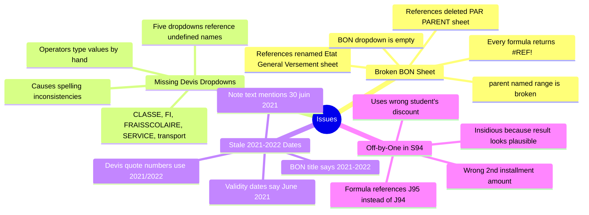

## Notes in this section

1. [[01 - Broken BON Sheet]] — every formula on BON returns `#REF!` because formulas reference deleted/renamed sheets.
2. [[02 - Missing Devis Dropdowns]] — five Devis dropdowns reference undefined named ranges, leaving them empty.
3. [[03 - Stale 2021-2022 Dates]] — BON's title and Devis quote numbers still reference the 2021/2022 school year.
4. [[04 - Off-by-One in S94]] — cell S94 references J95 instead of J94, applying the wrong student's discount.

## Severity

| Issue | Severity | Effect |
|---|---|---|
| Broken BON Sheet | High | BON is unusable; operators use slower ETAT workaround |
| Missing Devis Dropdowns | Medium | Operators type values by hand; data quality suffers |
| Stale 2021-2022 Dates | Medium | Customer confusion; potential audit/legal issues |
| Off-by-One in S94 | Low (single row) | One student's 2nd installment is wrong |

## Effort to fix

| Issue | Effort | Time |
|---|---|---|
| Broken BON Sheet | Medium | 30 min (minimal) to 1-2 hours (recreate PAR PARENT) |
| Missing Devis Dropdowns | Low | 30 min (add lists to REF + create named ranges) |
| Stale 2021-2022 Dates | Low | 15 min (find/replace in BON and Devis) |
| Off-by-One in S94 | Trivial | 1 min (change J95 to J94) |

## Suggested fix order

1. **Off-by-One in S94** — trivial, fix immediately.
2. **Stale 2021-2022 Dates** — quick, fix before printing any new quotes or statements.
3. **Missing Devis Dropdowns** — fixes data quality at the input boundary.
4. **Broken BON Sheet** — biggest effort, biggest payoff (restores the customer-statement workflow).

## Related sections

- [[00 - Hidden Logic MOC]] — the broken pieces live here (named ranges, data validations)
- [[00 - Sheets MOC]] — the sheets that are affected
- [[00 - Workflows MOC]] — the workflows that work around these issues


========================================================================
 FILE: 08 - Issues and Fixes/01 - Broken BON Sheet.md
   Language: markdown
========================================================================

---
tags:
  - issue
  - bon
  - broken
---

# Broken BON Sheet

> [!danger] One-line summary
> Every formula on the [[04 - BON - Client Statement|BON sheet]] returns `#REF!` because the formulas reference two sheets (`'PAR PARENT'` and `'Etat General Versement'`) that were deleted/renamed when the workbook was restructured for 2026/2027. The dropdown on F8 also references the broken `parent` named range.

## Symptoms

When you open the BON sheet, you'll see:

| Cell | What it shows |
|---|---|
| A4 | `Situation Client 2021-2022` (stale year) |
| F8 | (empty input cell, dropdown is empty) |
| C10 | `#REF!` |
| H12, I12 | `#REF!` |
| H13, I13 | `#REF!` |
| A22 through A31 | `#REF!` (10 cells) |

So 15 of the 16 formula cells show `#REF!`. Only `I8: =TODAY()` (the date) works correctly.

## Root cause

The BON formulas reference two sheets that don't exist in the current workbook:

### Missing sheet 1: `'PAR PARENT'`

Referenced by:

- `C10: =+VLOOKUP(F8,'PAR PARENT'!A4:E785,2,0)`
- `H12: =+VLOOKUP(E12,'PAR PARENT'!A4:E785,3,0)`
- `I12: =+VLOOKUP(E12,'PAR PARENT'!A4:K786,6,0)`
- `H13: =+VLOOKUP(E13,'PAR PARENT'!A5:E786,3,0)`
- `I13: =+VLOOKUP(E13,'PAR PARENT'!A5:K787,6,0)`

`PAR PARENT` is French for "by parent" — it was clearly a summary sheet that aggregated student data by parent. It probably had:

- Column A: parent name (the lookup key)
- Column B: family annual quote total
- Column C: per-student quote
- Columns D–E: more family-level data
- Columns F–K: per-student payment data

When the workbook was restructured for 2026/2027, this sheet was deleted entirely. The BON formulas still reference it, so they all return `#REF!`.

### Missing sheet 2: `'Etat General Versement'`

Referenced by:

- `A22 through A31: =+VLOOKUP(F8,'Etat General Versement'!G7:AS1255,33..42,0)`

`Etat General Versement` is French for "General Statement of Payments" — it was the **old name** of the main ledger sheet. The sheet still exists but was renamed to `ETAT 20262027` for the new school year. The BON formulas weren't updated to follow the rename.

## The dropdown is also broken

Cell F8 (where the operator types the family name) has a data-validation dropdown that should offer a list of valid parents:

```
type=list  formula1='parent'  range=F8, E12:E13
```

But the `parent` named range is also broken:

```
parent  ->  #REF!
```

So the dropdown is empty. See [[01 - Named Ranges]] for the full story.

## Why this happened

When the operator renamed/restructured the workbook for the 2026/2027 school year, they:

1. Renamed `Etat General Versement` → `ETAT 20262027` (good — it now reflects the year).
2. Deleted the `PAR PARENT` summary sheet (maybe because it was out of date).
3. Did **not** update the BON formulas to follow the rename or work around the deletion.
4. Did **not** repoint the `parent` named range.

The result: BON is a print template with no data source. Every formula fails.

## How to fix it

There are three approaches, in order of effort:

### Approach 1 — Minimal fix (repoint the formulas to ETAT)

This makes BON functional but loses the "per-parent summary" capability. Each BON lookup goes directly to the ETAT sheet.

#### Step 1: Repoint the C10 formula

Original:

```
C10: =+VLOOKUP(F8,'PAR PARENT'!A4:E785,2,0)
```

This looks up the family name in F8 and returns the family's total annual quote. Without `PAR PARENT`, we need to compute this from ETAT directly.

Replace with:

```
C10: =SUMIF('ETAT 20262027'!$E$2:$E$404, F8, 'ETAT 20262027'!$L$2:$L$404)
```

This sums the L (annual quote) column for all students whose parent (column E) matches F8.

#### Step 2: Repoint H12 and I12

Original:

```
H12: =+VLOOKUP(E12,'PAR PARENT'!A4:E785,3,0)
I12: =+VLOOKUP(E12,'PAR PARENT'!A4:K786,6,0)
```

These look up a student by name (in E12) and return their quote (column 3) and total paid (column 6).

Replace with:

```
H12: =VLOOKUP(E12, 'ETAT 20262027'!$F$2:$L$404, 7, FALSE)
I12: =VLOOKUP(E12, 'ETAT 20262027'!$F$2:$P$404, 11, FALSE)
```

Decoded:

- `H12`: look up E12 in column F (NOM) of ETAT, return column 7 of the range F:L, which is column L (DEVIS ANNUEL).
- `I12`: look up E12 in column F of ETAT, return column 11 of the range F:P, which is column P (TOTAL VERSEMENTS).

#### Step 3: Repoint H13 and I13 (same as H12/I12)

Same formulas, but for row 13.

#### Step 4: Repoint A22 through A31

Original:

```
A22: =+VLOOKUP(F8,'Etat General Versement'!G7:AS1255,33,0)
```

These look up the family name in F8 and return columns 33–42 from the (renamed) main ledger.

This is trickier. Columns 33–42 of `'ETAT 20262027'!G:AS` would be... let me count. Column G is column 7 of the sheet. Column AS is column 45. So the range G:AS is columns 7–45, and column 33 of that range is column 7 + 33 - 1 = column 39 (which is AM in the current sheet — the empty payment log column).

So `A22` was probably trying to pull data from the columns at the right edge of the old sheet — possibly the term-tracking columns or a payment-history view. Without the old sheet structure, it's hard to know exactly what.

**Recommended fix**: replace A22:A31 with formulas that pull from the AM comment log (parsed) or from a new payment-history sheet.

For now, you could just clear these formulas (since they're broken anyway) and rebuild the payment-history section later.

#### Step 5: Repoint the `parent` named range

1. Formulas → Name Manager.
2. Click `parent` → Edit.
3. In "Refers to:", enter: `='ETAT 20262027'!$E$2:$E$404`
4. Click OK.

Now the F8 dropdown will offer parent names (though with duplicates — see Approach 2 for a cleaner version).

#### Step 6: Update the title in A4

Change `Situation Client 2021-2022` to `Situation Client 2026-2027`.

After these steps, the BON sheet should be functional (minus the payment history section).

### Approach 2 — Recreate the `PAR PARENT` summary sheet

This is more work but gives BON a proper "per-parent summary" data source, which is what it was designed to read from.

#### Step 1: Create a new sheet called `PAR PARENT`

Insert a new sheet and rename it to `PAR PARENT`.

#### Step 2: Build the parent summary table

In `PAR PARENT`, set up:

| Column | Formula |
|---|---|
| A1: `Parent` | (header) |
| B1: `Family Quote` | (header) |
| C1: `Family Paid` | (header) |
| D1: `Family Balance` | (header) |
| E1: `Student Count` | (header) |

In A2, enter the unique list of parent names. Two options:

- **Excel 365**: `=UNIQUE('ETAT 20262027'!E2:E404)` — spills down automatically.
- **Older Excel**: copy column E from ETAT, paste in A2, then Data → Remove Duplicates.

In B2, enter:

```
=SUMIF('ETAT 20262027'!$E$2:$E$404, A2, 'ETAT 20262027'!$L$2:$L$404)
```

In C2:

```
=SUMIF('ETAT 20262027'!$E$2:$E$404, A2, 'ETAT 20262027'!$P$2:$P$404)
```

In D2:

```
=B2-C2
```

In E2:

```
=COUNTIF('ETAT 20262027'!$E$2:$E$404, A2)
```

Drag B2:E2 down for all parent rows.

#### Step 3: Repoint the BON formulas

Now the original BON formulas can mostly stay as they were, just pointing to the recreated `PAR PARENT` sheet:

- `C10: =+VLOOKUP(F8,'PAR PARENT'!A:B,2,0)` — family quote
- For per-student lookup, still use ETAT directly (since `PAR PARENT` is family-level, not student-level):
  - `H12: =VLOOKUP(E12, 'ETAT 20262027'!$F$2:$L$404, 7, FALSE)`
  - `I12: =VLOOKUP(E12, 'ETAT 20262027'!$F$2:$P$404, 11, FALSE)`

#### Step 4: Repoint the `parent` named range to the new `PAR PARENT` sheet

```
parent  ->  ='PAR PARENT'!$A$2:$A$300
```

Now the F8 dropdown offers a unique list of parent names.

### Approach 3 — Skip BON entirely, print from ETAT

If you don't want to fix BON, just bypass it. See [[04 - Customer Statement]] for the workaround: filter ETAT by parent name in column E, set print area, print.

This is what the operator is probably doing today.

## Which approach to choose

| Approach | Effort | Result |
|---|---|---|
| 1 (minimal fix) | Low (30 min) | BON works for basic quote/paid/balance lookups |
| 2 (recreate PAR PARENT) | Medium (1-2 hours) | BON works fully, plus you get a useful parent-summary sheet |
| 3 (skip BON) | None | Operator uses ETAT directly, slower per statement |

If you only have time for one fix, **Approach 2** is the best — it gives you a reusable `PAR PARENT` sheet that's useful for management reporting (e.g., "show me all families with balance > 100,000"), not just for BON.

## What you'll need

- The list of parent names (from ETAT column E)
- The list of student names (from ETAT column F)
- The fee and payment columns from ETAT (L and P)
- Optionally: the AM comment log parsed into a payment-history sheet

## Verification

After applying the fix, test with a known family:

1. Open BON.
2. Type a parent name in F8 (e.g., `ABDELAOUI`).
3. Verify C10 shows the family's total annual quote (sum of L for all ABDELAOUI children).
4. Type a student name in E12 (e.g., `ABDELAOUI INES`).
5. Verify H12 shows that student's L and I12 shows their P.
6. Verify the dropdown on F8 offers a list of parents.
7. Verify the title says `Situation Client 2026-2027`.

If all checks pass, BON is functional again.

---

**See also**:
- [[04 - BON - Client Statement]] — the sheet itself
- [[01 - Named Ranges]] — the broken `parent` named range
- [[02 - ETAT - Master Ledger]] — the data source BON should be reading from
- [[04 - Customer Statement]] — what the operator is supposed to do with BON
- [[03 - Stale 2021-2022 Dates]] — the year-label issue in BON's title


========================================================================
 FILE: 08 - Issues and Fixes/02 - Missing Devis Dropdowns.md
   Language: markdown
========================================================================

---
tags:
  - issue
  - devis
  - dropdowns
---

# Missing Devis Dropdowns

> [!warning] One-line summary
> The [[03 - Devis - Quote Engine|Devis sheet]] has five data-validation dropdowns (one each for columns D, E, F, G, H) that all reference named ranges which **don't exist anywhere in the workbook**. As a result, every dropdown is empty, and operators must type values by hand.

## Symptoms

When you click any of the input cells in a Devis block (e.g., D15, E15, F15, G15, H15 in Block 1), the dropdown arrow appears in the cell — but when you click it, the list is **empty**. No values are offered.

## The five broken dropdowns

Each block in the Devis sheet has these five dropdowns (repeated across all 10 blocks):

| Column | Header | Formula1 (named range) | Should offer |
|---|---|---|---|
| D | Classe | `CLASSE` | Class codes (CP, CE1, CM2, 1AAM, etc.) |
| E | F I | `FI` | Registration fee tiers (18000, 25000, 28000, 30000, 33000) |
| F | Frais Scolarisation | `FRAISSCOLAIRE` | Tuition tiers (125000, 205000, 305000, 340000, etc.) |
| G | Services | `SERVICE` | Service types (Transport, PSY, ORTH, Ratrapage, E-PLANT) |
| H | (Services amount) | `transport` | Transport tiers (35000, 43000, 52000, 55000) |

## Why they're broken

The named ranges `CLASSE`, `FI`, `FRAISSCOLAIRE`, `SERVICE`, and `transport` are **not defined anywhere in the workbook**. They're referenced in the data validation rules but never created.

Looking at `xl/workbook.xml`, the only defined names are:

```xml
<definedNames>
  <definedName name="CLIENT">REF!$A:$A</definedName>
  <definedName name="NIVEAU">REF!$B:$B</definedName>
  <definedName name="parent">#REF!</definedName>
  <definedName name="TUTEUR">#REF!</definedName>
</definedNames>
```

None of the five names the Devis dropdowns need are present.

## What probably happened

In an earlier version of the workbook, there was probably a separate sheet called `Lists` or `Paramètres` (Parameters) that held all the dropdown lists, with corresponding named ranges pointing to each list column. When the workbook was restructured for 2026/2027, that sheet was deleted, but the data validations on the Devis sheet weren't updated.

The named ranges `CLASSE`, `FI`, `FRAISSCOLAIRE`, `SERVICE`, `transport` were probably defined in that deleted sheet, and Excel silently removed the definitions when the sheet was deleted — but left the data validations referencing them.

## How to fix it

The cleanest fix is to **recreate the missing lists** on the [[01 - REF - Foundation|REF sheet]] and **define the missing named ranges** pointing to them.

### Step 1: Add new columns to REF

Open the REF sheet. It currently has:

- Column A: 8 parent names
- Column B: 26 class codes
- Column C: empty
- Column D: 20 town names

Extend it with new columns for each missing list:

#### Column F: Class codes (for `CLASSE` named range)

Actually, `CLASSE` should hold the same values as column B (which already has the class codes). So we can just point `CLASSE` at `REF!$B$1:$B$30` — no need for a new column.

#### Column E: Registration fee tiers (for `FI` named range)

Add these values in E1:E5:

```
E1: 18000    (pre-school)
E2: 25000    (primary standard)
E3: 28000    (primary, sometimes used)
E4: 30000    (collège/lycée)
E5: 33000    (collège variant)
```

#### Column F: Tuition tiers (for `FRAISSCOLAIRE` named range)

Add these values in F1:F15 (extend as needed):

```
F1:  125000   (pre-school)
F2:  165000   (primary variant)
F3:  170000   (primary variant)
F4:  180000   (primary variant)
F5:  185000   (primary)
F6:  205000   (primary)
F7:  210000   (primary, older)
F8:  220000   (primary, with transport)
F9:  230000   (primary, with transport)
F10: 248000   (variant)
F11: 250000   (collège)
F12: 280000   (collège/lycée)
F13: 285000   (collège)
F14: 305000   (collège AAM)
F15: 320000   (collège)
F16: 330000   (collège)
F17: 340000   (lycée 1st year)
F18: 355000   (lycée 2nd year)
F19: 365000   (lycée 3rd year)
```

#### Column G: Service types (for `SERVICE` named range)

Add these in G1:G6:

```
G1: Transport
G2: PSY
G3: ORTH
G4: Ratrapage
G5: E-PLANT
G6: (empty, for "no service")
```

#### Column H: Transport tiers (for `transport` named range)

Add these in H1:H4:

```
H1: 35000    (Tier 1 - nearby)
H2: 43000    (Tier 2)
H3: 52000    (Tier 3 - medium)
H4: 55000    (Tier 4 - far)
```

### Step 2: Define the missing named ranges

Formulas → Name Manager → New. Create each named range:

| Name | Refers to |
|---|---|
| `CLASSE` | `=REF!$B$1:$B$30` |
| `FI` | `=REF!$E$1:$E$5` |
| `FRAISSCOLAIRE` | `=REF!$F$1:$F$19` |
| `SERVICE` | `=REF!$G$1:$G$6` |
| `transport` | `=REF!$H$1:$H$4` |

### Step 3: Verify the dropdowns work

Click any input cell on the Devis sheet (e.g., D15 in Block 1). Click the dropdown arrow. You should now see the list of valid values.

### Step 4: Standardize existing data (optional)

After the dropdowns are working, you may want to standardize the existing values in the Devis blocks to match the new dropdown lists exactly. For example, if Block 1 has `CM1` in D15 but your dropdown offers `CM 1`, they won't match — fix the existing data to use the canonical form.

This step is optional but makes the data cleaner.

## Alternative approach: sheet-scoped named ranges

If you don't want to add columns to REF, you can define the named ranges inline using array constants. For example:

| Name | Refers to |
|---|---|
| `FI` | `={18000; 25000; 28000; 30000; 33000}` |
| `transport` | `={35000; 43000; 52000; 55000}` |
| `SERVICE` | `={"Transport"; "PSY"; "ORTH"; "Ratrapage"; "E-PLANT"}` |

This works in modern Excel (2010+) and avoids modifying REF. But it's harder to maintain (you have to edit the named range definition to add a value, rather than just typing in a cell).

## Why this matters

Working dropdowns would:

1. **Reduce typos**: operators can only pick valid values, eliminating spelling variations.
2. **Speed up data entry**: clicking a dropdown is faster than typing.
3. **Enable validation**: with `showErrorMessage=True`, Excel would reject invalid input.
4. **Standardize the data**: all Devis blocks would use the same set of class codes, fees, and services.

Without working dropdowns, the Devis sheet is just a static form — operators type values by hand, and the data quality suffers.

## Should you also fix the ETAT dropdowns?

While you're at it, you should also add dropdowns to the ETAT sheet for columns G (niveau), H (CLASSE), I (OPTION), and V (DISTINATION). These currently have no validation, leading to inconsistent spelling and made-up codes.

Recommended:

| Column | Dropdown source |
|---|---|
| G (niveau) | New named range `NIVEAU_BROAD` pointing to a list of: PRIM, COLG, LYC, GS, MS, AUTISTE |
| H (CLASSE) | `CLASSE` (same as Devis) |
| I (OPTION) | New named range `OPTIONS` pointing to: TRNSP, (empty) |
| V (DISTINATION) | New named range `TOWNS` pointing to `REF!$D$1:$D$30` |

This would dramatically improve data quality on the ETAT sheet.

## Verification

After applying the fix, test each dropdown:

1. **Devis column D (Classe)**: click D15, dropdown should offer CP, CE1, CM1, CM2, 1AAM, etc.
2. **Devis column E (F I)**: click E15, dropdown should offer 18000, 25000, 28000, 30000, 33000.
3. **Devis column F (Frais Scolarisation)**: click F15, dropdown should offer 125000, 205000, 305000, etc.
4. **Devis column G (Services)**: click G15, dropdown should offer Transport, PSY, ORTH, etc.
5. **Devis column H (Services amount)**: click H15, dropdown should offer 35000, 43000, 52000, 55000.

If all dropdowns work, the fix is complete.

---

**See also**:
- [[03 - Devis - Quote Engine]] — the sheet with the broken dropdowns
- [[02 - Data Validations]] — the full list of data validation rules in the workbook
- [[01 - Named Ranges]] — the existing named ranges (and which are broken)
- [[01 - REF - Foundation]] — where the new lists should go
- [[02 - Class Codes (CLASSE)]] — what values the CLASSE dropdown should offer
- [[03 - Town List (DISTINATION)]] — what values the DISTINATION dropdown should offer
- [[05 - Price Table]] — what values the FI and FRAISSCOLAIRE dropdowns should offer


========================================================================
 FILE: 08 - Issues and Fixes/03 - Stale 2021-2022 Dates.md
   Language: markdown
========================================================================

---
tags:
  - issue
  - stale-dates
  - devis
  - bon
---

# Stale 2021-2022 Dates

> [!warning] One-line summary
> Although the workbook is named `Suivis clients 2026_2027.xlsx` and the main sheet is `ETAT 20262027`, several places still reference the **2021/2022** school year — leftovers from when the workbook was originally created.

## Where the stale dates appear

### 1. BON!A4 — the page title

```
A4: 'Situation Client 2021-2022'
```

The BON sheet's page title still said "2021-2022" when the workbook was renamed for 2026/2027. Anyone printing a customer statement from BON (if it were working) would see the wrong year on the printout.

### 2. Devis quote numbers

Each of the 10 Devis blocks has a quote number in cell I7 (or I55, I103, etc.) that ends in `2021/2022`:

| Block | Cell | Quote number |
|---|---|---|
| 1 (MAHAMED OUSSAID) | I7 | `0101/2021/2022` |
| 2 (KOUBA) | I55 | `0102/2021/2022` |
| 3 (DJAOUD) | I103 | `0103/2021/2022` |
| 4 (LOUNA) | I152 | `0103/2021/2022` (numbering error too) |
| 5 (NEGACHE) | I200 | `0104/2021/2022` |
| 6 (HEBBAZ) | I250 | `0104/2021/2022` (numbering error too) |
| 7 (FOUIDI) | I296 | `0105/2021/2022` |
| 8 (OUERDAN) | I345 | `0106/2021/2022` |
| 9 (MEDJKANE) | I392 | `0107/2021/2022` |
| 10 (KOROGLI) | I440 | `0107/2021/2022` (numbering error too) |

So all 10 quote numbers say `2021/2022`. If the operator prints any of these quotes (rather than creating a new one), the family sees a 5-year-old date.

### 3. Devis "Validité" dates

Some Devis blocks have a typed "Validité" (validity) date in column I of row 11 (or similar):

| Block | Cell | Date |
|---|---|---|
| 2 (KOUBA) | I59 | `15/06/2021` |
| 3 (DJAOUD) | I107 | `15/06/2021` |
| 5 (NEGACHE) | I204 | `30/062021` (typo: missing slash) |
| 6 (HEBBAZ) | I254 | `30/062021` (same typo) |

These are 2021 dates — they should be 2027 dates for the current school year.

### 4. Devis note text

Several Devis blocks have a printed note that mentions "30 juin 2021":

```
A35: 'Nb 01: une remise de 5%   sois'
E35: 'est rajoutée si le paiement est effectué en totalité avant le 30 juin 2021'
```

This text appears in every block's notes section, telling families they get a 5% discount if they pay before June 30, **2021**. For the 2026/2027 school year, this should say June 30, 2027.

## Why this happened

When the operator prepared the workbook for the 2026/2027 school year, they:

1. Renamed the file from `Suivis clients 2021_2022.xlsx` (or similar) to `Suivis clients 2026_2027.xlsx`.
2. Renamed the main sheet from `Etat General Versement` (or `ETAT 20212022`) to `ETAT 20262027`.
3. **Did not update** the BON title, Devis quote numbers, Devis validity dates, or Devis note text.

These are all hardcoded text values that need to be updated manually each year. The operator either forgot or didn't bother.

## Why it matters

### Customer confusion

If the operator prints a quote from the Devis sheet (using one of the existing blocks) without updating the year, the family sees:

- Quote number `0101/2021/2022` (looks like a 5-year-old quote)
- Validity date `30/06/2021` (already expired)
- Note about "30 juin 2021" (also expired)

The family might think the quote is invalid or that the school is disorganized.

### Legal/audit risk

In Algeria, formal quotes (devis) are often used as supporting documents for tax and accounting purposes. If the date on the quote doesn't match the year the service was provided, it could create inconsistencies in the school's records.

### Internal confusion

When the operator opens the BON sheet and sees "Situation Client 2021-2022", they might wonder if they're looking at the right file. The stale date creates unnecessary cognitive load.

## How to fix it

### Fix 1 — BON!A4

Click `BON!A4`. Change the text from:

```
Situation Client 2021-2022
```

to:

```
Situation Client 2026-2027
```

### Fix 2 — Devis quote numbers

For each of the 10 Devis blocks, update the quote number in cell I7 (or I55, I103, etc.) from `XXXX/2021/2022` to `XXXX/2026/2027`.

Even better: also fix the numbering errors (blocks 3/4 share `0103`, blocks 5/6 share `0104`, blocks 9/10 share `0107`):

| Block | Old quote # | New quote # |
|---|---|---|
| 1 | 0101/2021/2022 | 0101/2026/2027 |
| 2 | 0102/2021/2022 | 0102/2026/2027 |
| 3 | 0103/2021/2022 | 0103/2026/2027 |
| 4 | 0103/2021/2022 | 0104/2026/2027 |
| 5 | 0104/2021/2022 | 0105/2026/2027 |
| 6 | 0104/2021/2022 | 0106/2026/2027 |
| 7 | 0105/2021/2022 | 0107/2026/2027 |
| 8 | 0106/2021/2022 | 0108/2026/2027 |
| 9 | 0107/2021/2022 | 0109/2026/2027 |
| 10 | 0107/2021/2022 | 0110/2026/2027 |

### Fix 3 — Devis "Validité" dates

For each block, update the validity date in I11 (or I59, I107, etc.) from a 2021 date to a 2027 date. For example:

- `15/06/2021` → `15/06/2027`
- `30/062021` → `30/06/2027` (also fix the missing-slash typo)

### Fix 4 — Devis note text

For each block, update the "Nb 01" note in E35 (or E83, E132, etc.) from:

```
est rajoutée si le paiement est effectué en totalité avant le 30 juin 2021
```

to:

```
est rajoutée si le paiement est effectué en totalité avant le 30 juin 2027
```

### Fix 5 — Consider a template-based approach

Instead of having 10 hardcoded quote blocks that need to be updated every year, consider:

- Keep just 1 template block on the Devis sheet.
- Use Excel's "Save As" to create a new quote file for each family.
- Use Excel formulas like `=YEAR(TODAY())` to auto-fill the current year in the quote number and validity date.

This would eliminate the year-update chore entirely.

## Verification

After applying the fixes, search the workbook for any remaining `2021` references:

### In Excel

1. Ctrl+F (Find).
2. Search for `2021`.
3. Click "Find All".
4. Verify that no cells in BON or Devis contain `2021` (only the AM comments may legitimately contain `2021` if they reference prior-year payments — though they don't in this file).

### In Python

```python
import openpyxl
wb = openpyxl.load_workbook("Suivis clients  2026_2027 .xlsx")
for sheet_name in wb.sheetnames:
    ws = wb[sheet_name]
    for row in ws.iter_rows():
        for cell in row:
            if isinstance(cell.value, str) and "2021" in cell.value:
                print(f"{sheet_name}!{cell.coordinate}: {cell.value!r}")
```

This will list every cell containing "2021" so you can verify each one.

---

**See also**:
- [[04 - BON - Client Statement]] — where the page title lives
- [[03 - Devis - Quote Engine]] — where the quote numbers and validity dates live
- [[01 - Broken BON Sheet]] — another BON issue (broken formulas) to fix at the same time
- [[01 - New Family Inquiry]] — how to create new quotes without repeating the stale-date mistake


========================================================================
 FILE: 08 - Issues and Fixes/04 - Off-by-One in S94.md
   Language: markdown
========================================================================

---
tags:
  - issue
  - off-by-one
  - bug
  - formula
---

# Off-by-One in S94

> [!warning] One-line summary
> Cell `S94` on [[02 - ETAT - Master Ledger|ETAT 20262027]] contains the formula `=110000-J95`, but it should be `=110000-J94`. The off-by-one row reference causes S94 to use the wrong student's discount, producing an incorrect 2nd installment amount.

## The bug

Looking at the formula in cell S94:

```
S94: =110000-J95
```

This formula is on row 94, so it should reference `J94` (the discount for the student on row 94). Instead, it references `J95` (the discount for the student on row 95 — a different student).

## What this means

S94 is supposed to be the 2nd tuition installment for the student in row 94, computed as `110,000 − J94` (base amount minus this student's discount).

Instead, it's `110,000 − J95` (base amount minus the next student's discount).

### Concrete example

Let's say:

- Row 94 student: AHMED, discount J94 = 15,000
- Row 95 student: BILAL, discount J95 = 5,000

**Correct S94**: `=110000-J94` = `110,000 − 15,000` = **95,000**
**Buggy S94**: `=110000-J95` = `110,000 − 5,000` = **105,000**

So AHMED's 2nd installment is recorded as 105,000 instead of 95,000 — he's being **charged 10,000 more than he should be** (because his discount is being under-applied by 10,000).

Meanwhile, BILAL's S95 formula (whatever it is) is unaffected — only S94 is wrong.

## Where the bug came from

The operator typed `J95` instead of `J94`. This is an easy typo to make — the keys are adjacent, and when you're typing fast, you might hit the wrong number.

Excel doesn't catch this kind of error because:

- `J95` is a valid cell reference.
- The formula evaluates to a number (no error).
- The result looks plausible (close to the correct value).

The only way to catch it is to manually verify each formula or use Excel's formula auditing tools.

## How to find similar bugs

To check for other off-by-one errors in column S (or any other column with arithmetic formulas):

### Method 1 — Manual review

Open the sheet, scroll to each formula cell, and verify the row reference matches the formula's row. Tedious but reliable.

### Method 2 — Python script

```python
import openpyxl, re
wb = openpyxl.load_workbook("Suivis clients  2026_2027 .xlsx")
ws = wb["ETAT 20262027"]

for col_letter in ["S", "J", "U", "L"]:
    col_num = openpyxl.utils.column_index_from_string(col_letter)
    for row in range(2, 405):
        cell = ws.cell(row, col_num)
        v = cell.value
        if isinstance(v, str) and v.startswith("="):
            # Find all cell references like J94, J95, etc.
            refs = re.findall(r'\b([A-Z]+)(\d+)\b', v)
            for ref_col, ref_row in refs:
                if ref_col == "J" and int(ref_row) != row:
                    print(f" {col_letter}{row}: {v} — references J{ref_row} (not J{row})")
```

This would print a list of all formulas where the J reference doesn't match the formula's row.

### Method 3 — Excel formula auditing

In Excel:

1. Click a formula cell.
2. Formulas → Trace Precedents.
3. Arrows appear showing which cells the formula references.
4. If the arrow points to a different row, you have an off-by-one.

## How to fix it

Click cell S94. Change the formula from:

```
=110000-J95
```

to:

```
=110000-J94
```

Press Enter. The cell will recalculate with the correct value.

If you've already recorded payments based on the wrong S94 value, you may also need to:

- Verify the AM94 comment matches the new S94 amount.
- Contact the family if they overpaid or underpaid as a result.
- Adjust subsequent installments (U94) if needed.

## Are there other off-by-one errors?

Based on the original analysis, S94 is the **only** confirmed off-by-one in the workbook. However, a thorough audit (using Method 2 above) would be needed to verify this with confidence.

Other things to check:

- **L column formulas** — does each `L{row}` formula reference `J{row}` (not `J{row-1}` or `J{row+1}`)?
- **P and Q formulas** — these are simple row-aligned sums, so they should be safe, but verify.
- **Devis block formulas** — does each block's I-formula reference the correct block's row range?

## Why this kind of bug is dangerous

Off-by-one errors are particularly insidious because:

1. **They produce plausible results** — the formula doesn't error out, it just gives a wrong number.
2. **They affect individual rows, not the whole sheet** — so the overall totals look fine, hiding the bug.
3. **They're hard to spot visually** — `J94` and `J95` look almost identical.
4. **They may not be caught by reconciliation** — if both J94 and J95 are small, the error is small.

In a financial workbook like this one, an off-by-one means **real money is mis-accounted**. A family might be overcharged (or undercharged) by the difference between two discounts, and nobody notices until the family complains or the year-end audit finds the discrepancy.

## Recommendations

1. **Fix S94 immediately** — change `J95` to `J94`.
2. **Audit all formulas with row references** — use the Python script above to scan for other off-by-ones.
3. **Use Excel's structured references** — if the data were in an Excel Table, formulas would use `[@Discount]` instead of `J94`, eliminating the possibility of row-reference typos.
4. **Add a validation column** — e.g., a column that checks `L = 25000+205000+35000-J` and flags rows where it doesn't.
5. **Periodic reconciliation** — at end of each month, sum Q across all rows and compare to the school's bank deposits. Discrepancies indicate bugs like this.

---

**See also**:
- [[02 - REMISE and Installment Shortcuts (J, S)]] — the column where this bug lives
- [[01 - ETAT Core Formulas (L, P, Q)]] — the column being mis-referenced
- [[02 - ETAT - Master Ledger]] — the sheet
- [[03 - Payment Recording]] — the workflow that depends on S being correct


========================================================================
 FILE: 09 - Appendix/00 - Appendix MOC.md
   Language: markdown
========================================================================

---
tags:
  - moc
  - appendix
---

# Appendix MOC

Reference material that doesn't fit elsewhere — full data dumps, statistics, and the AM comment sample list.

## Notes in this section

1. [[01 - Workbook Stats]] — quick-reference statistics about the workbook (sizes, counts, validations).
2. [[02 - REF Sheet Full Content]] — the complete row-by-row dump of the REF sheet.
3. [[03 - AM Comment Samples]] — ~80 extracted cell comments from column AM (the hidden receipt log).

## What's in here

This section is for **reference data** that you might need to look up but don't need to read end-to-end. Use it as a lookup table when you need a specific number, code, or sample.

## Related sections

- [[00 - Codes MOC]] — interprets the codes shown here
- [[00 - Hidden Logic MOC]] — explains the validations and named ranges summarized here
- [[06 - Hidden Payment Log (AM)]] — explains the AM comment convention shown here


========================================================================
 FILE: 09 - Appendix/01 - Workbook Stats.md
   Language: markdown
========================================================================

---
tags:
  - appendix
  - stats
  - reference
---

# Workbook Stats

Quick-reference statistics about the workbook, verified by Python analysis of the actual `.xlsx` file.

## File-level

| Property | Value |
|---|---|
| **File name** | `Suivis clients  2026_2027 .xlsx` (note: double space, trailing space) |
| **File size** | ~208 KB |
| **Creator** | (set to "openpyxl" by the last save — the original creator was probably the school's accountant) |
| **Created** | 2026-07-21 (today's analysis date — the file was likely re-saved during inspection) |
| **Modified** | 2026-07-21 (same) |
| **Calculation mode** | `fullCalcOnLoad=True` (Excel will recompute all formulas when the file opens) |
| **Calc ID** | 124519 |

## Sheets

| # | Sheet name | State | Dimensions | Max row | Max col |
|---|---|---|---|---|---|
| 1 | `ETAT 20262027` | visible | A1:BB1032 | 1032 | 54 |
| 2 | `BON ` (trailing space) | visible | A4:Z45 | 45 | 26 |
| 3 | `Devis` | visible | A1:Z480 | 480 | 26 |
| 4 | `REF` | visible | A1:D224 | 224 | 4 |

## Formulas per sheet

| Sheet | Formula count |
|---|---|
| ETAT 20262027 | 1,422 |
| BON | 16 (all broken — `#REF!`) |
| Devis | 75 |
| REF | 0 |
| **Total** | **1,513** |

## Formulas per column on ETAT 20262027

| Column | Header | Formula count |
|---|---|---|
| J | REMISE | 144 |
| L | DEVIS ANNUEL | 387 |
| P | TOTAL VERSEMENTS | 403 |
| Q | TOTAL*CREANCE | 403 |
| S | V2 | 83 |
| U | v3 | 2 |
| **Total formulas on ETAT** | | **1,422** |

Other columns have 0 formulas (all values are typed literals).

## Student distribution

| Level (col G) | Count |
|---|---|
| PRIM (primary) | 204 |
| COLG (collège) | 113 |
| LYC (lycée) | 40 |
| GS (pre-school) | 21 |
| MS (pre-school) | 4 |
| AUTISTE | 2 |
| NV2, NV3, NV4, NV5 | 5 |
| CLYC, LYCI | 2 |
| **Total students** | **390** |

## Class distribution (top 15)

| Class (col H) | Count |
|---|---|
| CP | 51 |
| 3AAM | 41 |
| 1AAM | 33 |
| CE1 | 34 |
| CM2 | 34 |
| CE2 | 31 |
| CM1 | 29 |
| 2AAM | 21 |
| GS | 22 |
| 4AAM | 18 |
| 2EM | 16 |
| 3EM | 13 |
| 1ER | 12 |
| 5AP | 7 |
| 4AP | 6 |

## Transport destinations (top 10 by student count)

| Town (col V) | Count |
|---|---|
| BOUMERDES | 35 |
| CORSO | 17 |
| BOUDOUAOU | 16 |
| OULEDMOUSSA | 12 |
| THENIA | 6 |
| BORDJMNAIL | 5 |
| REGHAIA | 5 |
| ZEMMOURI | 4 |
| ZEMOURI | 4 |
| SAHEL | 4 |

## Option codes (col I)

| Code | Count |
|---|---|
| TRNSP | 121 |
| TENSP | 4 |
| TRNP | 1 |
| (empty — no transport) | ~264 |

## Defined names

| Name | Refers to | Status |
|---|---|---|
| `CLIENT` | `REF!$A:$A` | Working (unused) |
| `NIVEAU` | `REF!$B:$B` | Working (unused) |
| `parent` | `#REF!` | Broken |
| `TUTEUR` | `#REF!` | Broken (unused) |
| `_xlnm._FilterDatabase` (hidden) | `'ETAT 20262027'!$A$1:$AN$404` | Working (auto-filter memory) |

## Data validations

| Sheet | Rule count | All working? |
|---|---|---|
| ETAT 20262027 | 1 (decimal <10000 on AG) | Yes, but ineffective (column AG is empty, and `showErrorMessage=False`) |
| BON | 1 (list = `parent`) | No — `parent` is broken |
| Devis | 5 (lists = `CLASSE`, `FI`, `FRAISSCOLAIRE`, `SERVICE`, `transport`) | No — none of these named ranges exist |
| REF | 0 | n/a |

## Conditional formatting

| Sheet | Rule count | Type |
|---|---|---|
| ETAT 20262027 | 2 | `notContainsBlanks` (green fill) + `colorScale` (green-to-white) |
| BON | 0 | — |
| Devis | 0 | — |
| REF | 0 | — |

## Cell comments

| Sheet | Comment count | Where |
|---|---|---|
| ETAT 20262027 | ~80 | Column AM (rows 2–390), plus 1 stray comment on AL531 |

All comments are payment receipt entries in the format `amount/date/receipt#`. See [[06 - Hidden Payment Log (AM)]] and [[03 - AM Comment Samples]].

## Merged cells

| Sheet | Merged range count | Purpose |
|---|---|---|
| ETAT 20262027 | 0 | — |
| BON | 18 | Print layout |
| Devis | ~150 | Print layout |
| REF | 0 | — |

## Auto-filter

| Sheet | Auto-filter range |
|---|---|
| ETAT 20262027 | `$A$1:$AN$404` (active) |
| BON | None |
| Devis | None |
| REF | None |

## Sheet protection

All four sheets have protection **off** — no password is required to make changes.

## Hidden rows/columns

No rows or columns are hidden on any sheet.

## Frozen panes

No sheets have frozen panes.

## Images embedded

| File | Likely purpose |
|---|---|
| `xl/media/image1.jpg` | Probably the school logo (used in Devis print header) |
| `xl/media/image2.jpg` | Probably a secondary logo or watermark |

## Files inside the .xlsx archive

```
xl/comments1.xml                   ← cell comments (AM log)
xl/drawings/vmlDrawing1.vml        ← legacy drawing support
xl/drawings/drawing1.xml           ← image positioning
xl/drawings/drawing2.xml           ← image positioning
xl/drawings/drawing3.xml           ← image positioning
xl/drawings/drawing4.xml           ← image positioning
xl/worksheets/sheet1.xml           ← ETAT 20262027
xl/worksheets/sheet2.xml           ← BON
xl/worksheets/sheet3.xml           ← Devis
xl/worksheets/sheet4.xml           ← REF
xl/theme/theme1.xml                ← color theme
xl/sharedStrings.xml               ← all text strings (shared for efficiency)
xl/styles.xml                      ← cell styles
xl/persons/person.xml              ← author info
xl/workbook.xml                    ← sheet list, defined names
xl/media/image1.jpg                ← embedded image
xl/media/image2.jpg                ← embedded image
```

## How these stats were computed

All numbers in this note were verified by reading the actual `.xlsx` file with Python:

```python
import openpyxl, zipfile, re
from lxml import etree

SRC = "Suivis clients  2026_2027 .xlsx"
wb = openpyxl.load_workbook(SRC, data_only=False)

# Sheet count, names, sizes
print(f"Sheets: {len(wb.sheetnames)}")
for name in wb.sheetnames:
    ws = wb[name]
    print(f"  {name}: {ws.max_row}x{ws.max_column}")

# Formula count per sheet/column
from collections import Counter
for name in wb.sheetnames:
    ws = wb[name]
    counter = Counter()
    for row in ws.iter_rows():
        for cell in row:
            if isinstance(cell.value, str) and cell.value.startswith("="):
                counter[cell.column_letter] += 1
    print(f"{name} formulas by column: {dict(counter)}")
```

The original analysis scripts are preserved in `/home/z/my-project/scripts/` for re-verification.

---

**See also**:
- [[00 - Home]]
- [[01 - Workbook at a Glance]]
- [[02 - Architecture and Layers]]


========================================================================
 FILE: 09 - Appendix/02 - REF Sheet Full Content.md
   Language: markdown
========================================================================

---
tags:
  - appendix
  - reference
  - ref-sheet
---

# REF Sheet Full Content

The complete row-by-row dump of the [[01 - REF - Foundation|REF sheet]]. Use this as a reference when adding new parents, class codes, or towns.

## Column A — Parent/tutor family names (named range `CLIENT`)

| Row | Value |
|---|---|
| 1 | MERDAS SAMIR |
| 2 | TALAOOURAR YOUNES |
| 3 | BELRECHID |
| 4 | HARBI |
| 5 | MOULFI |
| 6 | HAMADACHE |
| 7 | HASSAIN |
| 8 | SLIMANI |
| 9–224 | (empty) |

> [!warning] Incomplete
> This list is incomplete — it has only 8 parents, but the ETAT sheet has hundreds of distinct parent names in column E. REF!A:A is not actively maintained.

## Column B — Class level codes (named range `NIVEAU`)

| Row | Value | Category |
|---|---|---|
| 1 | MS | Pre-school (Moyenne Section) |
| 2 | GS | Pre-school (Grande Section) |
| 3 | PS | Pre-school (Petite Section) |
| 4 | TPS | Pre-school (Très Petite Section) |
| 5 | CP | Primary (Cours Préparatoire) |
| 6 | CE1 | Primary (Cours Élémentaire 1) |
| 7 | CE2 | Primary (Cours Élémentaire 2) |
| 8 | CM1 | Primary (Cours Moyen 1) |
| 9 | CM2 | Primary (Cours Moyen 2) |
| 10 | 1AP | Middle school (variant) |
| 11 | 2AP | Middle school (variant) |
| 12 | 3AP | Middle school (variant) |
| 13 | 4AP | Middle school (variant) |
| 14 | 5AP | Middle school (variant) |
| 15 | 1AAM | Middle school (1ère Année Moyenne) |
| 16 | 2AAM | Middle school |
| 17 | 3AAM | Middle school |
| 18 | 4AAM | Middle school |
| 19 | 1AS | High school (1ère Année Secondaire) |
| 20 | 2AS | High school |
| 21 | 3AS | High school |
| 22 | 1CS | High school (variant — "Cours Secondaire"?) |
| 23 | 2CS | High school (variant) |
| 24 | 3CS | High school (variant) |
| 25 | 4CS | High school (variant) |
| 26 | autiste | Special needs |
| 27–224 | (empty) |

## Column C — empty

Column C is entirely empty across all 224 rows. Possibly intended for an additional attribute that was never used.

## Column D — Town names (no named range)

| Row | Value | Notes |
|---|---|---|
| 1 | BOUMERDES | School's home town |
| 2 | CORSO | Coastal town east of Boumerdès |
| 3 | SAHEL | Hillside area |
| 4 | FIGUIER | Neighborhood ("fig tree") |
| 5 | ZEMOURI | Coastal town ~20 km east |
| 6 | BOUDOUAOU | Town ~25 km southwest |
| 7 | REGHIAA | (Reghaia) ~30 km southwest |
| 8 | ROUIBA | District ~30 km south |
| 9 | BORDJ MNAIL | (Bordj Ménaïl) ~40 km east |
| 10 | SI MUSTAPHA | ~35 km east |
| 11 | ISSER | ~50 km east |
| 12 | THENIA | (Thénia) ~20 km west |
| 13 | BENI AMRANE | ~30 km south, inland |
| 14 | OULED MOUSSA | ~25 km south |
| 15 | OULED HEDDAJ /HOUCHE MEKHEFI | Two adjacent areas combined |
| 16 | KHEMIS KHENCHELA | (Khemis el-Khechna) ~20 km south |
| 17 | TIDJELABINE | ~25 km southwest |
| 18 | BENYOUNES | Neighborhood in Boumerdès |
| 19 | SOUK ELHAD | ~30 km east |
| 20 | CAP DJENET | Coastal town ~25 km east |
| 21–224 | (empty) | |

## All non-empty cells in one table

For quick reference, here are all the non-empty cells in REF:

```
A1: MERDAS SAMIR          B1: MS          D1: BOUMERDES
A2: TALAOOURAR YOUNES     B2: GS          D2: CORSO
A3: BELRECHID             B3: 1AP         D3: SAHEL
A4: HARBI                 B4: CP          D4: FIGUIER
A5: MOULFI                B5: 2AP         D5: ZEMOURI
A6: HAMADACHE             B6: CE1         D6: BOUDOUAOU
A7: HASSAIN               B7: 3AP         D7: REGHIAA
A8: SLIMANI               B8: CE2         D8: ROUIBA
                         B9: 4AP          D9: BORDJ MNAIL
                         B10: CM1         D10: SI MUSTAPHA
                         B11: 5AP         D11: ISSER
                         B12: CM2         D12: THENIA
                         B13: 1AAM        D13: BENI AMRANE
                         B14: 2AAM        D14: OULED MOUSSA
                         B15: 3AAM        D15: OULED HEDDAJ /HOUCHE MEKHEFI
                         B16: 4AAM        D16: KHEMIS KHENCHELA
                         B17: 1AS         D17: TIDJELABINE
                         B18: 2AS         D18: BENYOUNES
                         B19: 3AS         D19: SOUK ELHAD
                         B20: 1cs         D20: CAP DJENET
                         B21: 2cs
                         B22: 3cs
                         B23: 4cs
                         B24: autiste
                         B25: PS
                         B26: TPS
```

## What's missing from REF

Based on what the workbook's dropdowns need, REF should also contain:

| Missing list | Used by | Suggested contents |
|---|---|---|
| `CLASSE` (named range) | Devis column D dropdown | Same as column B (class codes) — just point `CLASSE` at `REF!$B$1:$B$26` |
| `FI` (named range) | Devis column E dropdown | 18000, 25000, 28000, 30000, 33000 |
| `FRAISSCOLAIRE` (named range) | Devis column F dropdown | 125000, 165000, 170000, 180000, 185000, 205000, 210000, 220000, 230000, 248000, 250000, 280000, 285000, 305000, 320000, 330000, 340000, 355000, 365000 |
| `SERVICE` (named range) | Devis column G dropdown | Transport, PSY, ORTH, Ratrapage, E-PLANT |
| `transport` (named range) | Devis column H dropdown | 35000, 43000, 52000, 55000 |
| `TUTEUR` (named range, broken) | (was) ETAT column E dropdown | All distinct parent names from ETAT!E:E |
| `parent` (named range, broken) | BON!F8 dropdown | Same as TUTEUR (unique parent names) |
| Level codes (broad) | ETAT column G dropdown (missing) | PRIM, COLG, LYC, GS, MS, AUTISTE |
| Option codes | ETAT column I dropdown (missing) | TRNSP, (empty) |

See [[02 - Missing Devis Dropdowns]] for the full repair procedure.

## Notes on case sensitivity

Notice that some class codes are uppercase (`MS`, `GS`, `CP`, `CE1`, `CM1`, `CM2`) while others are lowercase (`1cs`, `2cs`, `3cs`, `4cs`, `autiste`). This inconsistency is in the original data — the operator typed them with different cases.

If you're adding a dropdown that uses these codes, you may want to standardize the case first. Uppercase is the most common convention.

---

**See also**:
- [[01 - REF - Foundation]] — the sheet overview
- [[01 - Named Ranges]] — the named ranges that point here
- [[02 - Class Codes (CLASSE)]] — what each code means
- [[03 - Town List (DISTINATION)]] — the town list with transport tiers
- [[02 - Missing Devis Dropdowns]] — what's missing and how to add it


========================================================================
 FILE: 09 - Appendix/03 - AM Comment Samples.md
   Language: markdown
========================================================================

---
tags:
  - appendix
  - reference
  - audit
  - am-comments
---

# AM Comment Samples

The complete extracted list of cell comments from column AM on [[02 - ETAT - Master Ledger|ETAT 20262027]]. These are the school's **manual audit trail** for payment receipts. See [[06 - Hidden Payment Log (AM)]] for the format convention.

## The comment format

Every AM comment follows (roughly) this format:

```
amount/date  receipt#
```

| Component | Meaning | Example |
|---|---|---|
| `amount` | The payment amount in DZD | `239500`, `25000`, `600000` |
| `/` | Separator | |
| `date` | Payment date as `DD/MM` | `05/05` (May 5), `17/06` (June 17) |
| `B` + number | Receipt book identifier | `B01`, `B11`, `B12` |

Multi-line comments represent multiple payments.

## All extracted comments

| Cell | Comment |
|---|---|
| AM2 | `239500/05/05` |
| AM3 | `294500/05/05` |
| AM8 | `600000/17/06` + `22000/07/06b01` |
| AM10 | `292500/06/05` |
| AM11 | `449000/06/05` |
| AM12 | `109000/06/05` |
| AM17 | `250000/07/05B11` |
| AM19 | `261000/10/05` |
| AM24 | `309000/10/05B11` |
| AM25 | `30000/10/05` |
| AM26 | `154000/11/05B11` |
| AM27 | `371000/05/11/B11` |
| AM28 | `220000/11/05B11` |
| AM33 | `113000/12/05B11` |
| AM35 | `242000/13/05B11` |
| AM41 | `43000/13/05B11` |
| AM43 | `393000/13/05B11` |
| AM51 | `96000/13/05` |
| AM52 | `220000/14/05/B11` |
| AM58 | `200000/14/05B11` + `64500/03/06B01` |
| AM59 | `348500/14/05B11` |
| AM60 | `348500/14/05B11` |
| AM61 | `25000/14/05B11` |
| AM62 | `258000/14/05B1` + `1` (split across two lines, probably a typo) |
| AM68 | `125000/11/05B11` |
| AM69 | `309000/14/05B11` |
| AM76 | `75000/17/05B12` |
| AM84 | `25000/17/05B12` |
| AM85 | `245000/17/05B12` |
| AM86 | `199000/17/05B12` |
| AM90 | `279500/18/05B12` |
| AM91 | `239500/18/05B12` |
| AM92 | `25000/18/05B12` |
| AM93 | `300000/8/05B12` |
| AM94 | `110000/20/05B12` (note: this is the row with the S94 off-by-one bug) |
| AM101 | `50000/18/5B12` |
| AM107 | `96000/19/05B12` |
| AM108 | `234500/19/05B12` |
| AM109 | `25000/20/05` |
| AM110 | `25000/20/05` |
| AM111 | `309000/20/05` |
| AM116 | `128000/20/05B12` |
| AM124 | `100000/20/05B12` |
| AM127 | `144000/20/05B12` |
| AM135 | `25000/20/05B12` |
| AM136 | `96000/21/05B12` |
| AM141 | `18000/21/05B12` |
| AM142 | `96000/21/05B12` |
| AM143 | `299000/12/05B12` |
| AM144 | `50000/21/05B12` |
| AM149 | `23000/21/05B12` |
| AM150 | `260000/21/05B12` |
| AM151 | `200000/21/05` + `162500/25/05` (two payments) |
| AM156 | `300000/24/05B12` |
| AM157 | `146000/24/05B12` |
| AM158 | `25000/24/05B12` |
| AM159 | `170000/24/0512` (typo: missing B) |
| AM161 | `303000/24/05B12` |
| AM167 | `117000/24/05B12` |
| AM168 | `110000/24/05B12` |
| AM169 | `25000/24/05B12` |
| AM173 | `309000/24/05B12` |
| AM176 | `25000/24/05B12` |
| AM177 | `245000/12/04B12` (note: April 12, not May — possibly a prior-year payment) |
| AM183 | `54000/25/05B12` |
| AM184 | `126000/25/05B12` |
| AM189 | `347000/25/05B12` |
| AM191 | `1253500/25/05/B12` (large payment — 1.25 million DZD) |
| AM200 | `14300025/05B12` (typo: missing `/` between amount and date) |
| AM201 | `25000/25/05B12` |
| AM202 | `25000/25/05B12` |
| AM206 | `453000/25/5B12` |
| AM209 | `239500/` (incomplete — missing date and receipt) |
| AM210 | `200000/25/05B12` |
| AM211 | `200000/25/05B12` |
| AM222 | `240000/25/05B12` |
| AM223 | `218000/25/05B12` |
| AM225 | `167000/25/05B12` |
| AM226 | `25000/25/05B12` |
| AM227 | `452500/25/05B12` |
| AM231 | `55000/25/05B12` |
| AM233 | `66000/25/05B12` |
| AM234 | `304000/26/05B01` |
| AM240 | `50000/26/05B01` |
| AM242 | `255000/26/05B01` |
| AM243 | `96000/26/05B01` |
| AM244 | `127000/2605B01` (typo: missing `/`) |
| AM248 | `400000/31/05B01` + `794000/14/07` (two payments months apart) |
| AM256 | `300000/31/05B01` + `312800/01/06B01` |
| AM258 | `600000/31/05B01` |
| AM266 | `20000/31/05B01` |
| AM267 | `25000/31/05B01` |
| AM268 | `71000/31/05B01` |
| AM272 | `147000/01/06B01` |
| AM276 | `96000/01/06` |
| AM277 | `67000/01/06B01` |
| AM281 | `920000/02/06/01` (the `/01` at the end is unclear — possibly B01 split) |
| AM283 | `598500/02/06B01` + `250000/02/0601` (two payments, second has typo) |
| AM289 | `25000/02/06B01` |
| AM290 | `45000/03/06B01` |
| AM291 | `24000/03/06B01` |
| AM292 | (the only AM cell with a value — just `'-'`) |
| AM292 (comment) | `25000/07/06` |
| AM301 | `514000/03/06B01` |
| AM305 | `164000/04/06B01` |
| AM306 | `144000/04/06B01` |
| AM307 | `200000/04/06B01` + `19000/07/06b01` |
| AM308 | `30000/04/06B01` |
| AM309 | `75000/04/06B01` |
| AM310 | `96000/04/06B01` |
| AM316 | `157000/04/06B01` |
| AM322 | `200000/04/06B01` |
| AM334 | `25000/07/06` |
| AM338 | `740000/07/06B01` |
| AM341 | `300008/07/06B01` (typo: extra 0 — probably 30,000) |
| AM343 | `136000*07/06B01` (typo: `*` instead of `/`) |
| AM347 | `600000/70/06B01` (typo: `70` instead of `07`) |
| AM350 | `24000/07/06` |
| AM355 | `50000/07/06B01` |
| AM357 | `100000/07/06B01` |
| AM365 | `118000/08/06` |
| AM366 | `25000/09/06B01` |
| AM367 | `30000/09/06B01` |
| AM371 | `18000/10/06B01` |
| AM376 | `242000/10/06B01` |
| AM380 | `194000/11/06B01` |
| AM382 | `270000/14/06B01` |
| AM383 | `733500/14/06B01` |
| AM390 | `40000/15/06B01` |

Plus one stray comment on `AL531`: `50000/19/09 ======` — this looks like a misplaced receipt entry that should have gone in AM531. It's the only non-AM comment in the workbook.

## What the log tells us

Looking at the comments as a whole, we can infer:

### Payment timing

Most payments are dated **May–June**, with a few in **September**. This suggests:

- The school year's payment cycle is concentrated in May and June (the end of the prior school year and the start of enrollment for the next).
- September payments are likely registration fees for the new year.
- There are no payments dated July–August (summer break) or October–April (the bulk of the school year) — the operator doesn't seem to log payments during those months, either because none are made or because the operator falls behind on logging.

### Payment amounts

The amounts range from 18,000 (a single pre-school registration) to 1,253,500 (a large family paying all children's fees at once). The most common amounts are:

- 25,000 (registration fee)
- 30,000 (transport tranche or larger registration)
- 100,000 (large tuition installment)
- 200,000, 300,000, 400,000, 600,000 (large lump-sum payments covering multiple installments)

### Receipt book usage

- `B11` was used heavily in May (mostly the first three weeks).
- `B12` was used in late May and early June.
- `B01` is the current book, used from late May onward.

This suggests the school cycles through receipt books roughly every few weeks during peak enrollment season.

### Operator typos

The comments contain many typos:

- Missing slashes: `14300025/05B12` (should be `143000/25/05B12`)
- Missing `B`: `170000/24/0512` (should be `170000/24/05B12`)
- Extra characters: `300008/07/06B01` (probably `30000/07/06B01`)
- Wrong separators: `136000*07/06B01` (should be `136000/07/06B01`)
- Typos in dates: `600000/70/06B01` (probably `600000/07/06B01`)

These typos make the log harder to parse programmatically but don't affect the receipt-tracking purpose — the operator can still find the receipt in the physical book.

## How to read the log programmatically

If you wanted to extract the AM comments with Python (as the original analysis script did):

```python
import openpyxl, zipfile, re
from lxml import etree

SRC = "Suivis clients  2026_2027 .xlsx"

with zipfile.ZipFile(SRC) as z:
    cxml = z.read("xl/comments1.xml").decode("utf-8")
    root = etree.fromstring(cxml.encode("utf-8"))

ns = {"m": "http://schemas.openxmlformats.org/spreadsheetml/2006/main"}
comments = root.findall(".//m:comment", ns)

for c in comments:
    ref = c.get("ref")  # e.g., "AM2"
    text_parts = c.findall(".//m:t", ns)
    text = "".join(t.text or "" for t in text_parts)
    print(f"{ref}: {text}")
```

This would let you build a separate "payment history" sheet from the comments, which would be useful for analysis or for including in customer statements.

---

**See also**:
- [[06 - Hidden Payment Log (AM)]] — the full convention explanation
- [[02 - ETAT - Master Ledger]] — the sheet where AM lives
- [[03 - Payment Recording]] — the workflow that creates AM comments
- [[01 - Workbook Stats]] — total comment count


========================================================================
 FILE: 00 - Home.md
   Language: markdown
========================================================================

---
tags:
  - moc
  - home
  - suivis-clients
---

# Suivis Clients 2026 2027 — Knowledge Base

> [!info] What this is
> A knowledge base explaining the Excel workbook **`Suivis clients 2026_2027.xlsx`** — the financial tracking system used by **Sarl Elimtiyaz**, a private school in Boumerdès Province, Algeria, to manage school-fee receivables for the 2026/2027 academic year.

## Read this first

If you are new to the workbook, read in this order:

1. [[01 - Workbook at a Glance]] — what the workbook does, who uses it, the four sheets.
2. [[02 - Architecture and Layers]] — the four-layer mental model (REF → Devis → ETAT → BON).
3. [[03 - End-to-End Data Flow]] — one payment traced end-to-end through all sheets.
4. [[02 - ETAT - Master Ledger]] — the operational heart of the workbook.
5. [[01 - ETAT Core Formulas (L, P, Q)|ETAT Core Formulas]] — the three formulas that drive the entire system.

After that, jump to any section that interests you. Every note links to related notes, so you can follow your nose.

## Vault map

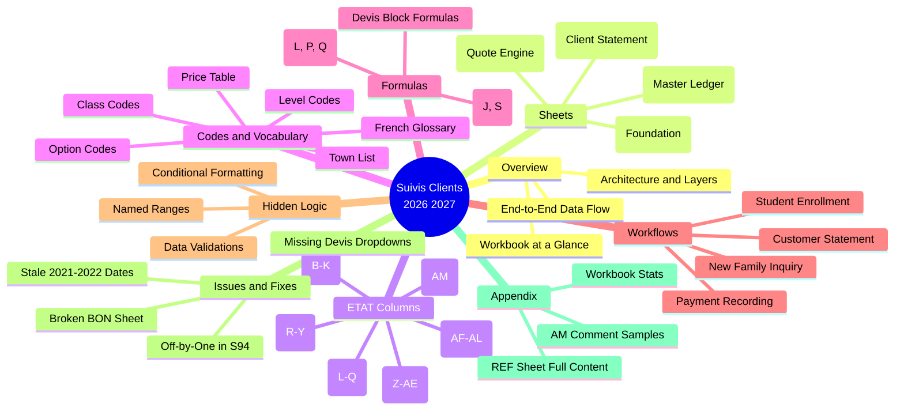

## Section index

| Section | Purpose | MOC |
|---|---|---|
| 01 - Overview | High-level mental model | [[00 - Overview MOC]] |
| 02 - Sheets | One note per sheet (4 sheets) | [[00 - Sheets MOC]] |
| 03 - ETAT Columns | Column groups on the master ledger | [[00 - ETAT Columns MOC]] |
| 04 - Codes and Vocabulary | Codes, prices, French terms | [[00 - Codes MOC]] |
| 05 - Formulas | Every formula pattern | [[00 - Formulas MOC]] |
| 06 - Workflows | The four operator workflows | [[00 - Workflows MOC]] |
| 07 - Hidden Logic | Named ranges, validations, formatting | [[00 - Hidden Logic MOC]] |
| 08 - Issues and Fixes | Known bugs and repair guides | [[00 - Issues MOC]] |
| 09 - Appendix | Stats, full REF content, AM samples | [[00 - Appendix MOC]] |

## The system in one paragraph

The workbook tracks 390 students. Each student is one row in [[02 - ETAT - Master Ledger|ETAT 20262027]]. The [[01 - ETAT Core Formulas (L, P, Q)|L formula]] computes their annual quote (registration + tuition + transport − discount). The operator types payments into columns R–Y as families pay installments. The [[01 - ETAT Core Formulas (L, P, Q)|P formula]] sums those payments. The [[01 - ETAT Core Formulas (L, P, Q)|Q formula]] computes the balance owed (`Q = L − P`). [[03 - Devis - Quote Engine|Devis]] generates printed quotes for prospective families. [[04 - BON - Client Statement|BON]] is a print template for customer statements (currently broken). [[01 - REF - Foundation|REF]] holds reference data (mostly dormant). Column AM holds hand-typed receipt comments as the audit trail.

## Tags

Browse notes by tag:

- `#moc` — Map of Content notes
- `#sheet/REF`, `#sheet/ETAT`, `#sheet/Devis`, `#sheet/BON` — per-sheet notes
- `#formula` — notes about formulas
- `#workflow` — operator workflows
- `#issue` — known bugs and fixes
- `#codebook` — code lists and reference tables
- `#hidden-logic` — named ranges, validations, formatting
- `#audit` — receipt log, audit trail

## Conventions

- **Currency**: All amounts are in Algerian Dinars (DZD), written as bare numbers.
- **French terms**: Defined inline and in [[06 - French Terms Glossary]].
- **Sheet references**: Written as `ETAT!L2` (sheet name, exclamation, cell).
- **Cross-references**: `[[Wiki Links]]` connect related notes throughout the vault.
- **Diagrams**: Only Mermaid is used. No ASCII art.


========================================================================
End of merged export - (entire project) - Part 1 of 1
========================================================================